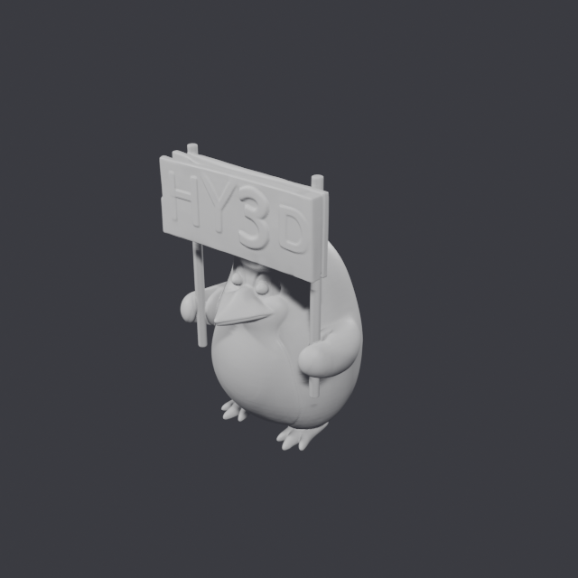
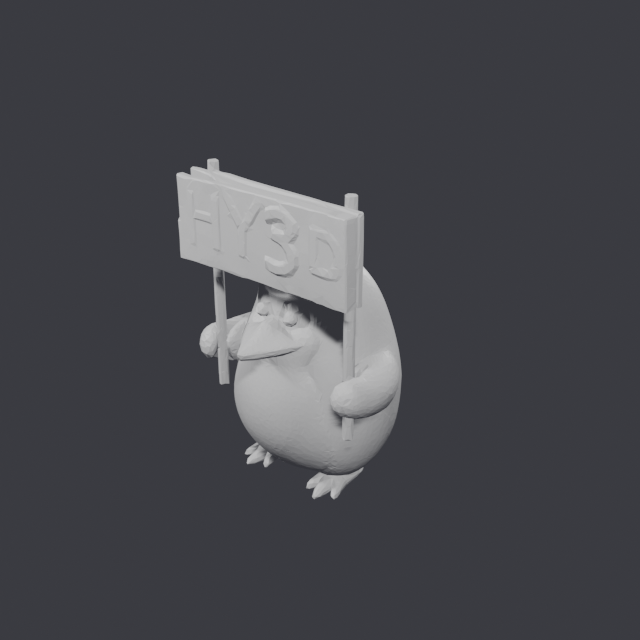
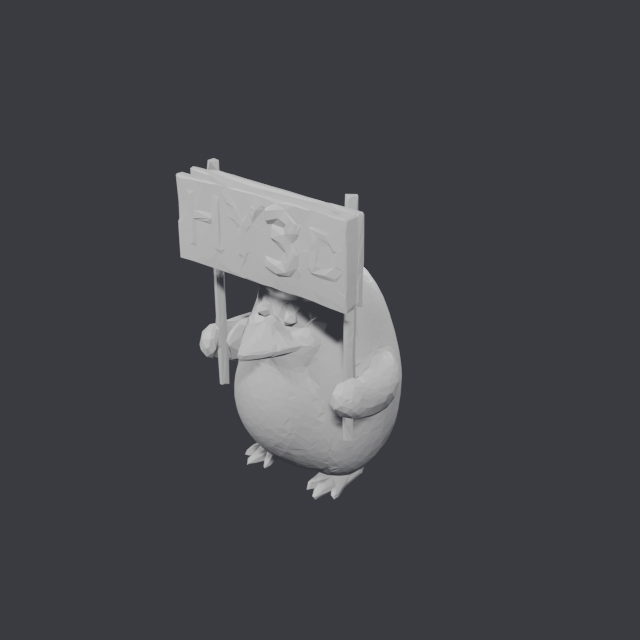

# How much can you decimate before it shows?

Hunyuan3D emits ~350k faces for a single object. No game engine will take that,
so every asset gets decimated on the way out. The question is how far.

Measured on the reference object (Hunyuan3D's `demo.png`), decimated with
`trimesh.simplify_quadric_decimation`, rendered flat-shaded so the polygon
silhouette is visible.

| Faces | File | Reduction | Verdict |
| --- | --- | --- | --- |
| 353,966 | 6.2 MiB | — | Unusable in an engine |
| 40,000 | 704 KiB | 9× | Indistinguishable from raw |
| **20,000** | **352 KiB** | **18×** | **Sweet spot — fine relief survives** |
| 8,000 | 141 KiB | 44× | Silhouette perfect, fine relief lost |

Decimation itself costs ~0.3s, so it is free relative to the 40s generation.

## What actually degrades

Not the silhouette. At 8k the body, wings, feet and beak are still correct —
proportions and pose survive aggressive reduction because quadric decimation
spends its budget on curvature.

What dies first is **fine surface relief**. The reference object holds a sign
with "HY3D" embossed on it:

| Raw (354k) | 20k | 8k |
| --- | --- | --- |
|  |  |  |

At 20k the lettering is legible. At 8k it is mush, while the bird itself still
looks fine.

## Picking a number

- **20,000** — the default worth reaching for. 18× smaller with no visible loss.
- **8,000** — fine for props with no engraved or embossed detail. Most Roblox
  scenery qualifies.
- **40,000+** — only if the part carries text or fine relief that has to read up
  close.

The rule is about *detail type*, not object size: a smooth rock decimates to 4k
without complaint, a control panel covered in switches does not.

## Two caveats

**Decimation breaks watertightness.** Raw meshes come out watertight; decimated
ones generally do not. Engines do not care. 3D printing and boolean operations
do.

**The dense original is kept.** Every job writes `mesh_raw.glb` alongside the
decimated `mesh.glb`. It is the better input for retopology, and regenerating it
would cost another 40s.

## Why not pymeshlab

`pymeshlab` is installed and does this job well, but it is **GPL**. Importing it
into the server would make the server a derivative work. `trimesh` (MIT) with
`fast-simplification` (MIT) gives the same result and keeps the stack
permissively licensed — which matters if any of this is ever hosted as a paid
service.
