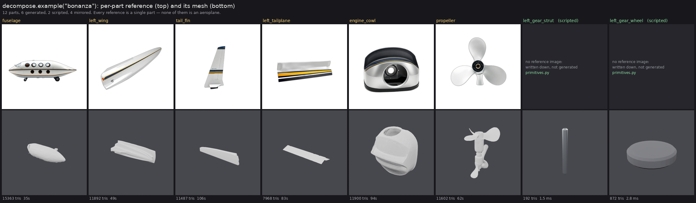
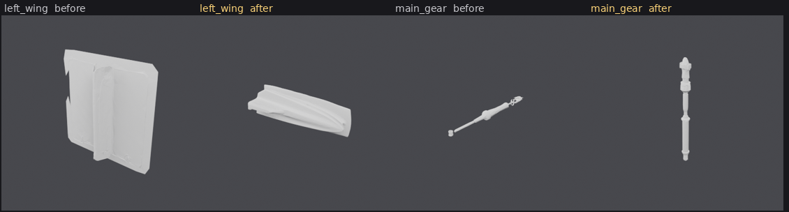

# Automatic part decomposition

`server/decompose.py`. This is the front half of the thing the project exists
for: [MULTI-PART.md](MULTI-PART.md) explains why an assembled object beats a
welded blob, and this explains how you get parts to assemble in the first place.

## The premise, restated

Cropping a photograph of the whole object does not give you parts. That was
tested on a Beechcraft Bonanza — tail, propeller, wing and cowl cropped out of
one reference — and **every crop generated a complete aeroplane**. Image-to-3D
models carry a strong object-completion prior. Tightening the crops, keying the
background to real alpha and padding generously all changed the result and none
of them fixed it.

So a per-part reference has to *depict only that part*, which means generating
it from its own prompt. That works. It also moves the problem: eight prompts
produce eight separately-imagined objects, and a scene built from those looks
like a parts bin from eight different aircraft.

## The plan format

A plan is data. The primary caller is a coding agent over MCP, which already has
the spatial and semantic reasoning to decide that a cart has two wheels and an
axle — so **there is no LLM call inside the server**. The agent authors the plan
and `decompose.run()` executes it.

```json
{
  "name": "bonanza",
  "subject": "a Beechcraft Bonanza G36 light aircraft",
  "style": "glossy white painted aluminium, navy blue and gold accent stripe, polished chrome, matte black rubber, soft neutral studio light from the upper left, photorealistic",
  "seed": 20260806,
  "generator": "trellis2",
  "target_faces": 12000,
  "textured": false,
  "scale_reference": "fuselage",
  "parts": [
    {
      "name": "fuselage",
      "mode": "generate",
      "prompt": "a hollow elongated shell with an oval cross section, tapered at both ends, six oval portholes in a row along the side, ...",
      "target_faces": 16000,
      "size_m": [1.1, 1.3, 8.4],
      "material": "paint",
      "placement": {"position": [0, 0, 0]}
    },
    {
      "name": "left_wheel",
      "mode": "script",
      "kind": "wheel",
      "params": {"radius": 0.85, "width": 0.22, "spoke_count": 8},
      "size_m": [1.7, 0.22, 1.7],
      "placement": {"anchor": {"to": "axle", "align": {"x": "min"}, "my": {"x": "max"}}}
    },
    {
      "name": "right_wing",
      "mode": "mirror",
      "placement": {"mirror_of": "left_wing", "mirror": "x"}
    }
  ]
}
```

Three modes, which are the three real costs of a part:

| mode | how it is built | cost |
| --- | --- | --- |
| `generate` | its own prompt → fal image → image-to-3D | ~4 s image + 35–106 s GPU |
| `script` | a parametric kind from [primitives.py](PROCEDURAL.md) | ~3 ms, no GPU |
| `mirror` | another part's mesh, reflected | **nothing at all** |

`mirror` earns its place. A left and a right wing are the same object; the plan
says so once and both wings come out of one generation. The Bonanza plan is
twelve parts and six generations.

`placement` is passed through untouched. It is `assemble.py`'s vocabulary —
`anchor`, `mirror`, `mirror_of`, `position`, `rotation`, `scale` — because
placement is deliberately not decided here. `run()` hands back an
`assemble_request` with each part's `job_id` and its placement already merged,
so the plan's intent does not have to be transcribed into a second document.

Two worked examples ship as data in `decompose.EXAMPLES`: `bonanza` (a generated
airframe with scripted landing gear) and `wooden_cart` (scripted hardware with
only the soft irregular cargo generated). They are the two halves of the routing
rule in [PROCEDURAL.md](PROCEDURAL.md), and they are also the test fixtures — an
example that stops validating fails the suite.

## `size_m`: how big the part really is

**The generator destroys scale, and this field is the only place the information
can come from.** Measured on the six generated Bonanza parts, the longest side of
every returned mesh:

| fuselage | wing | tail fin | tailplane | cowl | propeller |
| --- | --- | --- | --- | --- | --- |
| 0.9923 | 0.9989 | 0.9997 | 0.9936 | 0.9989 | 0.9921 |

Every image-to-3D model here normalises its output to a **unit box**. An 8.4 m
fuselage and a 0.9 m landing-gear strut come back exactly the same size, and
nothing downstream can recover the difference: the mesh does not know, the
reference image does not know (it is a 1024² frame with the subject filling it
either way), and an anchor cannot rescue it because an anchor measures whatever
box it is handed. The information only exists in the head of whoever decided the
subject was a Bonanza — which is the plan's author.

This is not hypothetical. The twelve-part Bonanza that assembled correctly did so
with a **throwaway script supplying every scale by hand**. That step is the
difference between "works for aircraft" and "works for anything", because every
new object hits the same wall.

So each part states its real size, in metres:

```jsonc
"size_m": 2.0                  // the longest dimension. Enough for a propeller
"size_m": [4.4, 0.25, 1.4]     // [x, y, z] extents, in the part's own frame
```

Both forms are accepted because both are easy to author correctly, which matters
when the author is an LLM. The single number is the one to reach for when the
part is round or blocky and has no obvious long axis; the triple says the same
thing about scale *and* additionally states the part's proportions, which is
what [orientation](ORIENTATION.md) needs (see below).

`scale_reference` names the part that is **1.0 unit** in the assembled scene —
`"fuselage"` on the Bonanza. Sizes then divide through it, so the numbers that
come back are ratios a human can check by eye: a wing is a bit over half a
fuselage, a wheel a fifteenth of one. Without a `scale_reference`, one unit is
one metre, which is what a plan built from primitives is already written in —
`primitives.py` builds a 3.2 m cart bed 3.2 units wide.

`run()` computes the scale and puts it in the `assemble_request`, so the caller
never writes that script again:

| part | `size_m` | scale |
| --- | --- | --- |
| `fuselage` | 8.4 m | **1.0** |
| `left_wing` | 4.4 m | 0.5238 |
| `propeller` | 2.0 m | 0.2381 |
| `tail_fin` | 1.5 m | 0.1786 |
| `left_tailplane` | 1.7 m | 0.2024 |
| `engine_cowl` | 1.4 m | 0.1667 |
| `left_gear_strut` | 0.9 m | 0.1071 |
| `left_gear_wheel` | 0.55 m | 0.0655 |

Those are the same eight numbers the hand-written script supplied. Applied to the
meshes still on the reference box, every part lands within 0.7% of the size it
declares.

The scale is **uniform**, never per-axis: the mesh already has the right
proportions and a non-uniform scale would stretch a part that is merely the wrong
size. A **mirrored part gets no scale at all** — it inherits its source's whole
transform, and scaling it again would square the source's scale.

### Scripted parts are measured, not assumed

A primitive is built at whatever its params say, so its span is known rather than
1.0, and the scale is `size_m ÷ unit ÷ that span`. The practical effect is that
**a primitive may be drawn at any convenient size**: the Bonanza's gear is drawn
at unit span like a generated part, the cart's axle is drawn 2.1 m long, and both
land at the size they claim. A scripted part that omits `size_m` is left exactly
as its params built it.

### It is also the input orientation wants

`orient` matches a part's oriented bounding box against declared target extents,
of which it uses only the ratios — so an `[x, y, z]` `size_m` is already the
right thing, in the right frame, in the right units. Rather than write the three
numbers twice, a part may defer:

```jsonc
{ "name": "left_wing", "size_m": [4.4, 0.25, 1.4], "placement": {"orient": true} }
```

which expands to `"orient": [4.4, 0.25, 1.4]` in the `assemble_request`. It needs
the triple; deferring with a single length is an error, because one number cannot
say which way a part lies.

### What validation catches

All of it before a single image is generated, because a plan that takes eight
minutes to fail is much worse than one that fails in a millisecond:

- a size that is not one or three positive finite numbers,
- a size outside 0.001 m – 1000 m, which is the mistake that actually happens:
  millimetres or centimetres in a field named `_m`. `"size_m": 550` for a 55 cm
  wheel is named as such;
- `size_m` on a mirror, or beside an explicit `placement.scale` — in both cases
  one of the two would be silently ignored;
- a `scale_reference` naming an unknown part, or one with no size of its own;
- `"orient": true` on a part whose size is a single length.

A generated part with **no** `size_m` is a warning rather than an error — half a
plan is still worth building, and a caller may be scaling downstream — but it
does not stay silent, because silence here is what made every object need a
hand-written scale script.

## Style coherence

**This is the part that decides whether the feature works**, and the measurement
is unambiguous.

Four Bonanza parts — propeller, cowl, fin, gear — generated three ways at
`fal-ai/flux/schnell`:

| | result |
| --- | --- |
| Part prompts alone, no shared suffix | grey and gunmetal hardware, no livery, three different finishes. **A pile of unrelated objects** — exactly the predicted failure |
| Part prompts + a shared style suffix, one fixed seed | the same white / navy / gold airframe on every part |
| Part prompts + the same suffix, a different seed each | *also* the same white / navy / gold airframe |

Mean opaque-pixel colour, spread across the four parts (a crude proxy, dominated
by how much black rubber each part happens to have, but directionally right):

| regime | max pairwise distance between part mean colours |
| --- | --- |
| no suffix | **240** |
| suffix, varied seeds | 142 |
| suffix, fixed seed | 169 |

So: **the shared style suffix does essentially all of the work, and the seed
does none of it.** The seed stays, because it buys something else — rerolling
one part at the same prompt and seed returns essentially the same image, which
makes a reroll a deliberate change rather than a dice throw. `Part.seed`
overrides the plan's for exactly that.

"Essentially", not "exactly": the same prompt and seed submitted twice came back
with a mean per-pixel difference of **4.6/255**, against **27.4/255** for a
one-off seed. Same composition, same livery, not bit-identical — fal's workers
are not deterministic to the last float. Do not build anything that expects a
byte-for-byte reproduction.

### The suffix must not name the whole object

The first suffix tried was the obvious one:

> *all parts of the same aircraft: … clean modern general-aviation livery …*

and it brought whole aeroplanes back. The propeller prompt rendered a propeller
**attached to an aeroplane**; the landing gear came out as a wing with a wheel
under it. Naming the parent object in the shared suffix re-arms the same
object-completion prior through the text encoder that the cropping experiment
hit through the image encoder.

Deleting the aircraft nouns and keeping only materials, palette and lighting
fixed three of the four immediately, at no cost to coherence — the palette
carries the family resemblance on its own.

`validate()` warns when the style repeats a content word from the subject, and
`run()` returns that warning in its result. It is a warning rather than an error
because a caller may know better, but it is worth saying out loud: nothing about
the resulting image looks like a prompt bug.

### Describe the geometry, not the object

The remaining failures were the parts whose *names* are inseparable from the
whole: "fuselage", "wing". Prompting for them by name renders a complete
aircraft no matter what negatives are attached:

| prompt | result |
| --- | --- |
| "a bare aeroplane fuselage shell with no wings and no tail, …" | a complete aeroplane, wings and tail included |
| "an aeroplane cabin body section only, wingless and tailless, …" | a complete aeroplane |
| "a hollow elongated shell with an oval cross section, tapered at both ends, six oval portholes in a row, a rounded glass canopy near one end" | **a hollow tapered shell with portholes** |
| "a single detached low-mounted aircraft wing panel with aileron and flap" | a complete aeroplane |
| "a long tapered blade-shaped panel, thick rounded leading edge and thin sharp trailing edge, a hinged flap along the back edge, a small orange light at the narrow tip, cut off flat at the wide end" | **a wing panel** |

The rule that falls out of it: **name the shape and its features, not the thing
it belongs to.** Where the part noun is unavoidable, add the explicit negatives
("no fuselage, no second wing, one panel only") and say where it is cut off —
"cut off flat at the root" gives the model somewhere to end the object.

Parts whose names are already self-contained — propeller, cowling, tail fin,
telescopic strut — need none of this and isolate cleanly first time.

### What else fal offers, and why it is not used

`fal-ai/flux/schnell` takes a prompt and a seed and nothing else. The stronger
consistency levers on the platform are all **image-conditioned** — FLUX Redux,
FLUX Kontext, IP-Adapter via `flux-general` — and image conditioning is exactly
the mechanism that failed in the cropping experiment: hand any of them a picture
of the whole aircraft as a style reference and the completion prior comes back
with it. They would also need an upload path in `imagegen.py` that does not
exist, and they cost roughly 8× a schnell call.

Given the measurement above — the text suffix already produces a coherent
family, at 3 seconds and schnell prices — that was not a trade worth making
yet. The place to revisit it is a build where the palette genuinely has to match
an *existing* asset rather than merely be self-consistent; a Redux reference
image is the right tool for that and the wrong tool for this.

## What comes out

`decompose.example("bonanza")` run end to end against the reference GPU box.
The shipped example is the *second* version — the first run is what taught it
the two lessons below, and both are in the plan now.



The first run: ten parts, seven generations, nothing hand-tuned.

| | measured |
| --- | --- |
| Plan → seven images + seven queued jobs | **22.3 s** |
| All seven meshes finished and fetched | **475 s**, 35–106 s each |
| Peak VRAM | **2.39 GiB** device-wide, every part |
| Faces | 7 968 – 15 363, at the budgets the plan asked for |
| Failures | none — 7/7 submitted, generated, downloaded |

**The reference images are the win, and it is total.** All seven were genuinely
isolated single parts. Not one whole aeroplane, against the cropping experiment
where *every* attempt was one. The livery is the same white/navy/gold across all
seven; side by side they read as one aircraft's parts bin.

**The meshes were mixed, which is a different problem.** By eye:

| part | mesh |
| --- | --- |
| `tail_fin` | good — clean tapered fin, crisp root |
| `left_tailplane` | good — a proper thin tapered plate |
| `propeller` | usable — three blades and a hub, blades softer than the reference |
| `engine_cowl` | usable — the shell is there, the intake is mushy, panels undulate |
| `fuselage` | weak — a smooth lozenge; the portholes and canopy did not survive |
| `left_wing` | **bad** — two crossed slabs, not a wing |
| `left_main_gear` | **bad** — a spindle, the wheel barely present |

The two failures were the two thinnest subjects, and both references showed them
near edge-on and small in frame. That is not bad luck — it is the same fact
MULTI-PART.md notes about crops: *a thin panel seen edge-on is close to
information-free*.

### Lesson one: name the viewpoint for thin parts

Appending `decompose.THIN_PART_VIEW` —

> *seen from above and to one side at a steep angle so its thickness and depth
> are clearly visible, large in frame*

— and regenerating:



**The wing is fixed**: one solid tapered wing instead of two crossed slabs, at
11 892 tris in 49 s. It is chunky, but it is a wing. `left_wing` in the shipped
example carries the clause.

**The gear is not fixed.** A thicker strut, and the wheel disappeared entirely.

### Lesson two: the gear was never a generation problem

The strut and the wheel are two objects at very different scales sharing one
1024² frame, so the wheel gets a few dozen pixels of depth cue whatever the
viewpoint. They are also both *dimensioned hardware*, which
[PROCEDURAL.md](PROCEDURAL.md) says should be written down rather than
generated. The shipped example scripts them:

| | generated | scripted |
| --- | --- | --- |
| strut | a featureless spindle, 7 984 tris, 51 s | `cylinder`, **192 tris, 1.5 ms**, exactly 1.0 × 0.11 × 0.11 |
| wheel | absent | `wheel`, **872 tris, 2.8 ms**, with a hub and six spokes |

That is the routing rule landing on an aircraft, and it is the more interesting
of the two lessons: **when a generated part keeps coming out wrong, check
whether it should have been generated at all.** The Bonanza plan is now 12 parts
— 6 generated, 2 scripted, 4 mirrored — and only six of them cost GPU time.

## Honest limits

- **Thin parts need their viewpoint named.** See above. `imagegen.FRAMING` asks
  for a three-quarter view, but for a wing or a strut the model happily reads
  that as edge-on. Say it again in the part prompt, and say "large in frame".
- **Fine surface detail does not survive.** The fuselage's portholes and canopy
  are in the reference and not in the mesh. At 512 pipeline resolution and
  16 000 faces they are below what comes back. Parts whose identity is a hole or
  a window should be scripted, or the hole should be a separate part.
- **The style suffix coheres the *reference images*, not the meshes.** Geometry
  comes back untextured — TRELLIS 2's texture path is noise, see
  QUALITY-COMPARISON.md — so the white/navy/gold that makes the references look
  like one aircraft is thrown away at the mesh stage, and colour is re-derived
  from part names by `materials.py`. The coherence work is not wasted: a
  coherent reference set produces parts at consistent *proportions* and
  detailing. But do not expect the livery in the glTF.
- **Scale has to be declared, and a wrong declaration is invisible.** Each
  reference is a 1024² frame with the object filling it, so a propeller and a
  fuselage arrive the same size and `size_m` is the only thing that separates
  them (above). Nothing can check it: a plan that says a Bonanza's wing is 44 m
  validates, generates, assembles, and produces an aeroplane with a wing ten
  times too long. The numbers are the author's responsibility; only the
  obviously-impossible ones are caught.
- **Nothing here is deterministic end to end.** Same seed, near-identical image
  (4.6/255); the mesh stage adds its own variation on top.
- **No LLM, by design** — which means a bad plan produces bad parts efficiently.
  `validate()` catches structural mistakes and the style-leak, not a
  decomposition that forgot the tail.

## Wiring

`decompose.run(plan, backend=None, progress=None)` is import-and-call. The
backend is injected because the two halves have wildly different costs — images
are a 4-second HTTP round trip, meshes are 35–106 seconds of GPU — and because a
test must reach neither.

Images are generated inline and meshes are queued, which is what keeps this a
request rather than a ten-minute connection: measured, ten parts returned in
22 s with seven job ids that finished over the following eight minutes.
`decompose.status(result)` reports where a build has got to; `decompose.wait()`
blocks, for scripts.

**There is no HTTP endpoint yet** — `POST /decompose` belongs in `app.py`, which
this module does not own. It is four lines: validate the body into a `Plan`,
call `run`, return the result. Note that the default `ServerBackend` files
scripted parts into the job registry itself rather than calling
`app.create_primitive`, precisely so that `app.py` can import this module
without a cycle.
