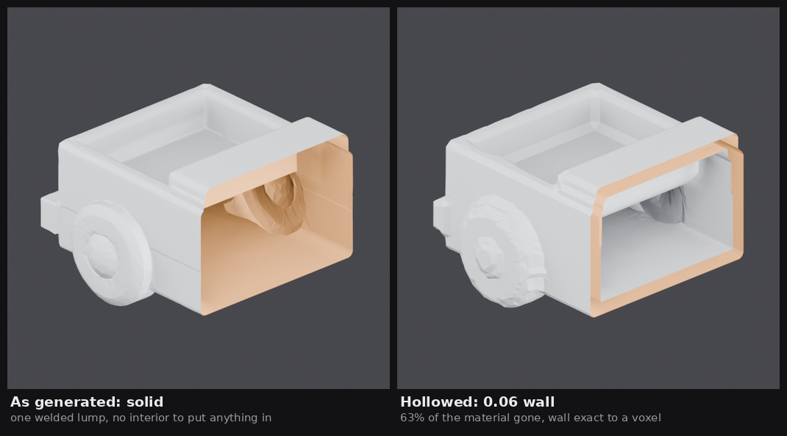
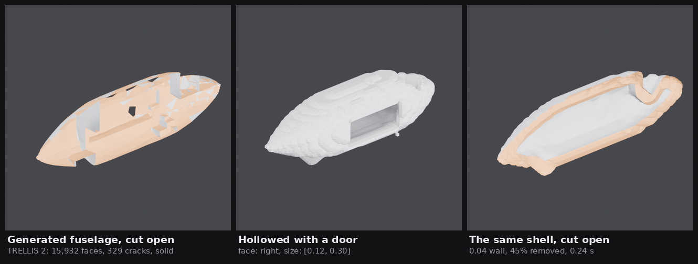
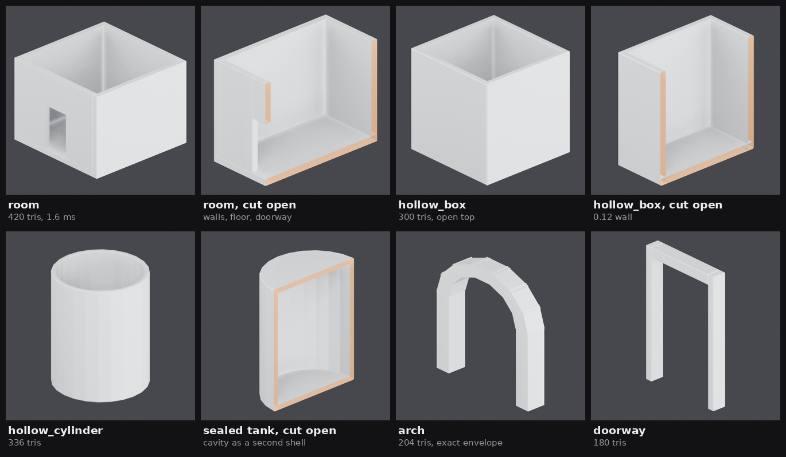

# Hollow interiors

**Every image-to-3D generator emits a solid.** A generated fuselage is a filled
lump: there is no cabin inside it, only more fuselage. That is fine for a render
and fatal for Roblox, where the point of a vehicle is that you get into it and
the point of a building is that you walk into it.



Both halves above are the *same generated mesh*, cut on the same plane. From
outside they are pixel-identical — which is exactly why every image in this
document is a cutaway. A hollow object photographed from the outside is
indistinguishable from a solid one, so nothing else proves anything.

## Two ways to get an interior

| | Carve it (`hollow.hollow`) | Build it hollow (`hollow.build`) |
| --- | --- | --- |
| Input | any mesh, however broken | a parameter set |
| Cost | 0.2–2 s, 12k–20k triangles | 1–3 ms, 200–450 triangles |
| Wall | exact to a voxel | exact |
| Surface | resampled onto a grid | untouched, chamfered, flat |
| Use it for | the generated hero part — a hull, a body, a rock | a room, a crate, a silo, a gateway |

The routing rule is the same one [PROCEDURAL.md](PROCEDURAL.md) states for
solids: *geometric, man-made, dimensioned → script it; organic, sculptural,
irregular → generate it, then carve it.*

## Carving: why not a boolean

The textbook shell is an inward surface offset and a boolean difference.
`manifold3d` is the right engine for it — it is genuinely permissive (see
[Licence check](#licence-check-manifold3d) below) and it is one of trimesh's
boolean backends. It was measured against the same four subjects the voxel route
was:

| Subject | Boolean (`manifold3d`) | Voxel SDF |
| --- | --- | --- |
| Box, 12 faces | works — but a **0.029 wall where 0.05 was asked for** | 0.050 |
| Icosphere | works, wall 0.051–0.076 | 0.050 |
| Cylinder, 48 sections | works, wall 0.042 | 0.050 |
| Hunyuan3D cart, watertight, 20k | works, wall 0.050, 41,110 faces, 1.04 s | 0.060 asked, 0.060 p10 |
| TRELLIS 2 fuselage, 329 boundary edges | **refuses** — still 317 boundary edges after hole filling | works |
| TRELLIS 2 nose cowl, 1,623 boundary edges | **refuses** — still 1,431 after hole filling | works |

Two independent problems, and both are structural rather than tuning:

**The offset is wrong before the boolean even runs.** Moving each vertex along
its own normal is only a constant-thickness offset on a smooth surface. At a
cube's corner the three faces share one vertex whose normal points diagonally,
so a 0.05 offset moves each face in by 0.05/√3 = **0.029**. Every hard edge in
the mesh — which is every edge of the props this project makes — thins the wall
by up to 42%.

**Generated meshes are not solids.** `trimesh.boolean` requires
`is_volume`: watertight, winding-consistent, positive volume. Decimated output
is none of those. Measured on the parts sitting on the live server:

| Part | Faces | Watertight | Winding | Volume | Boundary edges |
| --- | --- | --- | --- | --- | --- |
| Hunyuan3D, decimated to 20k | 20,000 | yes | yes | +0.873 | 0 |
| TRELLIS 2 fuselage | 15,932 | no | no | +0.0009 | 329 |
| TRELLIS 2 left wing | 11,897 | no | no | **−0.005** | 244 |
| TRELLIS 2 propeller | 11,602 | no | no | −0.002 | 846 |
| TRELLIS 2 nose cowl | 19,415 | no | no | +0.221 | 1,623 |

Hole filling does not rescue them — `trimesh.repair.fill_holes` closed 12 of 329
boundary edges on the fuselage — and it needs `networkx`, which is not in the
server's environment either. A negative volume on a "solid" tells you the
winding is inconsistent across the surface, which is not a hole to be patched.
The one generated mesh the boolean route *did* handle was the Hunyuan3D part,
which decimates through `trimesh` and comes out watertight.

So: **`manifold3d` is not a dependency of this project.** It is supported
(`hollow.hollow_boolean`, and the tests exercise it if the wheel is present) and
it is not installed, because the route that needs it cannot process the input
this project actually produces.

## Carving: what does work

`hollow.hollow()` never performs a boolean. It goes through a signed distance
field on a voxel grid, which has the property the boolean route lacks: **by the
time the shell is computed there is no topology left to be wrong**, only numbers
in an array.

```
mesh ──rasterise──> occupancy ──flood fill──> solid ──EDT──> φ
                                                              │
        shell = max(φ, −wall − φ)   ← a CSG difference in one array op
                                                              │
                          surface nets ──> closed shell ──> decimate to 20k
```

Five steps, each doing one job:

**1. Rasterise.** The mesh is subdivided until no edge is longer than half a
voxel, and every resulting vertex marks its cell. Nothing here asks whether the
surface is closed. A crack narrower than a voxel is sealed by the rasterisation
itself.

**2. Flood the outside.** Everything reachable from the grid border without
crossing the skin is outside; the rest is material. This is what decides what
"inside" *means* for a mesh that has no opinion on the matter — and it is the
step with the interesting failure mode, below.

**3. Distance transform.** An exact Euclidean distance transform (Felzenszwalb,
vectorised — 3 × 128 numpy calls for a 128³ grid, not 3 × 128³ Python ones) in
both directions gives φ, negative inside, in world units.

Two half-voxel corrections live here and both are load-bearing. A distance
transform measures centre to centre, so the first solid voxel reports a full
pitch when the surface is really half a pitch away — without correcting it every
isosurface below zero comes out half a voxel shallow, and **a 0.05 wall measured
0.039**. And a rasterised skin voxel is the one the surface passes *through*,
while the fill stops at its far face, so the zero level lands up to a full voxel
outside the real surface — **a 1.0 box measured 1.05**. With both, a unit cube
round-trips to volume 0.996 and extents 1.000.

**4. Shell it.** The shell is the region between the surface and the surface
offset inward: `max(φ, −wall − φ)`. That is a CSG difference expressed as one
array operation. It cannot fail on bad topology, and it costs nothing.

**5. Extract.** Naive surface nets: one vertex per cell that straddles the
level, one quad per straddling grid edge. Chosen over marching cubes because it
is twenty lines of numpy instead of a 256-entry table, and because it is
**manifold by construction** — the output is closed even though the input was
not.

Written out rather than imported because the libraries that provide these are
the ones this project will not take: `scipy` is not installed at all (it is what
`trimesh.slice_plane`, `mesh.ray` and `body_count` all reach for), `scikit-image`
is 90 MB for one marching-cubes function, and `pymeshlab` and `bpy` are GPL
([DECIMATION.md](DECIMATION.md)).

## Openings

A hollow shell with no way in is a paperweight. An opening is subtracted from
the same field — `max(shell, −cutter)` — using the vocabulary
[`assemble.py`](MULTI-PART.md#anchor) already uses for placement, because a
caller who can place a part should not have to learn a second dialect:

```jsonc
{"face": "right", "shape": "box", "size": [0.12, 0.30], "at": {"y": 0.5, "z": 0.45}}
```

- `face` — `front`/`back`/`left`/`right`/`top`/`bottom`, or a signed axis (`-z`).
- `at` — per axis, a fraction of the part's bounding box, or one of the names
  `assemble.FRACTIONS` takes (`min`, `center`, `max`, `top`, `bottom`, …). An
  axis you do not mention is centred, exactly as in an anchor.
- `shape` — `box` with `size: [across, up]`, or `cylinder` with `radius` for a
  porthole.
- `depth` — default `3 × wall`, enough to breach the wall and no more.
  `through: true` instead cuts a tunnel out the far side.

**The depth is measured off the mesh, not off the bounding box.** A door placed
on the +X face of a curved hull would either float outside the surface or tunnel
clean through it, depending on how round that spot happens to be, so the cutter
starts where the surface actually is — a low percentile of the first solid hit
in each column of the aperture, which gives a flat cut plane that clears the
nearest part of a curved skin.



The left tile is the input: TRELLIS 2's fuselage, cut open. Solid all the way
through, and the dark patches are real holes in the mesh. The middle is the same
part hollowed with one opening. The right is that shell cut open — 0.04 wall,
45% of the material gone, 0.24 s.

## Hollow by construction

Carving is the hard road, and most of the time it is the wrong one. A room is
*known* to be hollow; it does not need a distance field, it needs arithmetic.
Five kinds, built the way [PROCEDURAL.md](PROCEDURAL.md) builds everything —
composition of closed solids, no boolean engine, exact dimensions:



| kind | what it is | material | tris | build |
| --- | --- | --- | --- | --- |
| `room` | building shell: four walls, floor, doorway, optional window and roof | stone | 420 | 1.6 ms |
| `hollow_box` | container with a wall thickness and one face left off | wood | 300 | 1.4 ms |
| `hollow_cylinder` | silo, tank or fuselage section, open at either end | metal | 336 | 1.5 ms |
| `arch` | gateway: two piers carrying a segmented arch | stone | 204 | 2.9 ms |
| `doorway` | a standalone frame, to trim an opening you cut | wood | 180 | 1.2 ms |

**420 triangles against 20,000, and 1.6 ms against 0.24 s.** The same argument
PROCEDURAL.md makes about the crate applies with more force here, because a
carved shell is two surfaces and costs twice what a carved solid would.

Three construction notes worth keeping:

- **An opening is never subtracted.** A doorway is the three slabs *around* it,
  same as `primitives._wall_panel`. Exact, boolean-free, and it leaves quads
  where a mesh boolean leaves slivers.
- **A sealed tank cannot be one revolve.** A closed tube's cavity does not touch
  the axis, so its profile is a ring in the half-plane and no single closed loop
  describes it. It is built as two nested shells with the inner one inverted, so
  its normals point out of the *material*. A cup, open at one end, is one loop:
  the profile walks up the outside and back down the inside.
- **Voussoirs are exact trapezoids** between two radii and two angles, scaled to
  the rise. That keeps the arch's envelope exactly the width and height asked
  for, where boxes rotated onto a curve bulge past it by a few percent.

## Measured

Every number from the laptop (no GPU), against the four subjects. `wall p10/med`
is the ray-probe measurement of the *delivered* mesh: p10 is the wall, and the
median runs above it because it also counts the parts that stayed correctly
solid.

| subject | res | seal | tris | tris pre-decimation | wall p10/med | size err | time |
| --- | --- | --- | --- | --- | --- | --- | --- |
| chamfered box, wall 0.05 | 64 | 1 | 20,000 | 41,192 | 0.050 / 0.050 | 2.1% | 0.35 s |
| | 96 | 1 | 20,000 | 95,344 | 0.050 / 0.050 | 1.0% | 0.69 s |
| | 128 | 1 | 20,000 | 168,608 | 0.050 / 0.050 | 0.5% | 1.71 s |
| Hunyuan3D cart, watertight, wall 0.06 | 96 | 1 | 20,000 | 63,892 | 0.060 / 0.072 | 1.8% | 1.03 s |
| | 128 | 1 | 20,000 | 114,116 | 0.060 / 0.071 | 1.0% | 2.09 s |
| TRELLIS 2 fuselage, 329 cracks, wall 0.04 | 64 | 2 | 12,304 | 12,304 | 0.043 / 0.103 | 4.4% | 0.23 s |
| | 96 | 3 | 19,999 | 30,154 | 0.041 / 0.104 | **18.1%** | 0.65 s |
| TRELLIS 2 nose cowl, 1,623 cracks, wall 0.06 | 48 | 2 | 12,880 | 12,880 | 0.047 / 0.072 | 5.6% | 0.29 s |
| | 96 | 6 | 19,999 | 57,814 | 0.066 / 0.077 | 6.6% | 2.48 s |
| | 128 | — | — | — | — | — | **refused** |

Read the last three rows carefully, because they are the finding.

## The interesting failure: cracks want a coarser grid

The flood fill is face-connected. A rasterised triangle is only *corner*-
connected, so two voxels meeting at a corner leave a face-connected gap the fill
pours through: an early version found **951 interior voxels in a fuselage that
should have had forty thousand.** The fix is to fatten the skin by a voxel
before flooding and hand the voxel back afterwards, everywhere it was not real
surface, so the surface lands where it started.

That same dilation bridges *real* cracks, and generated meshes are full of them
— the TRELLIS 2 fuselage's longest boundary edge is **0.106, a tenth of the
part's own length**. A crack of width *w* needs a seal of about *w*/2 voxels,
so the seal a mesh needs rises as the grid gets finer, and a seal of *n* voxels
moves the skin near a crack by up to *n* voxels. Hence the fuselage's 18% size
error at resolution 96, against 4.4% at 64.

**So a cracked mesh wants a coarse grid, not a fine one.** The voxel is the
repair tool; making it smaller stops it repairing anything. The module picks the
seal automatically and refuses rather than guessing: a coarse pass at a quarter
the resolution referees the fine one — a coarse cell that is interior and
contains no surface at all is unambiguously inside, whatever the fine grid
thinks — and if even an 8-voxel seal cannot satisfy it, you get

```
the fill leaks through this mesh at resolution 128: even a 8-voxel seal loses
3% of the interior. The cracks in it are wider than 8 voxels, so drop to
resolution 64 — a coarser voxel is what makes a crack sub-voxel — or repair
the mesh first
```

`report["seal"]` is worth reading on every call: **1 means the mesh was sound**,
and anything higher is a measurement of how broken the input was.

## Roblox

A hollow part is still one mesh, so it is still **one `MeshPart`**. Verified
through the ordinary `export_for(..., "roblox")` path:

| | Hollowed fuselage | `room` primitive |
| --- | --- | --- |
| `part_count` | 1 | 1 |
| Triangles | 11,832 | 420 |
| Budget warnings | none | none |
| Pivot | base-centred | base-centred |
| `.glb` | 209 KiB | 8.6 KiB |

The 20,000-triangle cap is the reason `max_faces` defaults to it: surface nets
emits a quad per surface cell and a *shell is two surfaces*, so raw output is
40k–170k and always needs decimating. Since the cap is per mesh, the multi-part
assembly this project does anyway still applies — a hollow fuselage plus a
hollow cabin plus seats is 60,000 triangles of budget, not 20,000.

Watch the wall thickness in studs. `height_studs` scales everything, so a 0.04
wall on a part exported at 6 studs tall becomes **0.77 studs** — about right for
something a character walks through, and worth checking rather than assuming,
because Roblox rejects zero-thickness geometry outright.

## Honest limits

- **The surface is resampled.** The outer skin is no longer the generated
  triangles; it is an isosurface on a grid, accurate to about half a voxel per
  face. At resolution 128 on a 2-unit part that is 0.008 units — under 1% of the
  size — but sharp creases round off at voxel scale and **UVs and vertex colours
  do not survive**. A textured part hollowed here comes back untextured. Hollow
  before texturing, not after.
- **Decimation ends watertightness.** The isosurface is closed by construction;
  the quadric decimation that fits it into 20,000 triangles is what breaks that,
  exactly as [DECIMATION.md](DECIMATION.md) records for generated meshes.
  `report` carries both `watertight` and `watertight_before_decimation`.
- **Surface nets pinches.** Where two surface sheets pass through one voxel, one
  vertex per cell cannot represent both, and the result is a handful of
  non-manifold edges — 41 out of 114,116 faces on the cart. `report`
  distinguishes `boundary_edges` (holes, which stay at zero) from
  `non_manifold_edges`. Nothing downstream of here notices; an exact boolean
  would.
- **Thin parts stay solid, and that is correct.** Anything thinner than two
  walls has no cavity to give. A wing comes back solid, and `measure_wall`
  reports those rays as `solid_rays` rather than pretending.
- **The wall is uniform.** There is no way to ask for a thicker floor than roof,
  and no ribs or bulkheads. Compose those from primitives inside the shell.
- **Cost is cubic in resolution.** 128 is about 2 s; 320 is the hard cap
  and 15× the work.
- **A cracked mesh trades fidelity for an interior.** See the section above.
  Beyond a certain amount of damage the honest answer is that this mesh does not
  have an inside, and the module says so instead of returning something.

## Licence check: `manifold3d`

Checked before adding, because [PROCEDURAL.md](PROCEDURAL.md) records
`cadquery-ocp` declaring `License: Apache-2.0` in its wheel metadata while
shipping `libTK*.so` — the LGPL Open CASCADE kernel. Metadata describes the
Python bindings; it does not describe the binaries.

So the wheel itself was opened
(`manifold3d-3.5.2-cp312-cp312-manylinux_2_28_x86_64.whl`, 1.4 MB):

| Check | Result |
| --- | --- |
| Metadata | `License :: OSI Approved :: Apache Software License` |
| Bundled licence file | full Apache-2.0 text, 201 lines |
| Files in the wheel | **one** `.so`, a `.pyi`, and the dist-info. No bundled third-party libraries |
| `ldd` on that `.so` | `libstdc++`, `libgcc_s`, `libm`, `libdl`, `libpthread`, `libc`. Nothing else |
| Statically linked code (symbols) | Clipper2 (Boost Software Licence 1.0), oneTBB (Apache-2.0), an embedded QuickHull. All permissive |
| GPL/LGPL strings | none |

**Verdict: genuinely Apache-2.0, and clean.** Unlike `cadquery-ocp` it links
nothing it has not vendored under a permissive licence, and the whole thing is
4 MB rather than 592. It would be a safe dependency.

It is still not one, for the reason in the first section: the route that needs
it refuses the input this project produces. `hollow.hollow_boolean` is there for
anyone whose meshes are clean, and it says what it needs if the wheel is absent.

## Using it

```python
from pathlib import Path
import trimesh, hollow

mesh = trimesh.load("mesh.glb", force="mesh")

result = hollow.hollow(
    mesh,
    wall_thickness=0.04,
    resolution=64,
    openings=[{"face": "right", "shape": "box", "size": [0.12, 0.30],
               "at": {"y": 0.5, "z": 0.45}}],
)
result.mesh.export("hollow.glb")
result.report["seal"]            # 1 means the input was sound
result.report["material_saved"]  # 0.45

# Prove it, without opening the file:
hollow.measure_wall(result.mesh, axis=2)["wall_p10"]   # 0.043
len(hollow.ray_crossings(result.mesh, [-3, 0, 0], [1, 0, 0]))  # 4, not 2

# Or skip the carving entirely:
room = hollow.build("room", {"width": 12.0, "door_width": 3.0})
```

`hollow.cross_section(mesh, axis=0, fraction=0.5)` produces the cutaway every
image in this document was rendered from.
