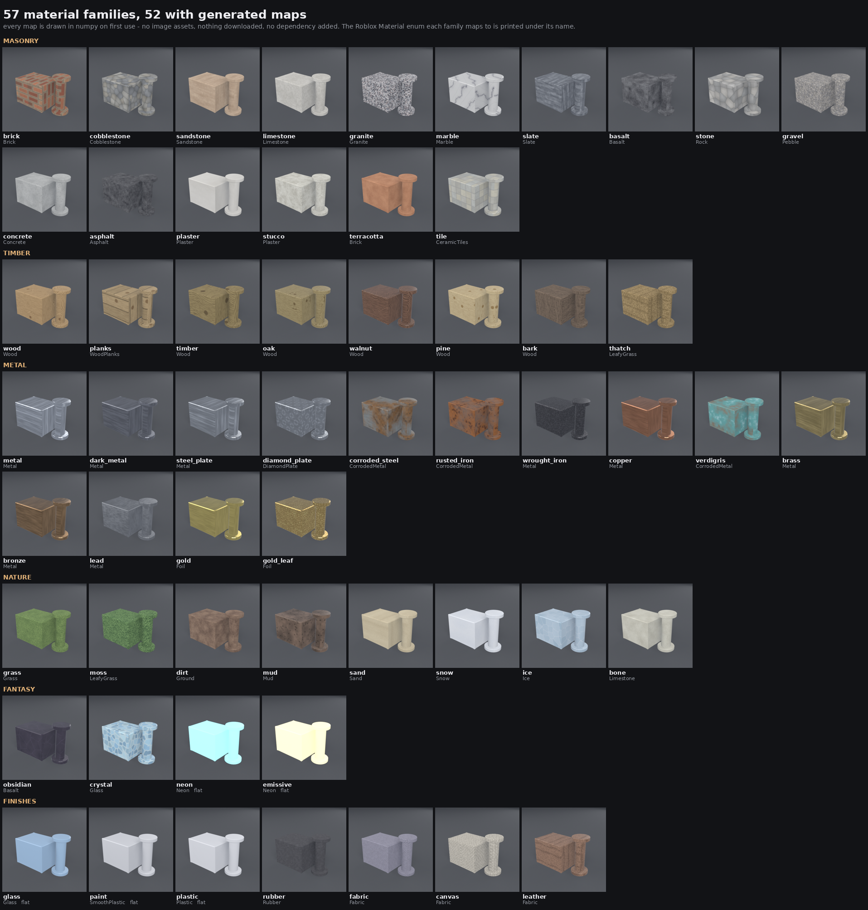
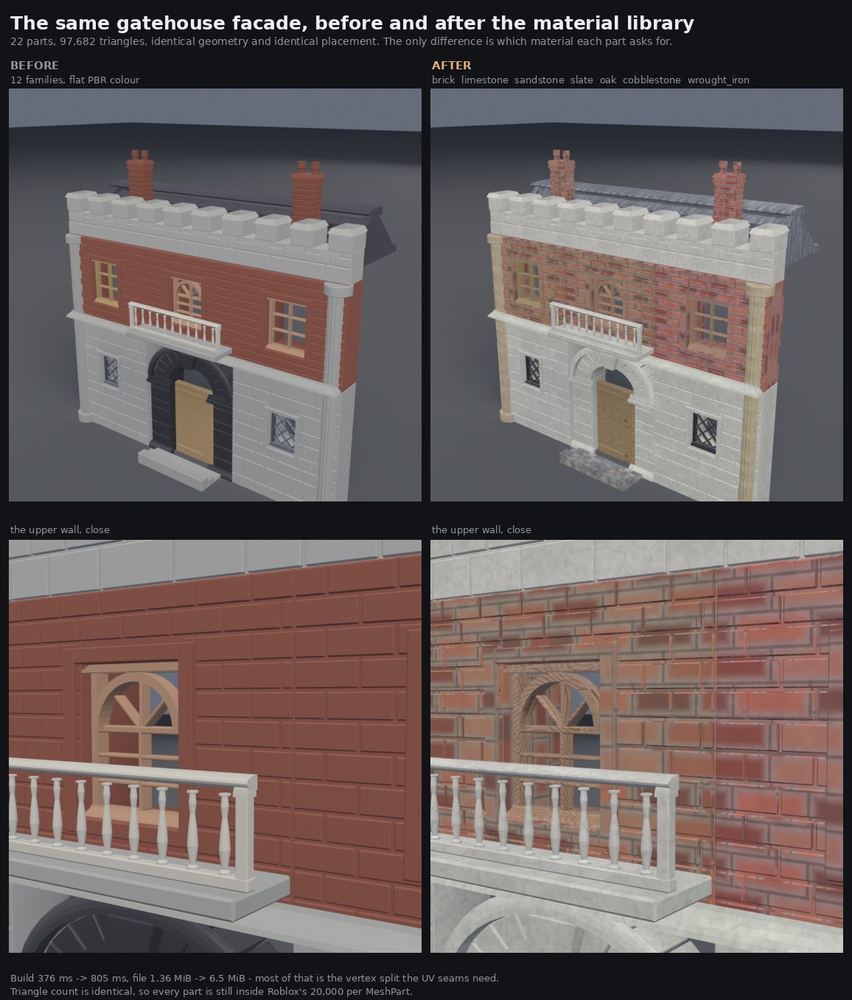

# Materials

Fifty-seven material families, fifty-two of them carrying a base-colour and a
roughness map drawn in numpy at first use. No image assets are bundled, nothing
is downloaded, and no dependency was added: it is numpy and the Pillow that
trimesh already requires.



## The gap this closes

[SHOWCASE-CHEST.md](SHOWCASE-CHEST.md) built an eighty-eight-part treasure
chest out of scripted primitives and then said the honest thing about it:

> The wood has no grain — flat PBR. Biggest gap.

That was the whole story of `server/materials.py`. It mapped a part name to one
`baseColorFactor` and stopped. The geometry was good — every stave, every
voussoir, every roof tile is real geometry rather than a normal map, which is
the entire reason to script a building — and it still read as untextured
blocking the moment it stood next to a generated asset carrying a photographic
albedo.

[PROCEDURAL.md](PROCEDURAL.md)'s gatehouse showed the same thing more sharply,
because its walls have real brick *geometry* and every brick was the same flat
colour:



Identical geometry, identical placement, identical 97,682 triangles. The only
difference is which material each of the twenty-two parts asks for.

## What is in it

The library is four flat tables in `server/materials.py` and each reads on its
own:

| table | what it holds |
| --- | --- |
| `PALETTE` | the PBR factors. The whole material for a flat family; the *mean colour* of the map for the rest |
| `TEXTURE` | the recipe: which generator draws it, its arguments, how many studs one tile covers, and at what resolution |
| `PACKS` | themed sets, so an agent picks a coherent palette in one move |
| `ROBLOX` | the `Material` enum each family maps to |

The original twelve families keep their exact names and exact colours.
Everything downstream knows what `wood` and `paint` look like and a texture
library is no reason to move them.

### Masonry

| family | Roblox `Material` | tile | packs |
| --- | --- | --- | --- |
| `brick` | `Brick` | 3.0 | medieval |
| `cobblestone` | `Cobblestone` | 2.6 | medieval |
| `sandstone` | `Sandstone` | 2.6 | medieval |
| `limestone` | `Limestone` | 2.8 | medieval |
| `granite` | `Granite` | 1.6 | medieval, natural |
| `marble` | `Marble` | 3.6 | medieval, fantasy, interior |
| `slate` | `Slate` | 2.2 | medieval |
| `basalt` | `Basalt` | 2.0 | natural |
| `stone` | `Rock` | 2.8 | medieval, natural |
| `gravel` | `Pebble` | 1.4 | industrial, natural |
| `concrete` | `Concrete` | 3.0 | industrial |
| `asphalt` | `Asphalt` | 2.0 | industrial |
| `plaster` | `Plaster` | 3.4 | medieval, interior |
| `stucco` | `Plaster` | 2.4 | medieval |
| `terracotta` | `Brick` | 2.4 | medieval |
| `tile` | `CeramicTiles` | 2.0 | industrial, interior |

### Timber

| family | Roblox `Material` | tile | packs |
| --- | --- | --- | --- |
| `wood` | `Wood` | 2.4 | medieval, industrial |
| `planks` | `WoodPlanks` | 3.2 | medieval, interior |
| `timber` | `Wood` | 3.0 | medieval, natural |
| `oak` | `Wood` | 2.2 | medieval, interior |
| `walnut` | `Wood` | 2.6 | fantasy, interior |
| `pine` | `Wood` | 2.0 | natural, interior |
| `bark` | `Wood` | 1.8 | natural |
| `thatch` | `LeafyGrass` | 2.6 | medieval, natural |

### Metal

| family | Roblox `Material` | tile | packs |
| --- | --- | --- | --- |
| `metal` | `Metal` | 3.0 | industrial |
| `dark_metal` | `Metal` | 3.0 | industrial |
| `steel_plate` | `Metal` | 3.0 | industrial |
| `diamond_plate` | `DiamondPlate` | 2.4 | industrial |
| `corroded_steel` | `CorrodedMetal` | 2.4 | industrial |
| `rusted_iron` | `CorrodedMetal` | 2.4 | industrial |
| `wrought_iron` | `Metal` | 1.8 | medieval, fantasy |
| `copper` | `Metal` | 2.6 | industrial |
| `verdigris` | `CorrodedMetal` | 2.4 | fantasy |
| `brass` | `Metal` | 2.6 | industrial, interior |
| `bronze` | `Metal` | 2.6 | medieval, fantasy |
| `lead` | `Metal` | 2.6 | medieval, industrial |
| `gold` | `Foil` | 2.6 | medieval, fantasy, interior |
| `gold_leaf` | `Foil` | 1.6 | fantasy |

### Nature

| family | Roblox `Material` | tile | packs |
| --- | --- | --- | --- |
| `grass` | `Grass` | 1.6 | natural |
| `moss` | `LeafyGrass` | 1.2 | natural |
| `dirt` | `Ground` | 2.2 | natural |
| `mud` | `Mud` | 2.6 | natural |
| `sand` | `Sand` | 1.8 | natural |
| `snow` | `Snow` | 2.6 | natural |
| `ice` | `Ice` | 3.0 | natural |
| `bone` | `Limestone` | 2.0 | natural, fantasy |

### Fantasy and finishes

| family | Roblox `Material` | tile | packs |
| --- | --- | --- | --- |
| `obsidian` | `Basalt` | 3.2 | fantasy |
| `crystal` | `Glass` | 2.2 | fantasy |
| `neon` | `Neon` | *flat* | industrial, fantasy |
| `emissive` | `Neon` | *flat* | fantasy |
| `glass` | `Glass` | *flat* | industrial, interior |
| `paint` | `SmoothPlastic` | *flat* | industrial, interior |
| `plastic` | `Plastic` | *flat* | industrial, interior |
| `rubber` | `Rubber` | 1.6 | industrial |
| `fabric` | `Fabric` | 1.6 | interior |
| `canvas` | `Fabric` | 1.8 | medieval, fantasy, interior |
| `leather` | `Fabric` | 1.4 | medieval, interior |

Five families have no map, and that is deliberate rather than unfinished.
Glass, paint, plastic, neon and emissive genuinely *are* one colour; inventing
a pattern for them would add noise and a UV split and buy nothing.

## Packs

The asset-store experience this is imitating is not "give me a material", it is
"give me a set that looks like it came from one place". A facade built out of
`medieval` cannot end up with a granite plinth under a plastic wall.

| pack | families | for |
| --- | --- | --- |
| `medieval` | 22 | castles, villages, anything with masonry and timber |
| `industrial` | 19 | machinery, warehouses, vehicles, sci-fi hulls |
| `natural` | 16 | terrain, rocks, vegetation, weather |
| `fantasy` | 13 | treasure, ruins, magic, the ornate end of everything |
| `interior` | 15 | furniture, panelling, fittings |

Packs overlap on purpose. `stone` is in three of them because stone is in three
of them, and every family is in at least one — a family no pack contains is a
family nobody finds.

```python
materials.pack("medieval")   # ['brick', 'cobblestone', ...]
materials.packs()            # every pack
```

## How the maps are drawn

Eighteen generators cover the fifty-two families. Keeping them shared is
deliberate: thirteen near-copies of `_speckle` would hide the fact that what
actually separates concrete from terracotta from basalt is colour and pit
density, not a different idea.

Each generator returns `(albedo, roughness)` — albedo as linear light, since
glTF base colour is linear and the PNG is sRGB-encoded on the way out;
roughness raw, since glTF says that channel is not colour data.

A few things in there are load-bearing and were each arrived at by looking at a
render and finding it wrong:

**Everything tiles.** These are box-projected across parts that butt against
each other, so a seam at the tile edge does not appear once, it appears on every
wall in the facade. Tileability comes from indexing the noise lattice modulo its
own size. It is also easy to lose by accident: the wood recipe measured ring
distance as `abs(y - pith)`, which is not periodic in Y, and put a hard line
across every board every 2.4 studs until a test caught it.

**Anisotropy is most of the identity.** Wood grain, brushed metal, sedimentary
bedding and grass blades are all "fine across, coarse along", which is one
`stretch` parameter on the noise lattice. It has a trap: push `stretch` past
`freq` and the X lattice collapses to a single column, the field stops varying
along X entirely, and you get perfectly ruled lines — corrugated sheet instead
of brushed metal, printed veneer instead of wood. Both of those shipped in a
draft.

**Marble is mostly flat stone.** Its whole read comes from a small number of
high-contrast veins that share a direction, so the vein term is a
`(1 - |sin|)` raised to a high power over a **linear ramp** plus turbulence.
Turbulating a *sine* instead — the obvious first attempt — closes the level sets
into little loops and you get tadpoles scattered on a white slab.

**Roughness is not decoration.** It is the reason a rusted plate looks rusted:
the map swings the full 0.30-0.98 across the corrosion boundary, so the clean
steel beside the bloom still catches a highlight the rust does not. It ships at
half resolution, because roughness carries the broad story while the
pixel-scale detail that needs full resolution lives in the base colour, and
halving it takes about three quarters off the second map.

**The map's mean is the family's colour.** `_normalise` scales each channel so
that a textured part and an untextured one come out the same colour. Without it
`PALETTE` would stop describing anything and turning texturing on would recolour
a scene.

### Cost

| | |
| --- | --- |
| One family, first use | 26 ms median, 106 ms worst (`brick`) |
| Whole library | 2.8 s, and nothing pays for a family it does not use |
| Map sizes | 256-384 px base colour, half that for roughness |
| PNG per family | 93 KiB median, 201 KiB worst (`granite`) |
| VRAM | none. This is numpy on the CPU |

Maps are drawn on first use and cached for the process, keyed on the family. A
scene with twenty brick parts draws brick once and embeds one image.

## Turning UVs on

`materials.py` used to note that UVs were dead weight because nothing had a
texture to put on them. Now something does, and `primitives._unwrap` — a
box projection at one tile per N studs — is the right unwrap for this: tiled
world-space texturing is exactly what it produces, and it keeps texel density
constant across parts of different sizes, so a garden wall and a gatehouse get
the same size brick.

The tile size is a property of the **material**, not the part. A brick is the
same size on both buildings, so scaling the tile to the part would give you
giant bricks on big walls. `uv_scale` still overrides it per part.

### Where the split happens, and why it is not in `build`

Unwrapping splits every vertex at a projection seam. The solid is unchanged and
no hole opens, but `trimesh.is_watertight` counts faces per *index pair*, so a
vertex duplicated to carry a second UV reads as an open edge. On a crate that is
736 vertices becoming 4,140.

So the two entry points differ, and the asymmetry is the point:

| | `primitives.build` | `primitives.store` |
| --- | --- | --- |
| returns | a **solid** | writes an **asset** |
| `texture` default | off | **on**, wherever the family has a map |

`build` is what `decompose` and `strategy` call to measure geometry, and what
the suite's `test_every_kind_builds_a_closed_solid` measures. If its default
output were UV-split, that test could not ask its question any more — the
information is destroyed by the split. `store` is where the mesh becomes a file
somebody drops into Studio, and an asset that arrives as one flat colour is the
gap this whole document is about.

`store` still reports `watertight` for the *solid*, noted before the split
because it cannot be recovered afterwards: re-welding by position is not the
inverse of the unwrap, since it also fuses the deliberately-coincident vertices
`primitives._combine` leaves where two closed components touch. It also reports
a new `textured` field.

Is the split acceptable for Roblox? Yes. The cap is on **triangles**, which are
untouched, so every part is exactly as far inside the 20,000 per `MeshPart` as
it was. Decimation already breaks watertightness by the same index-level
measure and [ROBLOX-EXPORT.md](ROBLOX-EXPORT.md) records that Studio imports
those fine. What it costs is file size: the gatehouse goes from 1.36 MiB to
6.5 MiB, most of that the extra vertices rather than the images.

### Per kind

Box projection is not equally good everywhere.

| kind | how it reads |
| --- | --- |
| `wall_panel`, `plank`, `crate`, `panel_door`, `stairs`, `riveted_panel` | **best case.** Axis-aligned faces, correct tiling, no stretch |
| `archway`, `battlement`, `chimney`, `moulding`, `roof` | good. Mostly axis-aligned, with a texture discontinuity along each chamfer strip |
| `column`, `barrel`, `cylinder`, `wheel` | **weakest.** The projection axis flips four times around a curved side, so the pattern visibly changes direction at each quadrant |

Nothing here fixes the cylindrical case. A per-kind unwrap — cylindrical for
bodies of revolution, planar for panels — is the real answer and it belongs in
`primitives.py` rather than here.

## Variation

Every `archway` used to be identical to every other one, which is most of what
separates a kitbash from a tiling pattern. Each part now gets a small
deterministic shift within its family: ±8 % in value, ±4 % in saturation, ±2.5 %
in hue.

The seed defaults to a **hash of the part name**, so the three bays of a facade
differ without anyone asking, and two parts that really are the same part stay
identical. Pass `seed=` for explicit control.

Deliberately small. The point is that twenty walls are not clones, not that they
are twenty materials. And an explicit `color` is **never** jittered — the caller
said exactly what they wanted, and moving it would make the parameter
non-deterministic.

Note that on a textured part the variation lives in `baseColorFactor` as a tint
*ratio* against the family's own colour, so all twenty walls still share one
cached image. Twenty variants would otherwise mean twenty PNGs in the file.

## Colour on a textured part

`color` used to replace `baseColorFactor` outright. With a map in play that
would flatten the pattern, so it becomes a tint instead: the factor is set to
the ratio between the colour asked for and the family's own.

```python
{"kind": "wall_panel", "material": "brick", "color": "#803020"}
```

Red brick, still with courses and mortar, rather than a flat red slab.

## Roblox

[ROBLOX-EXPORT.md](ROBLOX-EXPORT.md) records how materials travel: a base colour
map lands on `MeshPart.TextureID` and the fuller PBR set lands in a
`SurfaceAppearance` child. Both of those now have something to carry.

The enum is a separate thing and it matters for a reason a texture does not
cover — it drives physics, footstep sound and the material-variant system. So a
Roblox developer asking for granite gets both:

```python
materials.roblox_material("granite")   # "Granite"
materials.texture_maps("granite")      # (baseColor, metallicRoughness)
```

Mappings are only made where they are honest. There is no Roblox brass, so
`brass` maps to `Metal` rather than to something close in colour and wrong in
behaviour. `roblox_material` returns `None` for anything it does not know
instead of guessing. Every name in the table is checked against the real enum by
a test, because a typo there is invisible until Studio throws at runtime.

## Using it

Nothing needs to change to get textures — a scripted part built through the API
comes back textured because its family has a map:

```json
{"kind": "wall_panel", "part_name": "north_wall", "material": "limestone"}
```

`GET /materials` lists the families and the default. Overrides:

```python
primitives.build("crate", material="oak")                  # solid, flat
primitives.build("crate", material="oak", texture=True)     # textured, UV split
primitives.store("crate", None, out, texture=False)         # asset, no texture
primitives.build("crate", material="oak", uv_scale=1.2)     # smaller grain
```

Assembly preserves what a part already carries. `assemble.apply_materials`
re-materials every mesh it loads, and `apply_to_mesh` now carries the mesh's
UVs across the replacement instead of dropping them — without that, assembling a
scene silently threw away every scripted part's unwrap and the whole thing came
out flat again. It also leaves a base-colour texture the mesh already has alone:
a generated part arrives with a photograph backprojected onto its own unwrap,
and that is better than anything drawn here.

## What still looks flat

Being straight about the limits.

- **Cylindrical parts.** Box projection flips axis four times around a barrel
  and the grain visibly changes direction at each quadrant. Fixable, but in
  `primitives.py`, with a per-kind unwrap.
- **Chamfer strips.** A 0.02-stud bevel gets its UVs from a different projection
  axis than the face beside it, so it samples an unrelated part of the image.
  At distance it reads as an edge catching light differently; up close it is a
  stripe of the wrong texture along every edge.
- **A pattern texture on patterned geometry.** The gatehouse's upper walls have
  brick *geometry*, and putting the brick *bond* on top of it double-counts —
  aligning the texture's courses to the wall's with `uv_scale` helps but the
  bond offsets still cross. Judged worth it: the tone variation per brick is
  most of what the "after" gained, and terracotta on the same wall was
  measurably duller. But a `wall_panel` at `surface="brick"` and a flat
  `plank` want different families and the library cannot tell which it is
  looking at.
- **No normal or ambient-occlusion maps.** Roughness varies; surface relief does
  not. Everything here is flat shading over real geometry, which is the right
  trade for this project — real geometry survives a grazing angle where a normal
  map does not — but it does mean brick mortar has no depth of its own.
- **`plaster`, `sand`, `snow`, `bone`, `terracotta` are nearly flat**, which is
  correct for those materials and still reads as less interesting than the rest.
  `stucco`'s pits are below one pixel at the sizes a wall actually gets seen at.
- **One image per family, not per part.** Twenty brick walls share one 384 px
  brick. The tint jitter keeps them from being clones but the pattern repeats,
  and at a grazing angle down a long wall you can see the tile.

## Tests

`server/tests/test_materials.py`, 299 of the suite's 1,413.

Whether brick reads as brick is settled by looking at
`docs/images/materials-library.png`, not by an assertion. What the tests cover is
everything that would silently ruin that: a map whose mean has drifted off the
family's stated colour, a recipe that collapsed to a flat fill, a texture that
stopped tiling, a UV set thrown away on the way into a scene, a pack that lists
a family twice, a Roblox enum name that does not exist.

Two of them found real bugs while being written — the wood tiling seam, and the
seed jitter losing its hue component on textured parts because glTF clamps a
`baseColorFactor` above 1.
