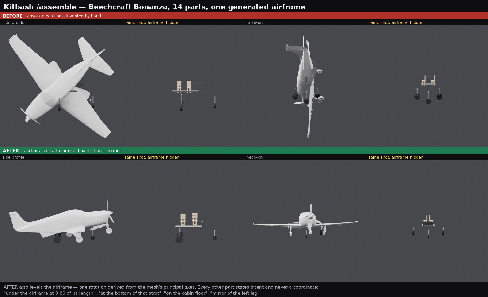

# Multi-part generation

The single feature this project exists for.

## The problem with one-shot generation

Ask any image-to-3D model for "a plane" and you get **one welded blob**. Import
it into Blender and it reports:

```
objects=1  materials=0
```

Nothing is addressable. You cannot move the wings, swap the engine, or fix the
tail, because there are no wings, engine or tail — there is one mesh. If any
part of it is wrong, your only option is to regenerate the whole thing and hope
the reroll is better everywhere else too.

## What we do instead

Generate each part separately, then compose them:

```
prompt → reference image → crop per part → image-to-3D per part → assemble
```

The assembled glTF has one **named node per part**:

```
OBJECTS: 4
  - body         polys=8000  loc=(+0.00,+0.00,+0.00)
  - left_wing    polys=8000  loc=(-1.20,-0.30,+0.00)
  - right_wing   polys=8000  loc=(+1.20,-0.30,+0.00)
  - tail         polys=8000  loc=(+0.00,-0.50,-1.10)
```

Which buys three things:

- **Per-part regeneration.** The tail is wrong? Regenerate the tail. 40 seconds,
  and everything else is untouched.
- **Parts are editable downstream.** Separate objects in Blender, separate
  MeshParts in Roblox.
- **Parts are reusable.** The same generated wheel goes on four vehicles.

## Cropping one reference per part does not work

The obvious way to get per-part references is to crop them out of a single
image of the whole object. It fails, and the failure is instructive.

Tested on a photograph of a Beechcraft Bonanza, cropping tail, propeller, wing
and cowl. **Every crop generated a complete aeroplane.** Not a bad tail — an
aeroplane. Tightening the crops, keying the background to real alpha and
padding generously all changed the result and none of them fixed it.

These models are trained on complete objects and carry a strong
**object-completion prior**: shown an ambiguous partial view of something
recognisable, they reconstruct the nearest whole object they know rather than
the fragment in front of them. A wing seen edge-on in a side view is nearly
information-free, so the prior wins outright.

The first attempt failed differently and is worth recording too: padding the
crop with opaque white produced meshes with the padding reconstructed as walls.
An opaque background becomes geometry — parts need a real alpha matte.

So per-part references have to **depict only that part**, which means either:

- generating each one from its own prompt ("a single aircraft propeller,
  isolated, plain background") — this is why the image provider is load-bearing
  rather than a convenience, and
- **scripting the parts that are scriptable**, which is most hard-surface
  hardware anyway. See [PROCEDURAL.md](PROCEDURAL.md).

A single generation of the whole object still works well and remains the right
move for the organic hero part. It just cannot be subdivided after the fact by
re-generating from crops.

## Placement is the caller's job — but not the arithmetic

`assemble_parts` does not guess where parts go. A coding agent driving this over
MCP is already doing spatial reasoning, and it has context the server does not —
it knows this is a biplane and that the second wing goes above the first.

What it does *not* have is the geometry. Absolute coordinates ask the caller to
invent numbers for meshes it has never measured, and that fails in practice. A
14-part Beechcraft Bonanza placed that way came out with the wheels at heights
unrelated to their struts, the cabin hovering outside the fuselage, and nothing
aligned to the airframe. Every number was a guess and most of them were wrong.

So a part may state **intent** instead, and the server derives the coordinates:

```jsonc
{ "job_id": "...", "name": "nose_wheel", "scale": 0.06, "rotation": [90, 0, 0],
  "anchor": { "to": "nose_gear_strut", "align": { "y": "min" } } }
```



### `anchor`

| Key | Meaning |
| --- | --- |
| `to` | The part to measure against, or `"ground"` for the y=0 plane |
| `align` | Per axis, **where on the target** this part goes |
| `my` | Per axis, **which point of this part** lands there. Default: its centre |
| `offset` | `[x, y, z]` in world units, added after alignment |

Both `align` and `my` take, per axis, a number that is a **fraction of the
target's box** — `0` the low face, `0.2` a fifth along, `1` the high face — or a
name: `min`/`bottom`/`left`, `center`, `max`/`top`/`right`.

`align` additionally takes an **attachment keyword**, which sets both sides of
the join at once so the faces actually touch: `under`/`below`, `above`/`over`/
`on`, and `flush_min`/`flush_max` for flush *inside* the target.

An axis you do not mention is **centred on the target**, so `{"to": "fuselage"}`
on its own means "centre this inside that". Because the anchor fixes all three
axes, `position` cannot be combined with it — use `offset` to move off the
anchor. (An anchor to `"ground"` is the exception: a plane only constrains
height, so `position` still supplies x and z.)

### `mirror_of`

Left and right gear legs are the same part reflected. Placing the left one
places both:

```jsonc
{ "job_id": "...", "name": "right_gear_strut",
  "mirror_of": "left_gear_strut", "mirror": "z" }
```

It takes the whole transform from the named part, so it cannot also set
`position` or `anchor`. `mirror` picks the world plane (`x` by default, or
`{"axis": "z", "about": 0}`) and may also be used on its own to flip a part's
own placement. Face winding is corrected, so a mirrored part is not inside-out.

### Order does not matter

Anchors form a graph, resolved by topological sort. A wheel may be listed before
the strut it hangs from, and a chain — wheel → strut → airframe — resolves in
the right order regardless. A cycle raises `placement cycle: a -> b -> a` rather
than hanging.

### It measures the placed part, not the file

The target's bounds are computed from its **transformed vertices**, after its
own scale, rotation and anchor. This is the whole point: a part scaled `0.05`
occupies a twentieth of the box its `.glb` reports, and anchoring to the file's
bounds would leave the wheel most of a unit away from the strut. It is also why
a rotated part anchors correctly — a fin turned on its side is measured on its
side.

### Verifying without opening the mesh

Every part in the `/assemble` response now reports its **final world bounds**:

```jsonc
{ "name": "left_wheel", "anchored_to": "left_gear_strut", "mirrored_from": null,
  "position": [-0.0709, 0.0319, 0.1911],
  "bounds_min": [-0.1028, 0.0, 0.1805], "bounds_max": [-0.039, 0.0639, 0.2017],
  "size": [0.0638, 0.0639, 0.0212], "center": [-0.0709, 0.032, 0.1911] }
```

Which is enough to check placement mechanically — that the wheel's `bounds_min.y`
is `0.0` says it is on the ground, and no one had to download the scene and look
at it. It also closes the loop: the Bonanza's gear legs are positioned by
assembling once, reading back how far each wheel is off the ground, and
correcting the attachment fraction. `anchored_to` and `mirrored_from` record how
each part got where it is, so an anchor that quietly resolved to the origin is
distinguishable from a deliberate absolute position.

What the server still provides, unchanged, is **measurements rather than
guesses**: `describe_part` returns real bounds, size and center for a part on
its own, which is how you choose a scale in the first place.

## Coordinate convention

glTF: **+Y is up**, +X right, +Z toward the viewer. Stack along Y.

**Roblox is Y-up too**, so nothing is converted on import — what you place is
what you get, and the importer's defaults are already correct.

**Blender is Z-up** and converts, mapping glTF `(x, y, z)` to Blender
`(x, -z, y)`. A part placed at `[0, -1.1, 0.5]` shows up in Blender at
`(0, -0.5, -1.1)`. This trips people up when they verify placement in Blender
and conclude the assembly is broken; it isn't.

## Transform order

Scale, then rotate (XYZ euler degrees), then translate. The usual order, but
worth stating because getting it backwards is a silent failure — the model
looks wrong rather than erroring.

An anchor computes the translate, so it sits at the end of that chain: the part
is scaled and rotated first, and the anchor then measures the result. A `mirror`
is applied after everything, reflecting the placement that the rest produced.

## Detail budget per part

Each part carries its own face budget, which is a real advantage: the part
someone will look at closely can be dense while background parts are cheap. Pass
`use_raw` on a part to assemble from its pre-decimation mesh.

See [DECIMATION.md](DECIMATION.md) for how far each part can be reduced.
