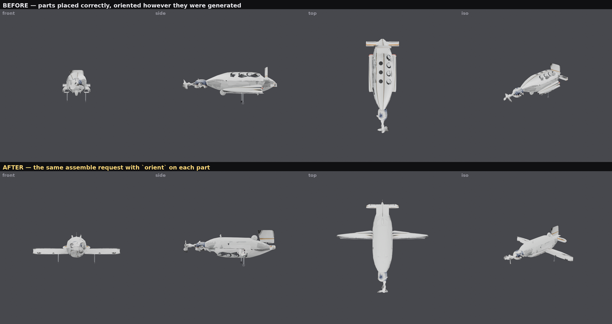
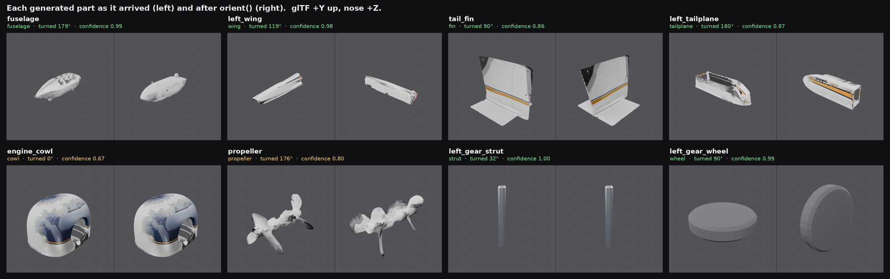

# Canonical orientation

`server/orient.py`. The last structural gap in the multi-part pipeline: parts
that are the right size, in the right place, the right colour — and facing the
wrong way.



Both rows are the same twelve parts and the same `/assemble` request. The only
difference is an `orient` key on each part.

## The problem

An image-to-3D generator reconstructs an object in **its input camera's frame**.
The reference image was a three-quarter view, so the mesh comes back turned by
whatever angle that image happened to use. Nothing downstream can recover from
it: `anchor` measures a *bounding box*, and a box cannot tell that the thing
inside it is lying down.

Measured on the last Bonanza run — every part normalised to its own longest
axis, so only the shape of the box is being compared:

| part | raw extents [x, y, z] | longest axis | should be |
| --- | --- | --- | --- |
| `fuselage` | [0.28, 0.31, 1.00] | z | z — right by luck, **and facing backwards** |
| `left_wing` | [0.17, 0.22, 1.00] | z | x, spanwise |
| `tail_fin` | [1.00, 0.80, 0.74] | x | y, vertical |
| `left_tailplane` | [1.00, 0.22, 0.29] | x | x |
| `propeller` | [0.73, 0.63, 1.00] | z | z |

Half the set is wrong and the errors do not agree with each other, which is what
makes an assembly look like debris rather than like a badly-built aeroplane.

One rotational degree of freedom had already been fixed: TRELLIS emits Z-up and
the untextured path was skipping the node that converts to glTF's Y-up, so
everything was rolled 90 degrees. That is a bug with a single global answer.
**Azimuth is not** — it was 318 degrees on one subject and 174 on another,
because it is a fact about the reference image, not about the pipeline.

## What the caller already knows

Not the rotation — but what the part *is*. A Bonanza wing is 4.4 m of span,
1.4 m of chord and 0.25 m thick. That is enough to derive the rotation, and it
is knowledge the caller has before anything is generated: the same knowledge
that wrote the prompt.

```jsonc
{ "job_id": "...", "name": "left_wing", "orient": "wing",
  "anchor": { "to": "fuselage", "align": {"x": 0.12, "y": 0.28, "z": 0.45} } }
```

`orient` takes a role name, a bare `[x, y, z]` of target extents, or an object:

| key | meaning |
| --- | --- |
| `role` | a named shape — `wing`, `fin`, `fuselage`, `cowl`, `propeller`, `wheel`, `strut`, `tailplane`, `blade`, `plate`, `rod`. `GET /orient/roles` lists what each declares |
| `extents` | `[x, y, z]` the part should measure once assembled. Real metres are ideal; only the ratios are used |
| `taper` | per axis, `"+"` or `"-"`: the direction the part gets **thinner** in |
| `spin` | `"x"`, `"y"` or `"z"`: the axis the part is rotationally symmetric about |
| `min_confidence` | leave the part as generated rather than turn it on a guess |

Nothing is regenerated. This repairs meshes that already exist, on the CPU, in
about 0.25 s a part.

## How it works

### 1. The part's own frame

Fit an oriented bounding box and the rotation is one of the 24 ways of putting
its axes on the world axes. trimesh's `oriented_bounds` needs a convex hull,
which needs scipy, which this server does not have and does not want (see
[TEXTURING.md](TEXTURING.md) making the same trade over KD-trees). So the box is
found here: sweep candidate box-face normals over a hemisphere — plus the mesh's
own dominant surface normals, which is where the answer usually is — and for
each one solve the remaining in-plane angle exactly, because with the third axis
pinned the problem drops to a 2D minimum-area rectangle and a quarter turn of
angles is one vectorised pass.

The objective is **not** minimum volume. It is

```
log(volume) − 3 × surface agreement
```

where surface agreement is the area-weighted mean of how closely each face
normal lines up with its nearest box axis. This is the single most important
line in the module, and the generated tail is why. That part is a fin with a
stabiliser across its foot — a cruciform in plan — and *the minimum-volume box
of a plus sign is the one turned 45 degrees*, because a diagonal rectangle round
a cross is smaller than the upright one. On a clean cross that box is 40%
tighter and completely meaningless; it put the fin on the diagonal and every
downstream measurement inherited it. A hard-surface part's real frame is written
in its face normals. Weighted like this the cruciform lands square (agreement
0.99 against 0.80) and every organic part in the set keeps the frame volume
alone chose, to within a percent.

### 2. Which axis is which

Sorting extents against the declaration is the obvious rule and it is not
enough. Generated parts are *chunky* — the Bonanza wing measures 1 : 0.22 :
0.17, so its chord and thickness are a third apart where the real wing's are a
factor of five — and, worse, a box is not the part: a plate with an upturned tip
fence is taller than it is deep, so sorted extents stand it on its edge. That is
the generated tailplane's shape, whose curled trailing edge makes its box a
third deeper than the plate inside it.

Two more pieces of evidence carry it:

- **Surface normals.** A slab spends most of its area on the two faces that look
  along its flat axis, whatever its box says — 69% on the tip-fenced plate — and
  a declared box predicts that distribution without the caller having to think
  about surfaces at all: the faces perpendicular to axis *i* have area
  proportional to the other two extents.
- **Rotational symmetry.** Some parts have no long axis worth sorting. The
  generated propeller is a spinner with blades round it, longer than its disc is
  wide, so sorted extents lay it on its side. `spin` names the axis it turns
  about, and that axis is *detected*: turn the voxelised part by a third, a
  quarter and a sixth of a turn about each box axis and see whether it lands on
  itself. The propeller scores 0.86 about its shaft and 0.23 and 0.20 about the
  other two. Half a turn is deliberately not tested — nearly everything is
  roughly two-fold symmetric about something, and including it sent the cowl in
  sideways.

### 3. The 180-degree question

An OBB cannot tell nose-forward from nose-backward, or a wing's leading edge
from its trailing edge, and a propeller pointing backwards is as wrong as one
lying sideways. Nothing about the box will ever answer it, so the answer comes
from where the **mass** sits: the signed offset of the area-weighted surface
centroid along each axis, as a fraction of half the part. A wing is fatter at
the root, a fuselage at the cabin, a fin at its base.

`taper` says which way the caller expects that to run. `{"x": "-"}` reads as
"this thins toward −x", so the fat end is at +x. Measured on the real parts, a
tapered axis runs 0.13–0.29 and a symmetric one under 0.02, which is a clean
separation.

Two details that took a rewrite each:

- A taper both **rewards** an axis that really does taper and **punishes** one
  that tapers the wrong way. Punishment alone is not enough: a symmetric axis is
  never *wrong*, so a fin whose height and chord are declared equal would put
  its uniform chord upright at no cost, on a coin flip.
- The reward is capped well below the punishment. Being fat at the expected end
  is weak evidence that this is even the right axis — everything is lopsided
  about something — while being fat at the wrong end is strong evidence that it
  is not. Uncapped, the cowl's sideways lopsidedness outvoted its own measured
  axis of revolution and the cowl went on the aeroplane sideways.

### Which cue actually did the work

Worth knowing, because a scoring function with four terms in it invites the
suspicion that three of them are decoration. Turning each one off and
re-orienting all eight Bonanza parts:

| term off | what changes |
| --- | --- |
| extents | nothing turns differently; confidence falls hard — fuselage 0.99 → 0.75, wing 0.98 → 0.75 |
| surface normals | nothing turns differently *on this set*; fin 0.86 → 0.72, tailplane 0.87 → 0.81. It decides the tip-fenced plate above, which is the shape it exists for |
| rotational symmetry | **the propeller goes on sideways**, its shaft across the aeroplane, confidence 0.80 → 0.34 |
| taper | **the fuselage flies backwards** (turned 1° instead of 179°) and the tailplane's leading edge points aft |

So the extents and the normals mostly agree with each other and mostly settle
*which axis*; `spin` is the only thing that saves a part whose extents are a
lie; and `taper` is the only thing that answers 180 degrees at all. Each term
is load-bearing for a different part, which is roughly the argument for keeping
all four.

### 4. Declare only what holds

The roles in `orient.ROLES` are worth reading as a design statement, because two
of them are deliberately vague:

```python
"fin": {"extents": [0.12, 1.0, 1.0], "taper": {"y": "+"}},
"cowl": {"extents": [1.1, 1.1, 1.4], "spin": "z"},
```

A real fin is taller than its chord; a *generated* fin often is not, and this
one came back squatter than it is long. Declaring the true proportion put it up
on its leading edge. Declaring height and chord as **equal** costs nothing —
two equal extents cannot be got the wrong way round — and hands the decision to
the taper, which holds for every fin ever built. A cowling, meanwhile, is a
barrel open at both ends and measures within 5% of symmetric along its axis, so
it is given no taper at all. Declaring a front for it would be inventing
evidence, and the module duly found some.

The general rule: **an honest tie costs nothing and a wrong claim costs an
axis.**

## Confidence

Every result carries one, because some parts genuinely have no answer and
guessing is worse than doing nothing.

It is not a vibe. It is the expected **agreement** between the orientation that
was chosen and every other orientation the declaration still permits:

```
confidence = Σ  P(candidate) × voxel_overlap(candidate, chosen)
```

with `P` a softmax over how badly each candidate contradicts the declaration.
Which gives the right answer at both ends, and this is why it is defined by
consequence rather than by certainty:

- A **cube** is ambiguous in every direction and perfectly safe: all 24 readings
  are the same shape, they overlap completely, and confidence stays high. It
  should — turning a cube is a no-op.
- A **wheel** or a **cowl** is ambiguous about how it is clocked round its own
  axis, and equally safe. When a `spin` axis has been detected, rivals that
  differ only by a turn about it are scored as agreeing, because they are not a
  different answer.
- A **wing** whose rival reading is edge-on overlaps badly, so any real doubt
  collapses the number.

`min_confidence` on a part turns that into policy: below the floor the part is
placed exactly as it was generated, and the result is still reported so the
caller can see the number it declined. The notes say *why* — "the mesh is not
the shape it was declared to be", "the part is near-symmetric end to end, so
which way round it faces is a guess" — because 0.67 on its own does not tell
anyone whether to re-declare, re-generate or place it by hand.

## Results

The twelve-part Bonanza from scene `43fc169a61be`, eight distinct meshes,
re-assembled with orientation and nothing else changed:



| part | role | raw extents | oriented | turned | confidence |
| --- | --- | --- | --- | --- | --- |
| `fuselage` | fuselage | [0.28, 0.31, 1.00] | [0.28, 0.32, 1.00] | 179° | 0.99 |
| `left_wing` | wing | [0.17, 0.22, 1.00] | [1.00, 0.17, 0.22] | 119° | 0.98 |
| `tail_fin` | fin | [1.00, 0.80, 0.74] | [0.74, 0.80, 1.00] | 90° | 0.86 |
| `left_tailplane` | tailplane | [1.00, 0.22, 0.29] | [1.00, 0.29, 0.22] | 180° | 0.87 |
| `engine_cowl` | cowl | [0.74, 0.70, 1.00] | [0.74, 0.70, 1.00] | 0° | 0.67 |
| `propeller` | propeller | [0.73, 0.63, 1.00] | [0.62, 0.69, 1.00] | 176° | 0.80 |
| `left_gear_strut` | strut | [0.11, 1.00, 0.11] | [0.11, 1.00, 0.11] | 32° | 1.00 |
| `left_gear_wheel` | wheel | [1.00, 0.21, 1.00] | [0.21, 1.00, 1.00] | 90° | 0.99 |

Total 1.95 s for the eight, on the laptop, no GPU. Two entries are worth
reading twice:

- The **fuselage** was already on the right axis and was turned 179 degrees
  anyway. It was flying backwards, and no extent table could have shown that —
  only the mass offset along its length, +0.09 toward the cabin.
- The **cowl** was turned 0 degrees. Its own frame was already the world's, and
  with no taper declared there was nothing to flip, so the tie-break — prefer
  the answer that moves the part least — left it alone. A part that is already
  right is not spun for the sake of it.

The two low scores are both honest, and both were checked against the geometry
rather than assumed:

- The **cowl** at 0.67 is a barrel: sliced along its axis it measures a mean
  radius of 0.212 at one end and 0.203 at the other. There is no front.
- The **propeller** at 0.80 reports "near-symmetric end to end", and it is: the
  reconstruction has blades at *both* ends, 0.417 and 0.408 of maximum radius.
  Its facing is a coin flip because the mesh does not have one.

### Does it read as an aeroplane

Yes, from all four views. Wings horizontal and spanwise, tail fin vertical,
tailplanes horizontal at the tail, propeller on the nose, gear underneath. The
render at the top of this page is Blender 4.0.2 on the laptop, straight from the
`/assemble` output, no hand editing.

What is *still* wrong in it is not orientation: the propeller is a lumpy spindle
and the fin is a slab, because those two meshes are poor reconstructions. The
module says so — they are the two lowest confidences in the table — and that is
the useful outcome. **When orientation reports low confidence on a part, the
usual cause is that the part is bad, not that the orientation is.**

## Wiring

Resolved in `assemble.resolve_placements` **before** any placement, so anchors
measure the part as it will appear. Anchoring a wheel to a strut that is about
to be stood upright would otherwise measure the strut lying down.

Transform order is `orient → scale → rotation → translate`. Orientation first
means everything after it is stated in the frame the caller was thinking in — a
non-uniform `scale` applies to the part's real span and chord rather than to
whatever the generator's axes happened to be — and a `rotation` alongside an
`orient` is therefore a deliberate nudge on a canonical part (dihedral, an
incidence angle) rather than a competing absolute.

`mirror_of` inherits the source part's whole transform, orientation included, so
a right wing costs nothing and cannot disagree with its left. Setting both is an
error rather than a silent contest.

A decomposition plan needs no new vocabulary: `placement` is passed through to
`/assemble` untouched, so a part in a plan can carry `"orient": "wing"` today.

```jsonc
// POST /assemble
{ "parts": [
  { "job_id": "...", "name": "propeller", "orient": {"role": "propeller"},
    "anchor": {"to": "engine_cowl", "align": {"z": "max"}, "my": {"z": 0.35}} },
  { "job_id": "...", "name": "tail_fin", "orient": {"role": "fin", "min_confidence": 0.5} }
]}
```

Every part in the response reports what happened:

```jsonc
{ "name": "tail_fin", "size": [0.167, 0.182, 0.226],
  "orient": { "applied": true, "confidence": 0.863, "degrees": 90.0,
              "rotation": [-90.0, 89.9, -90.0],
              "extents": [0.741, 0.804, 1.0], "declared": [0.12, 1.0, 1.0],
              "asymmetry": [-0.003, -0.285, 0.011],
              "notes": ["x measures 0.74 of the part's length where the declaration says 0.12 — the mesh is not the shape it was declared to be"] } }
```

## Honest limits

- **A declaration can be wrong, and then the answer is wrong.** The module can
  say the mesh does not match what it was told (it does, in `notes`), but it
  cannot know which of the two is at fault. Declaring proportions a generated
  part does not have is the single most likely way to misuse this; see
  "declare only what holds" above.
- **Two-blade propellers are invisible to `spin`.** Half-turn symmetry is too
  common to be evidence, so a two-blade rotor has to be declared by extents.
- **The box is approximate.** A randomised direction search with a fine
  in-plane solve, not an exact hull-based minimum: extents land within about 2%
  and the axes within a degree or so, which decides every axis assignment in
  practice but is not a number to build a tolerance on. It is deterministic —
  fixed direction set, fixed seed — so the same mesh always gives the same
  answer.
- **It cannot recover a part that is not a shape.** A near-cubic reconstruction
  has no frame to find. That is what the confidence is for.
- **Confidence is about consequence, not correctness.** A high number means
  every reading the declaration allows looks the same, which is exactly what a
  caller needs to decide whether to apply a rotation — but a part whose
  declaration was a lie can be confidently wrong. Read the notes.
