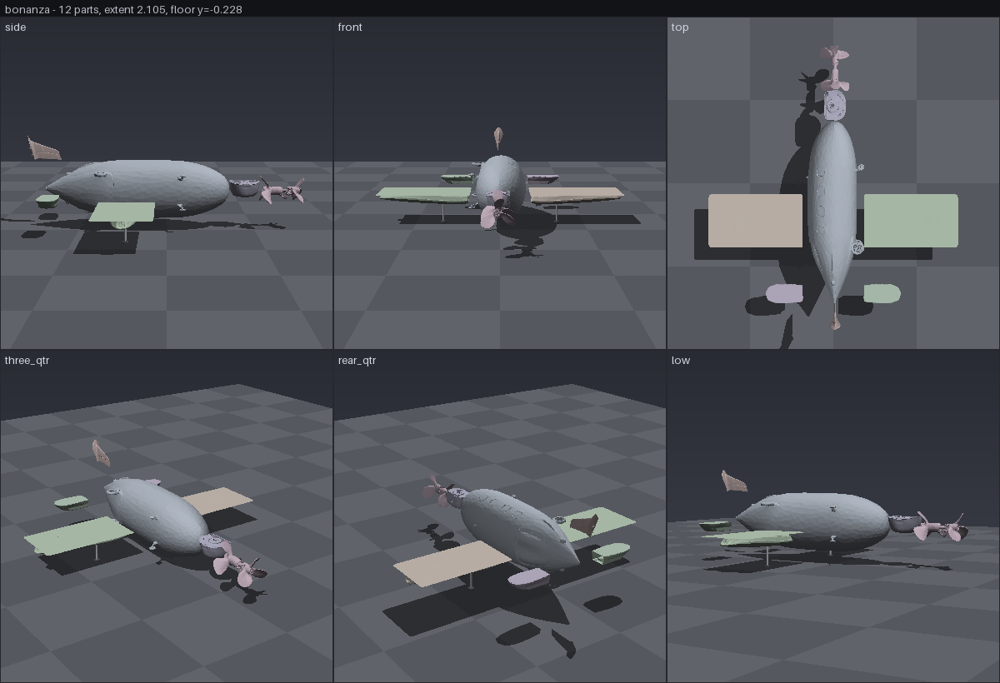
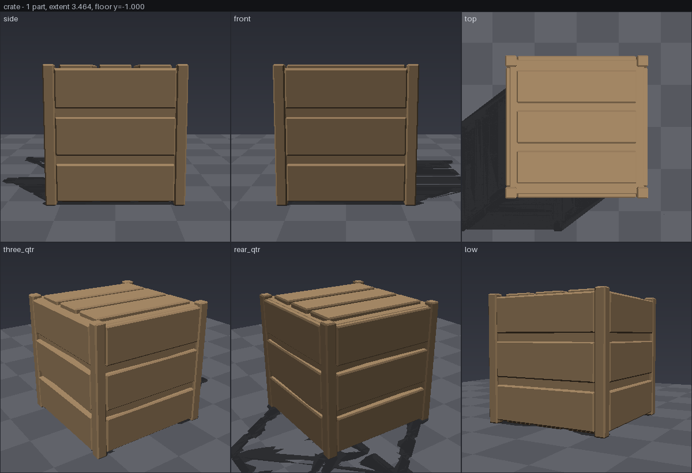

# Preview — giving the agent eyes

`server/preview.py`, `GET /jobs/{id}/preview`, `GET /scenes/{id}/preview`, and the
`preview_scene` / `preview_part` MCP tools.

## Why this exists

Assembly is a split job. An LLM authors placement *intent* — "the wing joins the
fuselage at mid-height, the wheel sits under the strut" — and the server resolves
that to coordinates from measured bounds. That split is right: an LLM inventing
coordinates for geometry it has never measured produced a debris field.

But the loop was open. The agent assembled and never saw the result. Every defect
recorded in `docs/MULTI-PART.md` was found the same way: a human opened the scene
in Blender, rendered it, and handed the picture to a model. The model could
diagnose the problem instantly *once it could see it*. It had no way to see it on
its own.

`POST /assemble` returns a part list — names, face counts, bounds, positions — and
that list describes a debris field exactly as convincingly as it describes an
aeroplane. Numbers do not have silhouettes.

This module is the eyes. It renders a scene to a shaded contact sheet and the MCP
tool returns it as image content, so the picture lands in the model's context in
the same turn as the tool call.

## The picture



Scene `e234624ca7fe`, a 12-part Bonanza, rendered in 1.4 s of pure numpy. Three
known defects, all visible without being told where to look:

- the **tail fin floats** — the tan flag hanging above and behind the fuselage in
  `side`, `three_qtr` and `low`, with its shadow lying on the floor a long way
  from it;
- the **wings never joined** — the two slabs in `top` are separated from the
  fuselage by a clear gap, and in `three_qtr` they hover with their own shadows
  under them;
- the **propeller overshoots** — a visible gap between it and the nose in every
  elevation.

Compare against the Blender render the same scene was diagnosed from
(`docs/images/preview-bonanza-vs-blender.png`): the defects read at least as
clearly here, and the framing is *more* honest, because Blender's harness
auto-framed each view.

The control, a scripted crate — one part, no defects, wood from its glTF
material, sitting on the floor with a shadow that touches it:



That is what "nothing is wrong" looks like, which is the comparison the aircraft
above needs to be read against.

## Design

### Software rendering, no GPU

Pure numpy: z-buffer, flat diffuse-plus-ambient shade, per-part colours from the
glTF materials. No OpenGL, no Blender, no CUDA.

This is not an aesthetic choice. The box has a card and the card is busy
generating — that is the entire point of the machine. A preview that only works
when the GPU is idle is a preview an agent cannot rely on, and it would be
unavailable at exactly the moment it is most wanted: halfway through a multi-part
build. It also means the renderer runs on the laptop and in CI, so the tests that
assert a floating part is visible actually run.

### A ground plane, always

A part floating in space looks fine. Everything is floating in space; nothing
looks wrong. The same part floating above a floor is obviously wrong, and its
cast shadow — sitting somewhere the part is not — says so a second time.

Floating parts are the most common assembly defect, so the floor is not
optional. It goes at the bottom of the scene's own bounds rather than at `y=0`,
because assembly places parts wherever the placement maths lands them and nothing
guarantees the origin is the ground. What matters is which parts fail to reach
the lowest thing in the scene.

Shadows are geometric, not a shadow map: every triangle is slid down the key
light's ray until it hits the floor and drawn dark. All triangles, not the
light-facing half — that halving is only valid for a closed surface, and
generated parts are open shells whose lit-facing set has holes that come through
as speckle.

`GET /scenes/{id}/ground` reports the same thing as a number: each part's gap
above the floor, worst first. A gap is only a defect if nothing holds the part
up — a wing on a fuselage should clear the floor; a wheel should not.

### One fixed camera for every view

Auto-framing per view re-frames on whatever that view happens to see. A part that
has drifted 30% of the model's length out of place pushes the frame out with it,
and the result looks like a slightly wider shot of a correct model. This was a
real bug in the human-side render harness, and it is visible in the Blender
ground truth: its `side` tile is framed noticeably tighter than its `top` tile of
the same object.

So the camera here is derived once, from the whole scene, and never recomputed:

- `Framing.of(parts)` takes the centre, the bounding radius and the floor height
  from **every** part;
- the scale comes from projecting every vertex through **every view in the
  catalogue** and taking the worst reach, so it does not depend on which views
  were requested either;
- highlighting or isolating a part does not touch it.

That last one is what makes `isolate` safe to offer. The isolated part renders at
the same pixels it occupied in the full sheet, so flipping between the two
answers "did it move?" rather than producing two pictures that both look fine.

Measured on real vertices rather than bounding-box corners, incidentally: a
corner of an aircraft's bounding box is empty air, and under perspective it sits
nearer the camera than any actual geometry, which inflated the frame ~20% and
shrank the subject for nothing.

### Four views minimum

A single view hides exactly the faults that matter. A wing detached along X is
invisible from the side. A fin floating in Y is invisible from the top. The
default sheet is six: `side`, `front`, `top`, `three_qtr`, `rear_qtr`, `low`.

`low` is nearly eye-level on purpose — the horizon cuts the model, so a hovering
part is separated from the floor by visible background rather than by a gap you
have to judge.

### Colour

Per-part base colour comes from the glTF, in the order the sources carry real
information: a base-colour texture sampled at the face's UV, then per-vertex or
per-face colours, then the material's `baseColorFactor` — which is what
`server/materials.py` assigns from the part name, so a part called `wheel` reads
as black rubber and a part given `color: "#cc2222"` reads red.

`baseColorFactor` is linear and a screen is not, so it is gamma-encoded for
display. Skipping that is the standard way a software render comes out muddy;
`materials.parse_color` deliberately converts the other way when a caller types
a hex colour, and this undoes it.

A part with no material at all gets a pale, faintly tinted grey, stable for a
given part name. It could be flat grey — the Blender ground truth is — but two
grey parts that touch merge into one silhouette, and "did the wing detach" is
exactly the question the preview has to answer. The tint is near-neutral so it
separates parts without claiming the part is that colour.

`highlight=<name>` paints one part magenta, a colour no material family can
produce, and leaves every other pixel *exactly* as it renders without it — so a
before/after pair isolates that part and nothing else.

### The rasteriser

Projection is `texturing.Camera`, unchanged: the same yaw/pitch/persp convention
used in the opposite direction. Back-projection asks which pixel a triangle comes
from; a preview asks which triangle a pixel shows. There is one camera model in
this codebase.

The rasteriser is a second implementation of the same half-space/barycentric/
z-buffer algorithm, and that is a measurement rather than a preference.
`texturing.rasterize` loops in Python per triangle, which is right when you
rasterise once against a reference photo — 1.7 s for the 93k-face Bonanza at
400 px. A contact sheet rasterises six times, plus shadow geometry, and 20 s per
preview is not something an agent will call in a loop.

`preview._rasterize` batches triangles by the power-of-two box that covers their
screen bounds, independently in x and y, so a whole group shares one candidate
grid and the per-triangle Python overhead disappears. A preview is
overwhelmingly sub-pixel triangles, so nearly everything lands in the smallest
buckets. Depth is resolved with a lexsort rather than `np.minimum.at`, which is
about an order of magnitude slower at these sizes.

Bucketing per-axis rather than square matters more than it sounds: a floor quad
320 px wide and 6 px tall would otherwise allocate a 512x512 grid, 99% of it
outside the triangle, and that alone made a 1.4k-face crate slower to draw than a
93k-face aircraft.

`test_batched_rasterizer_agrees_with_the_reference_one` pins the two
implementations to identical output on random geometry.

## Cost

Measured on the dev laptop (no GPU), default sheet, 1200 px wide, six views:

| scene | parts | faces | render | PNG |
|---|---|---|---|---|
| Bonanza `e234624ca7fe` | 12 | 92,697 | 1.4 s | 118 KB |
| scripted crate | 1 | 1,380 | 0.85 s | 44 KB |
| one part isolated | 1 | 11,692 | 0.22 s | 30 KB |

Fast enough to call after every assembly and again after every fix, which is how
it is meant to be used. No VRAM, so it works while the GPU is generating.

## HTTP

```
GET /jobs/{job_id}/preview        -> image/png
GET /scenes/{scene_id}/preview    -> image/png
GET /scenes/{scene_id}/ground     -> gap above the floor, per part
GET /preview/views                -> the view catalogue
```

Query parameters on both preview routes:

| param | default | meaning |
|---|---|---|
| `views` | all six | comma-separated view names, in sheet order |
| `size` | 1200 | sheet width in pixels, 256–2400 |
| `columns` | 3 | tiles per row |
| `highlight` | — | paint this named part magenta |
| `isolate` | false | with `highlight`, hide every other part |

PNG comes back directly, `Cache-Control: no-store` — the same scene id is
re-rendered after a part is fixed.

```
curl -o scene.png 'http://gpu:8188/scenes/e234624ca7fe/preview?size=1600'
curl -o fin.png   'http://gpu:8188/scenes/e234624ca7fe/preview?highlight=tail_fin&isolate=true'
```

## MCP

`preview_scene` and `preview_part` return the sheet as MCP image content —
`{type: "image", data: <base64>, mimeType: "image/png"}` — so the model *looks at
it* rather than being told a file path. That is the whole deliverable; everything
above is plumbing that makes it possible.

`preview_scene` also carries the ground report in its text block, so "it looks
like it is floating" can be checked against a number in the same turn.

The tool descriptions tell the agent to call `preview_scene` after every
`assemble_parts` and before reporting success, and `assemble_parts` repeats it in
its own result. The intended loop:

```
assemble_parts  ->  preview_scene  ->  look  ->  fix a position  ->  assemble_parts  ->  preview_scene
```

`preview_part` is worth calling before assembling too. Generation returns
whatever the model made of the prompt, and "a hollow elongated shell with six
oval portholes" comes back as a whole aeroplane often enough (see
`docs/DECOMPOSITION.md` on the completion prior) that a second of CPU is a good
trade.

`mcp/scripts/preview-smoke.mjs` drives both tools over stdio and asserts the
result really is image content decoding to a PNG, because a tool that silently
returned a file path in a text block would look like it worked and would defeat
the entire purpose.
