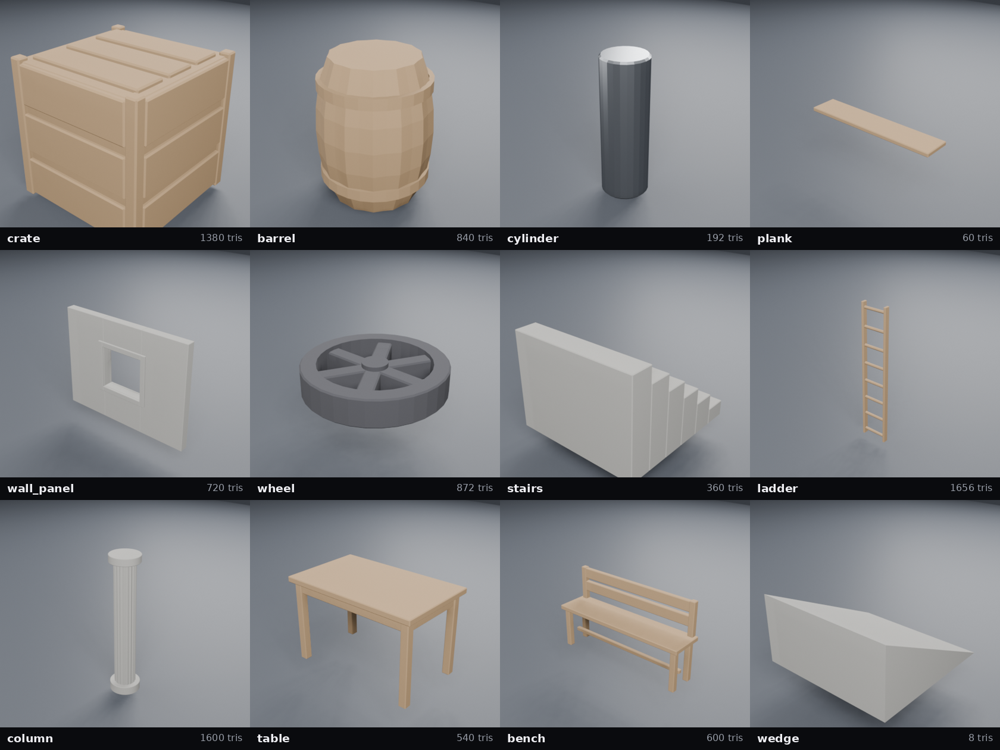
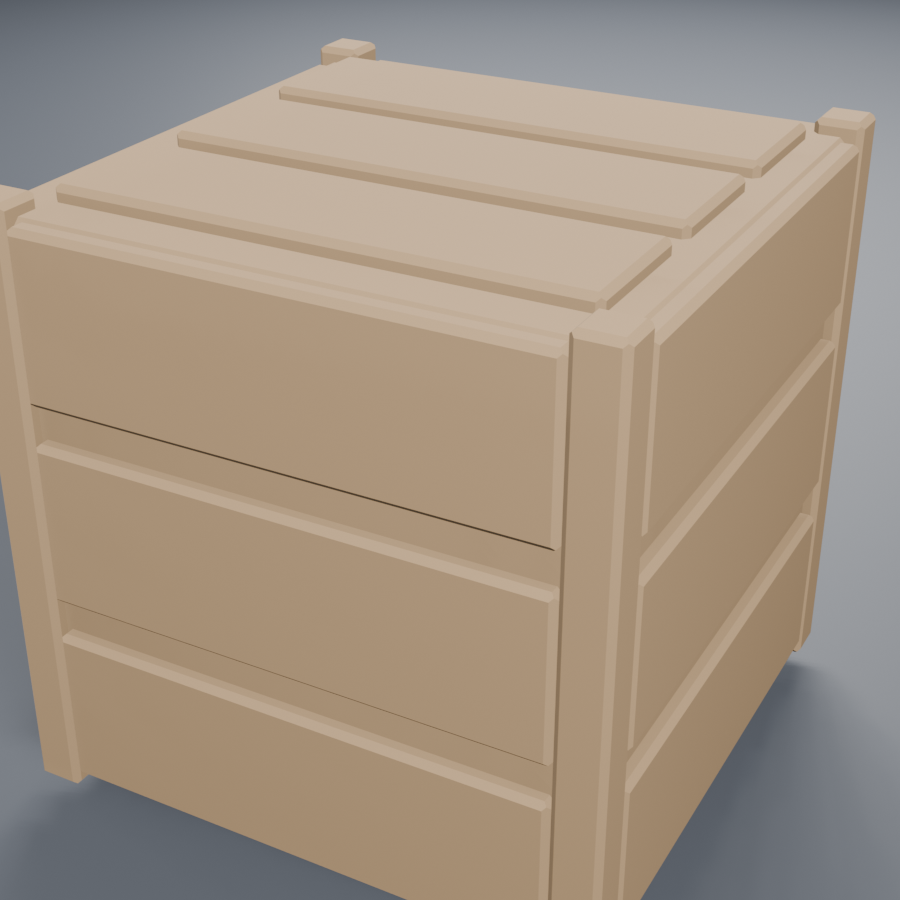
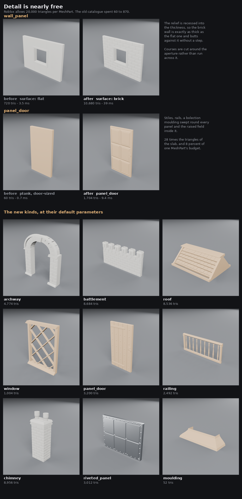
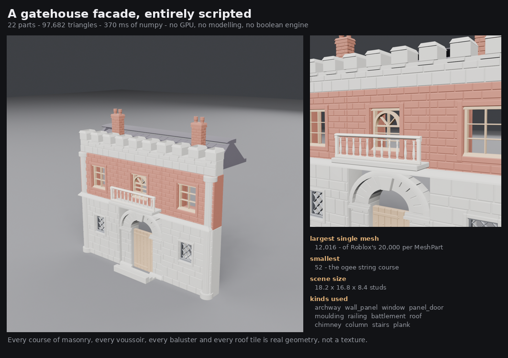
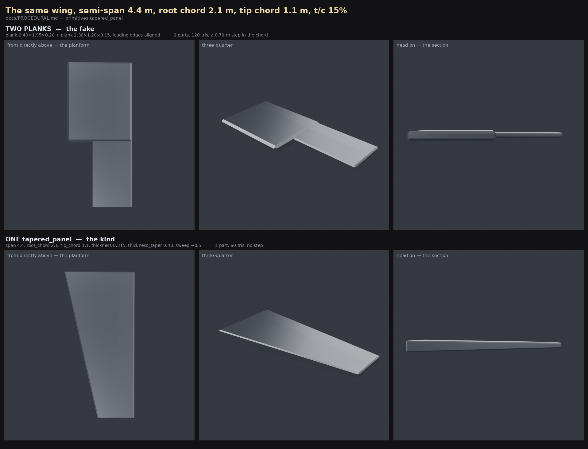
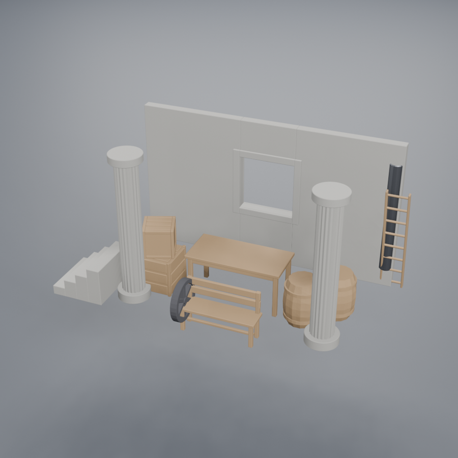

# Procedural parts

**A crate is the most expensive thing either generator makes, and the cheapest
thing to write down.** That sentence is the whole argument. `server/primitives.py`
is a library of parametric game props that produces a part record indistinguishable
from a generated one, so `/assemble` and `/export` cannot tell which half of the
pipeline a part came from.



## Why this exists: the crate is the worst case

[QUALITY-COMPARISON.md](QUALITY-COMPARISON.md) benchmarked three hard-surface
props against both generators. The crate was the most expensive subject for
both, and by a wide margin:

| Crate, image-to-3D | Wall | Peak VRAM | Faces out |
| --- | --- | --- | --- |
| Hunyuan3D 2.1 | 83.1 s (41.0 s gen + cold load) | 9.27 GiB | 19 982, decimated from 888 558 |
| TRELLIS 2, `512` / 2048 | **151.2 s** | **6.88 GiB** | 20 691, decimated from 9 762 008 |
| TRELLIS 2, recommended `1024_cascade` / 4096 | **killed at 21 min** | 9.69 GiB — 96 % of budget | — |

That document also explains *why*, and the reason is structural rather than a
tuning problem: **generation cost scales with occupied volume.** A dragon is
mostly empty space — thin wings, thin limbs — and is cheap. A crate is solid,
fills its voxel grid, and saturates the token budget. The eval that recommended
TRELLIS 2's settings measured them on a dragon. Kitbash's actual workload is
Roblox props, which are overwhelmingly solid boxes.

And after all that, the geometry still has the failures QUALITY-COMPARISON
records by eye: "every edge is slightly rounded where the reference is a crisp
90°, the large panels visibly undulate, and the brackets are mushy lumps."

The same crate, written down:



| | Generated crate | `POST /primitives {"kind": "crate"}` |
| --- | --- | --- |
| Wall time | 83–151 s | **4.6 ms** |
| VRAM | 6.88–9.27 GiB | **none — no GPU involved** |
| Faces | 20 000 (decimated from 0.9–9.8 M) | **1 380** |
| File | ~1 MiB | **25.7 KiB** |
| Dimensions | whatever came out, measured afterwards | **exactly what was asked for** |
| Watertight | not after decimation | **yes** |
| Edges | rounded, panels undulate | **flat panels, 90° corners, uniform chamfer** |
| Material | inferred from the part name | inferred from the *kind* — a crate is wood |
| Reroll | another 83 s | change a number |

Four milliseconds against eighty-three seconds is a factor of eighteen thousand.
That is not an optimisation, it is a different category of operation.

## The routing rule

**Geometric, man-made, dimensioned → script it. Organic, sculptural,
irregular → generate it.**

The two halves fail in exactly opposite directions:

| | Procedural | Generative |
| --- | --- | --- |
| Best at | boxes, cylinders, repeated structure, anything with a measurement | faces, foliage, creatures, rock, cloth, ornament |
| Worst at | anything you cannot write a formula for | flat planes, sharp creases, thin plates, exact sizes |
| Cost driver | face count you chose | occupied volume you did not |
| Failure mode | looks generic | looks melted |

A multi-part build usually wants both. Script the cart's wheels, bed and
staves; generate the horse. That is why the two paths share a job record rather
than living in separate systems — see *Interchangeability* below.

## The budget nobody was spending

Roblox enforces **20 000 triangles per `MeshPart`**. A generated part spends its
entire budget getting a silhouette right. The scripted catalogue used to spend
**60 to 870** — between 0.3 % and 4 % — and the whole thirteen-kind library came
to 8 888 triangles, less than half of what *one* generated crate costs.

That was not thrift, it was a habit carried over from a constraint that does not
apply here. A wall can carry five thousand triangles of real relief and still sit
at a quarter of the cap. So the second half of this library is about spending it:



| | before | after |
| --- | --- | --- |
| `wall_panel` | 720 triangles, a chamfered slab with a hole in it | **10 680** — twelve staggered courses of brick on both faces, cut around the aperture |
| a door | a `plank`, 60 triangles | **1 704** as `panel_door` — stiles, rails, a bolection moulding swept round every panel |
| whole catalogue | 8 888 across 13 kinds | **57 642 across 22 kinds** — still under three `MeshPart`s |

The arithmetic that makes this safe is that the cap is **per mesh**, and a
building is many meshes. The gatehouse below is 97 682 triangles across 22
parts; the largest single part is 12 016, and Roblox is asked for 22 separate
20 000-triangle budgets rather than one.

Build times move with it — a brick wall is 38 ms of numpy rather than 3 ms —
and 38 ms against 83 seconds of GPU is still a different category of operation.

## build123d vs. trimesh

I evaluated `build123d` properly rather than dismissing it, and **did not adopt
it.** The library is genuinely good and it installs cleanly on Python 3.12 in
one command. Three findings sank it for this use:

**1. It is not the permissive stack it looks like.** `build123d` is Apache-2.0
and `cadquery-ocp`'s wheel metadata says `License: Apache-2.0`, but the wheel
ships `libTK*.so.7.9.3` — the Open CASCADE kernel, which is **LGPL-2.1 with the
Open CASCADE exception**. The Apache label describes the Python bindings, not
the binaries that do the work. [DECIMATION.md](DECIMATION.md) explains why this
project keeps `pymeshlab` off the import path despite it being installed and
capable; taking on a bundled LGPL CAD kernel to draw boxes is the same trade in
the other direction.

**2. It costs 592 MB and 40+ transitive dependencies** — scikit-learn, sympy,
scipy, IPython, ezdxf, svgwrite — installed onto the GPU box whose environment
is already carefully pinned around Hunyuan3D. The server currently needs
`trimesh` + `numpy` + `fastapi`.

**3. Its output is the wrong shape for a triangle budget.** B-rep tessellation
is driven by a chord tolerance, not by a face count. Measured here, one filleted
pipe (`Cylinder(1,2) - Cylinder(0.8,2)`, `fillet(r=0.05)`):

| Export tolerance | Triangles |
| --- | --- |
| 1e-3 | **33 264** — over Roblox's per-mesh cap, for a single pipe |
| 1e-2 | 2 280 |
| hand-written `_revolve` | **192** |

To hit a budget you would tessellate and then decimate — reintroducing exactly
the QEM step, and the topology damage, that procedural generation exists to
avoid. It also does not hand you UVs.

The one thing build123d does better is fillets. Its chamfered box came out at 44
triangles against the 60 here, and a true rounded fillet is not something
composition can fake. That is a real loss and it is the reason to revisit this
if the library ever needs curvature continuity rather than bevels.

**So: plain `trimesh` + `numpy`, both MIT, both already dependencies.** No
boolean engine either — the test environment has no `scipy`, so `trimesh`'s
convex hull and boolean backends are unavailable anyway, and the module is
written to run on bare `trimesh` + `numpy` deliberately. Everything is built one
of three ways:

- `_box(w, h, d, chamfer)` — a chamfered box constructed vertex by vertex. With
  a uniform bevel on all twelve edges the six faces stay *rectangles* pulled in
  by the chamfer, joined by hexagonal bevel facets, and the three bevels meeting
  at each corner intersect at a single point rather than leaving a corner facet.
  32 vertices, 60 triangles, exactly. `_hexahedron(corners, chamfer)` is the
  same thing with the corners moved — six planar faces that are no longer
  square to anything, which is what a tapered panel is.
- `_revolve(profile, sections, modulation)` — a closed `(radius, height)`
  profile swept around +Y, with an optional per-section radial multiplier. That
  multiplier is what makes a barrel staved and a column fluted without a single
  boolean, and a per-point flag keeps the modulation off the rings that should
  stay round.
- `_prism(polygon, width, chamfer)` — a convex polygon extruded along X.
- `_sweep(profile, path, closed, up)` — a closed 2D section taken along a 3D
  polyline, mitring every corner. This is the one that produces most
  architectural detail: a cornice, a skirting, a window casing, a handrail, an
  archivolt, a plinth and a coping are the same mechanism at different sizes.
  `_prism` is its two-station case and `_revolve` its circular one.
- `_earclip(polygon)` — triangulates a *concave* polygon. `_prism` fans, which
  is why it is convex-only; every moulding section worth having is concave (an
  ogee is an S), so a sweep needs a real triangulator for its end caps. Ears are
  only cut at strictly convex corners, so it never emits a degenerate triangle.

The mitre is worth stating because it is the whole reason a casing is a sweep
rather than four boxes. At a corner between two segments with in-plane normals
`n0` and `n1`, the section's cross-axis is `(n0 + n1) / (1 + n0·n1)` — the
vector whose projection on *both* normals is still 1. A frame swept round a
3 × 2 path with a 0.2 projection comes out exactly 3.4 × 2.4, and the profile's
outer edge arrives at the corner unbroken.

The bevel itself is written once, in `_bevel`, and is not specific to a box:
give it any convex solid whose every corner meets exactly three faces and it
offsets each face plane inward, meets the neighbours in a hexagon, and solves
for the point where each corner's three bevels intersect. A box, a triangular
prism and a trapezoidal panel are all that shape, so all three bevel
identically — and `_bevel` reproduces the old hand-written chamfered box vertex
for vertex, including where it clamps a chamfer wider than the solid.

**Detail comes from composition, not subtraction.** A crate is a recessed core
plus corner posts plus boards; a wall's window is the four slabs around the
aperture rather than a hole cut through a slab. Both are exact, need no boolean
engine, and leave quads where a mesh boolean leaves sliver triangles. It is also
the same kitbashing idea the rest of the project is built on.

Every kind is asserted watertight, winding-consistent, free of degenerate
triangles, and dimensioned to what was requested — see
`server/tests/test_primitives.py` and `server/tests/test_detail.py`, and
*Honest limits* for the one place a bevel is allowed to move a bounding box.

## The detail layer

Four mechanisms, each of which applies to every kind rather than to one.

**1. Composition helpers.** The showcase chest placed 39 lid planks by hand, one
call each. `_line_points`, `_grid_points` and `_ring_points` produce a point
set; `_array(part, points, jitter, seed)` copies a part onto it. Detail stops
being expensive the moment it stops being typed out, and the seeded jitter is
the cheapest available answer to "every crate looks like every other crate".

**2. Detail decorators.** `_rivet(radius, proud, head)` builds a dome, pan or
hex-bolt head with a skirt *below* the surface, so it interpenetrates the plate
it is dropped on rather than resting a coincident face against it.
`_studs_at(points, radius, proud, direction)` orients one and arrays it. The
chest's brass studs, generalised: any face of anything can be greebled.

**3. Profile sweeps.** `_moulding_profile(style, projection, height)` carries
seven classical sections — `square`, `bevel`, `ovolo`, `cavetto`, `ogee`,
`step`, `round` — as a table, because a cornice, an architrave, a skirting, a
plinth, a coping and a handrail are the same curves at different sizes. `_sweep`
takes one along any path.

**4. Surface relief.** `_courses(...)` lays a rectangle out in staggered courses
and returns block rectangles; `_face_relief(...)` turns those into chamfered
boxes standing proud of a face. Two properties make it usable in a kit:

- **The relief is recessed, not added.** The slab behind is thinned by the
  relief and the blocks stand back out to the requested face, so a brick wall is
  *exactly* as thick as a flat one and butts against it without a step.
- **Apertures cut the courses.** A window is a keep-out rectangle that the
  courses are subtracted against, so bricks stop at the reveal and partial
  bricks are shortened. That is the difference between a wall with a hole in it
  and a brick pattern painted over one.

`surface` / `course` / `joint` / `relief` / `seed` are one shared vocabulary
across `wall_panel`, `archway`, `battlement` and `chimney`, so four parts
standing next to each other are the same masonry rather than four guesses at it.

## The catalogue

Twenty-two kinds. Every dimension is in **studs** (1 file unit = 1 stud,
matching `/export`), and every part is centred on its bounding-box origin,
matching generated parts so `/assemble`'s placement maths does not have to
branch.

| kind | what it is | material | tris | glb | build |
| --- | --- | --- | --- | --- | --- |
| `crate` | recessed panels, corner posts, boards on every face; `planks` / `frame` / `plain` | wood | 1 380 | 25.7 KiB | 5.1 ms |
| `barrel` | staved, bellied, with metal hoops | wood | 840 | 15.7 KiB | 1.5 ms |
| `cylinder` | rod or pipe (`wall_thickness > 0`), chamfered rims | metal | 192 | 4.3 KiB | 0.6 ms |
| `plank` | a dimensioned board | wood | 60 | 2.0 KiB | 0.5 ms |
| `tapered_panel` | a trapezoidal one — wing, tailplane, fin, blade, body side | paint | 60 | 2.0 KiB | 0.5 ms |
| `wall_panel` | wall section with an optional window or door, faced in real masonry | stone | 10 680 | 192.8 KiB | 38.3 ms |
| `wheel` | chamfered tyre with hub and spokes, or a solid disc | rubber | 872 | 16.4 KiB | 2.7 ms |
| `stairs` | `blocks` (masonry) or `open` (treads on two stringers) | stone | 360 | 7.4 KiB | 1.6 ms |
| `ladder` | two rails and N rungs | wood | 1 656 | 30.3 KiB | 4.4 ms |
| `column` | base and capital; `plain` / `tapered` / `fluted` | stone | 1 600 | 29.1 KiB | 1.6 ms |
| `table` | top, four legs, optional apron | wood | 540 | 10.6 KiB | 2.3 ms |
| `bench` | seat, legs, stretcher, optional back | wood | 600 | 11.7 KiB | 2.7 ms |
| `wedge` | a ramp — the most common blocking shape in a Roblox place | stone | 8 | 1.0 KiB | 0.4 ms |

### The building kit

Nine new kinds, because buildings were the stated target and most of them
compose out of the four mechanisms above.

| kind | what it is | material | tris | glb | build |
| --- | --- | --- | --- | --- | --- |
| `archway` | gateway with an order: plinth, impost band, jointed voussoir ring, keystone, archivolt | stone | 4 774 | 86.5 KiB | 23.6 ms |
| `battlement` | crenellated parapet: merlons, crenels, splayed copings, corbel table, arrow slits | stone | 8 684 | 157.1 KiB | 36.2 ms |
| `roof` | gabled roof clad in overlapping courses, with ridge, eaves and barge boards; `tile` / `shingle` / `corrugated` | wood | 8 536 | 154.3 KiB | 36.3 ms |
| `chimney` | brick stack, corbelled crown, pots | stone | 8 956 | 161.8 KiB | 35.0 ms |
| `window` | framed light with mullions, leaded lattice or a round head; moulded sill and hood | wood | 584 | 11.4 KiB | 3.8 ms |
| `panel_door` | stiles, rails and bolection-moulded panels; or planks on ledges under straps and clavos | wood | 1 704 | 31.2 KiB | 9.8 ms |
| `railing` | balustrade: newels with moulded caps, a swept handrail, turned balusters | wood | 2 492 | 45.0 KiB | 6.3 ms |
| `moulding` | a profile swept along a run — cornice, skirting, plinth, band, handrail — with mitred returns | wood | 52 | 1.9 KiB | 0.8 ms |
| `riveted_panel` | industrial plate: recessed bays, seams, ribs or corrugation, rows of rivets and hex bolts | metal | 3 012 | 55.4 KiB | 10.4 ms |

Counts are at default parameters; they move with `sections`, `course`,
`plank_count`, `steps` and so on. `config.PRIMITIVE_MAX_FACES` (default 20 000,
Roblox's per-`MeshPart` cap) refuses a parameter set that would exceed it, so a
scripted part can never be the thing that fails an import — and with the
detailed kinds that refusal is now *reachable*: a 16.8-stud `roof` at a
0.44-stud course is 22 576 triangles and comes back a `400` naming the counts to
reduce. That is the cap doing its job rather than a bug, but it is new.

## Showcase: a gatehouse, entirely scripted



Twenty-two parts, **97 682 triangles**, **370 ms** of numpy, no GPU, no
modelling and no boolean engine. Twelve kinds: `archway`, `wall_panel`,
`window`, `panel_door`, `moulding`, `railing`, `battlement`, `roof`, `chimney`,
`column`, `stairs` and `plank`.

| | |
| --- | --- |
| Parts | 22 |
| Triangles | 97 682 total; **largest single mesh 12 016** of the 20 000 cap |
| Parts over budget | **0** |
| Size | 18.2 × 16.8 × 8.4 studs |
| Build | 370 ms, single-threaded CPU |

Every course of masonry, every voussoir, every baluster and every roof tile is
real geometry rather than a texture, which is the whole reason to script it: it
still reads at a grazing angle and under any light, where a normal map would
not. The two floors are the same `wall_panel` kind at different `surface`,
`course` and `seed` values, and the string course between them is one
`moulding`.

The one thing to notice about the numbers is that 97 682 would be rejected
outright as a single mesh. It is legal because the cap is **per `MeshPart`**,
and a kit is many parts — the same fact that made the 88-part showcase chest
legal.

**The material comes from the kind**, via `server/materials.py` — a crate is
wood, a pipe is metal, a wall is stone, a wheel is rubber. That is strictly more
information than the name-keyword guess a generated part gets, because the kind
*is* the material fact. `material` and `color` on the request override it.

### Taper is one part, not two

`tapered_panel` was added after an agent built a whole aircraft's flight
surfaces out of this library and reported that the one thing it could not say
was "narrower at the far end". Wings, tailplanes, fins, rotor blades, boat hulls
and most vehicle body panels all taper, and with only the constant-section
`plank` the only way to suggest it is to butt two planks of different sizes
together. Seen from any angle but directly above that is convincing. Seen from
directly above — which for a wing is the diagnostic view — it is a staircase:



Both rows are the same wing: 4.4 m semi-span, 2.1 m root chord, 1.1 m tip
chord, 15 % thickness/chord. Measuring the chord at sixty stations across the
span, the two-plank version holds it constant and then drops **0.70 m at a
single station**; the panel's largest step between neighbouring stations is
0.0166 m, which is exactly the smooth gradient. It is also half the triangles
and half the parts, and the head-on view gets a real thickness taper for free
because `thickness_taper` costs nothing extra.

```json
{"kind": "tapered_panel",
 "params": {"span": 4.4, "root_chord": 2.1, "tip_chord": 1.1,
            "thickness": 0.315, "thickness_taper": 0.48, "sweep": -0.5}}
```

`span` runs along X with the root at −X, chord along Z, thickness along Y —
the same axes as `plank`, which it *is* when the two chords are equal: same 60
triangles, same volume, same envelope. `sweep` offsets the tip along the chord
axis, and ±(root − tip)/2 is the value that lines one edge up dead straight,
which is what a wing with an unswept leading or trailing edge wants.

The same report noted that `wedge` was the only kind that took no `chamfer`, so
a wedge fin met a bevelled slab with a knife edge. It takes one now. It is the
one kind where the bevel is **off by default**, and the reason is dimensional
rather than aesthetic: a ramp's apex and toe *are* its bounding box, so cutting
them shortens the rise and run it was asked for — by `chamfer / tan(half the
edge angle)`, which on a shallow ramp is several times the chamfer. A ramp is
blocking geometry that has to meet a floor, so it keeps its exact envelope
unless the caller asks otherwise. A thickness taper on the wedge did *not* come
for free and was not added: taper a triangular prism along its length and its
sloped face stops being planar, which is the one thing `_bevel` needs. A
thickness-tapered fin is a `tapered_panel` stood on its end.

## The API

`GET /primitives` returns the whole catalogue — kinds, parameters, types,
defaults, units, ranges and choices — so an agent discovers the library by
calling it rather than by being told about it. Same reason the MCP tool
descriptions carry numbers instead of prose.

```json
{
  "kind": "crate",
  "summary": "Shipping crate: recessed panels, corner posts and boards.",
  "material": "wood",
  "params": [
    {"name": "width",  "type": "number", "default": 2.0, "unit": "studs",
     "minimum": 0.01, "maximum": 200.0, "description": "X extent."},
    {"name": "style",  "type": "choice", "default": "planks",
     "choices": ["planks", "frame", "plain"], "description": "..."}
  ]
}
```

`GET /primitives/{kind}` returns one entry. `POST /primitives` builds one:

```json
{
  "kind": "crate",
  "params": {"width": 3.0, "height": 2.0, "depth": 2.0, "plank_count": 4},
  "part_name": "supply_crate",
  "material": null,
  "color": null,
  "uv_scale": null
}
```

It responds with a **finished job record**, not a queued one.

Validation is strict on purpose: an unknown kind, a misspelled parameter, a
value out of range, a string where a number belongs, a boolean where a number
belongs, a fraction where a count belongs, and an opening that does not fit its
wall are all `400` with a message that names the problem and the alternatives.
Silently ignoring `widht` would produce a default-sized crate and a confused
caller.

### Interchangeability is the point

`POST /primitives` is **synchronous and never enters the queue.** The queue
exists to serialise access to a GPU this path does not touch; putting five
milliseconds of numpy behind a 40-second generation would be a bug, not a
policy. What it *does* share is the job record — same `id`, `status`, `result`
shape, same `job.json` mirrored to disk, same rehydration after a restart, same
appearance in `GET /jobs`. `type` is `"primitive"` rather than `"image_to_3d"`,
which is the only difference a client can see.

So the id goes straight into everything downstream:

```
POST /primitives {"kind": "crate"}     -> job id
GET  /jobs/{id}/describe               -> exact bounds, no guessing
POST /assemble  [{"job_id": id, ...}]  -> a named node in the scene
POST /export    {"scene_id": ...}      -> Roblox .glb
```

The original thirteen scripted parts assembled through the ordinary `/assemble`
path — `OBJECTS: 13` in Blender, 12 412 triangles for the entire scene, 187 KiB.
The gatehouse above went through the same path and is eight times the geometry
for twenty-two parts:



## Honest limits

- **`/assemble` re-derives materials from the node name**, so a part built as
  `barrel` (wood) comes out `metal` — `materials.KEYWORDS` maps "barrel" to the
  gun kind. Pass `material` explicitly in the assemble call, or name the node
  something the keyword table reads correctly. The primitive's own material is
  the right answer and assembly currently throws it away; fixing that belongs in
  `assemble.py`.
- **UVs are opt-in and cost watertightness.** `uv_scale` emits a correct
  box-projection unwrap, one tile per N studs, but a hard-surface unwrap needs a
  vertex split at every seam and that ends the welded topology. It is off by
  default because nothing downstream has a texture to put on it yet.
- **No fillets, only chamfers.** See the build123d section. A bevel reads well
  on props and costs 48 extra triangles; a true rounded edge does not come out
  of composition.
- **A bevel on a face that is not square to an axis shortens the envelope.**
  Every extent here is exact to the request, with one bounded exception: where
  an extreme of the bounding box *is* a bevelled corner, cutting the corner
  moves it. On a `tapered_panel` that costs `chamfer` × the taper slope — 0.007
  on the 2.1 m wing above, a third of a percent — and it is why `wedge`, whose
  apex and toe are far sharper corners, does not bevel by default. Span,
  thickness and every axis-aligned face stay exact.
- **`_prism` fan-triangulates, so it is convex-only.** Anything concave has to
  be composed out of convex pieces — which is why `stairs` stacks boxes rather
  than extruding a staircase silhouette.
- **`_combine` is a merge, not a union.** Components interpenetrate and their
  interior faces survive. Each is independently closed so the result is still
  watertight by `trimesh`'s definition, and a renderer and Roblox both cope, but
  it is not a clean single-shell solid. Components are deliberately embedded in
  each other rather than placed flush, so no vertices coincide and nothing fuses
  into a non-manifold edge.
- **Six kinds are one solid; the other sixteen are assemblies.**
  `primitives.SINGLE_SOLID` names them — `cylinder`, `plank`, `tapered_panel`,
  `wedge`, `column`, `moulding` — and the distinction is checked rather than
  claimed (`test_detail.py` counts connected components with a union-find,
  because `trimesh.body_count` wants `scipy` and this project does not install
  it). This is the trade the whole detail layer rests on: a stud sitting *on* a
  face is a separate closed body, so relief is nearly free and the union is
  never a single shell. Watertightness and winding consistency hold for
  everything; connectedness holds only for the six.
- **`volume` is not a measure of an assembly.** Interpenetrating components
  double-count, so a faced wall can report *more* volume than the flat one it
  was carved out of. Measure the geometry, not the integral.
- **The chamfer on a brick is 80 % of a faced wall's cost.** Each block is 60
  triangles bevelled and 12 sharp, so `{"chamfer": 0}` takes `wall_panel` from
  10 680 to 2 136 and it still reads as brick. The bevel is kept on by default
  because it is what catches a highlight on every block edge, which is the same
  argument `_bevel` has always made — but on a facade of twenty walls it is the
  first dial to turn.
- **Facings are applied to both faces.** A wall seen from one side pays twice.
  There is no `sides` parameter and there should probably be one.
- **A roof's tiles are canted, not curved.** Each tile is a flat box tilted so
  its tail lifts clear of the course below; that produces the shadow line under
  every course, which is the only thing that says "roof" from a distance. It
  does not produce pantiles, ridge tiles with a roll, or a hipped roof — the
  kind is gabled only.
- **The window's glazing is off by default.** One primitive carries one
  material, so a glazed window would be wood-coloured glass. A real build wants
  the pane as its own part.
- **These are still generic.** `seed` now varies the irregular facings and the
  roof jitter, so two walls at the same parameters can differ — but every
  `archway` is still every other `archway`, and the ornament vocabulary is seven
  moulding profiles and four surfaces. Variation beyond that has to come from
  the parameters, from `color`, or from kitbashing several kinds together. That
  is the honest cost of the 18 000× speedup, and the reason the generator is
  still there.
