# Hunyuan3D vs TRELLIS 2 — side-by-side quality on hard-surface props

**Verdict up front: keep both, and do not make TRELLIS 2 the default yet.** TRELLIS 2 produces
**better geometry** on all three subjects and does it in half the VRAM — but its **texture
output was unusable on every one of them**, which was the single biggest reason to adopt it.
And the settings `TRELLIS2-EVAL.md` recommends **do not survive contact with a solid prop**:
the crate ran for 21 minutes without finishing before being killed.

`docs/TRELLIS2-EVAL.md` measured speed, VRAM and plumbing on **one** object (the TRELLIS
dragon) and closed with the right caveat — that visual quality had been verified statistically,
not by eye, and that a render pass on real Kitbash inputs should happen before locking anything
in. This is that pass. Three of its conclusions do not survive it.

## Why these three subjects

Image-to-3D models are trained overwhelmingly on organic and character data. **Hard-surface
man-made objects are the known weak spot** — flat planes go wobbly, thin plates get inflated,
sharp creases get rounded off. Roblox props are almost entirely hard-surface, so a benchmark
on a dragon flatters both models and tells you nothing useful.

| | Subject | What it stresses |
| --- | --- | --- |
| 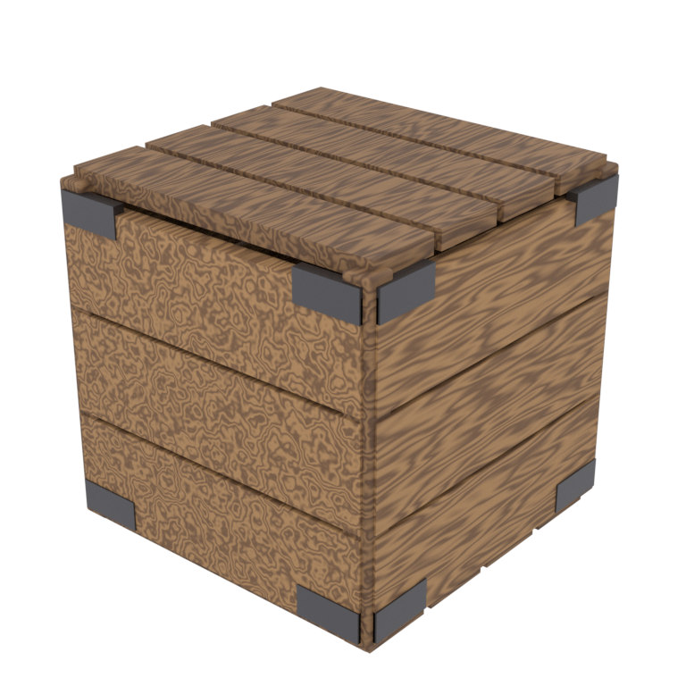 | **Crate** | Flat faces, sharp 90° edges, repeated slat relief, metal corner brackets. The "does it stay a box" test. |
| 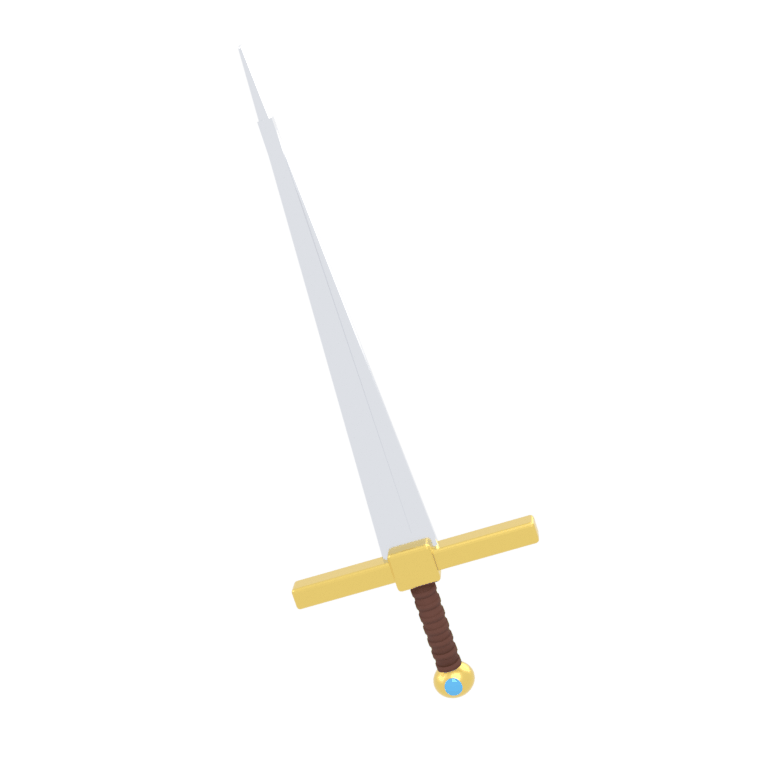 | **Sword** | An extremely thin, long blade plus small distinct parts (guard, grip, pommel jewel). The "does it survive thin geometry" test. |
| 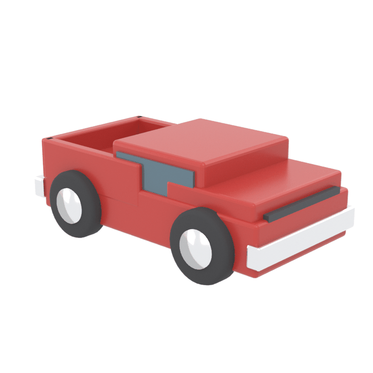 | **Truck** | Chunky primitives, a hollow bed, cylindrical wheels, strongly separated flat colour regions. The "does it get topology *and* texture" test. |

## Method

Both generators ran on the same RTX 3080 10 GB box against the identical 768×768 references, in
sequence, with the other model unloaded (`POST /admin/unload`) so neither influenced the
other's VRAM measurement.

- **Hunyuan3D** — via the Kitbash server, `POST /jobs` with `target_faces: 20000`. Shape only;
  there is no texture path on this card.
- **TRELLIS 2** — `D:\trellis2`, driven directly from Python per `TRELLIS2-EVAL.md`:
  `GGUF Q6_K`, 12 steps/stage, seed 42, Xatlas UV unwrap, Cumesh simplify, `low_vram=True`,
  `backend="sdpa"`, `target_face_num=20000` so both models are judged at the same face budget.
  The pipeline/texture resolution had to be reduced from the eval's recommendation — see below.
- **Peak VRAM is device-wide** (`total − free`, sampled at 20 Hz), so it includes the CUDA
  context, not just model tensors. Usable budget is 8.88 GiB.
- **Renders were made on the laptop**, not the GPU box: Blender 4.0.2, EEVEE, 512×512 ×4
  views. Every mesh is centred and scaled so its longest axis is 1.0, then shot from four
  azimuths at 22° elevation with a three-point rig that orbits with the camera. Camera
  distance is fixed **per subject** (computed once, reused for both models), so within each
  comparison **the camera, lighting and exposure are literally identical** — the only variable
  is the mesh.
- **Flat-shaded renders** force faceting and strip all materials to one neutral grey, so
  topology and silhouette can be judged with texture out of the picture.

### Finding 0: the recommended TRELLIS 2 settings do not fit a solid object

`TRELLIS2-EVAL.md` recommends `1024_cascade` + `texture_size=4096`, measured at **102.7 s and
5.03 GiB** on the dragon. Run unchanged on the crate, that configuration:

- was still inside the **generate** stage after **21 minutes** (vs 62 s for the dragon),
- climbed to **9.69 GiB device-wide, leaving 0.31 GiB free** — about 8.57 GiB of the 8.88 GiB
  usable budget, i.e. 96 % consumed, and
- dropped from 314 W to 150 W while pinned at 100 % utilisation.

That power-and-utilisation signature is memory pressure: at 96 % of budget the allocator
starts spilling and retrying rather than computing, and throughput collapses. It was killed,
not completed.

The cause is that TRELLIS 2's cost scales with **occupied volume**. A dragon is mostly empty
space — thin wings, thin limbs. A crate is solid, fills its voxel grid, and saturates the
`max_num_tokens=49152` budget. The eval's numbers were measured on the single friendliest
subject available; **Kitbash's actual workload is the worst case.**

All TRELLIS 2 results below therefore use **`512` + `texture_size=2048`**, which fits
comfortably (3.58–6.88 GiB) and completes in 79–151 s. This is a real constraint on adoption,
not a footnote: the recommended settings are not available for this workload on this card.

### Finding 1: background handling is not symmetric

The references are opaque white-background renders with no alpha. Run that way — as the eval
did, correctly, because the dragon image *already had* alpha — TRELLIS 2 went pathological in
the same way described above, spending its budget reconstructing the backdrop as geometry.

Hunyuan3D was handed the **exact same opaque images and did not care.** That is not because
something upstream cleaned them: `server/pipeline.py` only does `.convert("RGBA")`, and
Hunyuan3D's own `ImageProcessorV2.load_image` does no background removal either — with a fully
opaque alpha it builds `mask = ones * 255`, i.e. it is told the entire frame is the subject. It
produced clean geometry anyway. **Robustness to a baked-in white background is a real
Hunyuan3D advantage and a real TRELLIS 2 weakness.**

So every TRELLIS 2 result below was re-run against **exact alpha mattes** computed from the
references (flood-fill "near white" inward from the border, so only background-connected white
is removed — verified that the sword's near-white blade and the truck's white bumper survive
intact, with fractional alpha on the boundary to preserve antialiasing). **A TRELLIS 2 worker
in Kitbash must guarantee an alpha channel before the image reaches the model.** Kitbash's
`server/imagegen.py` already documents the hazard and calls rembg — but only on the
`POST /images` path, not on `POST /jobs` with `image_b64`.

## Measured cost

Hunyuan3D's crate row includes a cold model load (~42 s); its other two ran warm. TRELLIS 2
reloads its DiTs from disk every run by design (`keep_models_loaded=False`), so its figures are
already all-in.

| Object | Model | Wall | Peak VRAM (device) | Faces out | Texture |
| --- | --- | --- | --- | --- | --- |
| Crate | Hunyuan3D | 83.1 s (41.0 s gen + cold load) | 9.27 GiB | 19 982 (from 888 558) | none |
| Sword | Hunyuan3D | 42.5 s (40.4 s gen) | 9.27 GiB | 16 564 (no decimation needed) | none |
| Truck | Hunyuan3D | 43.0 s (40.6 s gen) | 9.34 GiB | 19 997 (from 280 608) | none |
| Crate | TRELLIS 2 Q6_K / 512 | **151.2 s** (100.8 gen + 50.2 bake) | **6.88 GiB** | 20 691 (from 9 762 008) | 2048² — **unusable** |
| Sword | TRELLIS 2 Q6_K / 512 | **104.2 s** (96.4 gen + 7.6 bake) | **3.58 GiB** | 19 983 (from 135 052) | 2048² — **unusable** |
| Truck | TRELLIS 2 Q6_K / 512 | **78.6 s** (61.4 gen + 17.0 bake) | **3.58 GiB** | 19 940 (from 3 123 716) | 2048² — **unusable** |
| Crate | TRELLIS 2 Q6_K / 1024_cascade | **killed at 21 min** | 9.69 GiB (96% of budget) | — | — |

Two things stand out. **TRELLIS 2's VRAM advantage is real and large.** Device-wide figures
include a ~1.12 GiB baseline that Windows holds even at idle, so net of that Hunyuan3D uses
about **8.15 GiB of the 8.88 GiB usable budget — 92 %, with 0.73 GiB to spare on every job**,
while TRELLIS 2's sword and truck use about **2.46 GiB (28 %)** and the crate about 5.76 GiB.
Hunyuan3D fits, but only just; TRELLIS 2 has room to spare.

But **TRELLIS 2 is not faster here**: 79–151 s against Hunyuan3D's ~41 s of generation. The
eval's "2× faster on shape-only" does not hold once texture is on and the subject is solid.

## Geometry metrics — and why they do not settle it

All meshes normalised to a unit bounding box first.

- **planar%** — share of surface *area* whose normal is within 3° of one of the six largest
  normal clusters. **crease%** — share of edges with dihedral angle above 40°. **rough°** —
  mean angle between neighbouring face normals, excluding creases.

| Mesh | Faces | planar% | crease% | rough° |
| --- | --- | --- | --- | --- |
| Hunyuan3D crate | 20 000 | 69.9 | 9.1 | 5.71 |
| TRELLIS 2 crate | 20 691 | 20.3 | 1.6 | 5.09 |
| Hunyuan3D sword | 16 564 | 0.1 | 3.4 | 5.38 |
| TRELLIS 2 sword | 19 983 | 0.6 | 0.7 | 4.56 |
| Hunyuan3D truck | 20 000 | 61.3 | 4.1 | 5.29 |
| TRELLIS 2 truck | 19 940 | 7.0 | 0.8 | 5.00 |
| _(calibration)_ TRELLIS 2 dragon, organic | 194 087 | 5.5 | 1.2 | 5.36 |

**These numbers say Hunyuan3D wins, and the renders say the opposite. Trust the renders.** The
metrics are confounded by triangulation, and the confound is not small:

- Hunyuan3D's meshes are **QEM-decimated**, which leaves large triangles spanning each flat
  panel. A large triangle averages surface noise away, so its normal reads as perfectly planar.
- TRELLIS 2's meshes are **uniformly remeshed** at roughly constant edge length (note the
  crate: 9.7 M faces remeshed down to 20 k). Small triangles resolve small-amplitude waviness
  that Hunyuan3D's large triangles integrate over, and they spread a 90° corner across several
  edges instead of one — deflating both planar% and crease%.

So these columns compare *meshing style* at least as much as shape fidelity, and cannot be read
as a cross-model verdict. They are still useful **within** a model. The sword's ~0 % planar
score is a further artefact: a tapered blade has no two faces sharing a normal, so it scores
like an organic surface even when the shape is correct.

## Crate

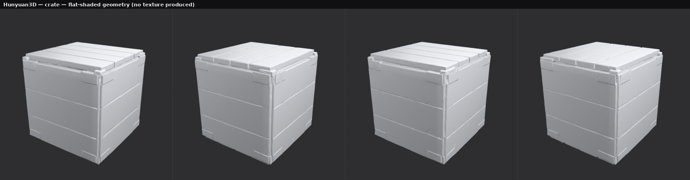

**Hunyuan3D.** Better than expected. The cube is a cube from all four angles, it does not bulge
or lean, and proportions match. Top slats are resolved as separate boards with real gaps,
horizontal seams appear on every side, and the corner brackets exist as raised geometry. The
failures are softness, not structure: every edge is slightly rounded where the reference is a
crisp 90°, the large panels visibly undulate, and the brackets are mushy lumps with no defined
border.

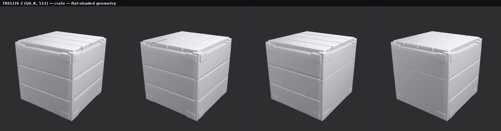

**TRELLIS 2 — geometry: better, and clearly so.** Same correct cube (1.004 × 1.004 × 0.976),
but everything Hunyuan3D softened is sharp here. Panel edges are crisp rather than rounded, the
top slats are cleanly separated boards with straight parallel gaps, and — the clearest
difference — the **corner brackets are distinct raised plates with defined borders**, not
lumps. Panels read flat rather than wavy.

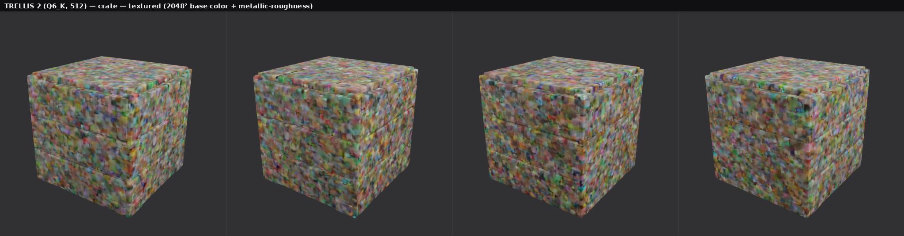

**TRELLIS 2 — texture: unusable.** The reference is brown wood with dark metal brackets. What
came back is multicoloured confetti with no wood, no grain, no brackets, and no relationship to
the reference at all.

## Sword

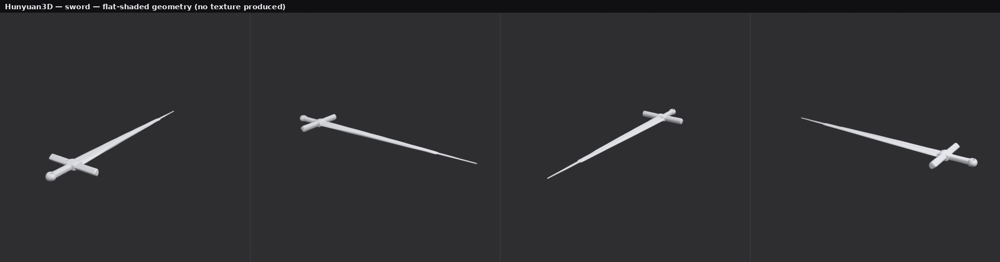

**Hunyuan3D.** The hard case, and it mostly survives. The blade is genuinely thin — 0.07 units
against a 1.99-unit length — tapers to a point, and does not inflate into the tube thin
geometry usually becomes. But the small parts give up: the reference's **rectangular**
cross-guard becomes a round bar with bulbous ends, the wrapped grip is a featureless cylinder,
and the pommel is a plain sphere with the blue jewel gone. This was also the one mesh returned
*below* the face budget (16 564 faces, no decimation needed) — there was less detail to spend
polygons on.

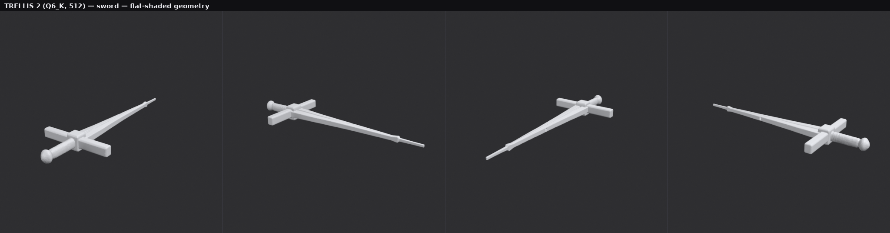

**TRELLIS 2 — geometry: the clearest win of the three.** The cross-guard is a **rectangular bar
with flat faces and square ends**, exactly as the reference draws it, where Hunyuan3D rounded it
into a dowel. The grip is a properly separated cylinder, the pommel a distinct rounded cap
rather than a fused sphere, and the blade carries a visible central ridge instead of a
featureless wedge. The blue jewel is still missing.

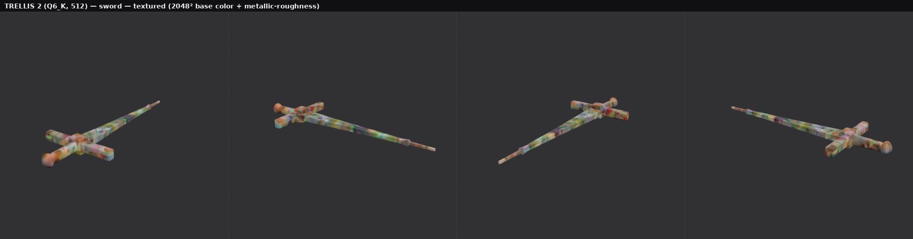

**TRELLIS 2 — texture: total failure.** Steel blade, gold guard, brown grip, blue jewel in;
pastel confetti out.

## Truck

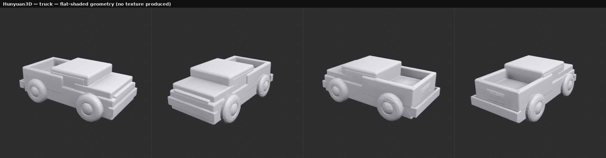

**Hunyuan3D.** Structurally its best result. Cab, stepped bonnet, hollow cargo bed with proper
interior floor and walls, and both bumpers are present and correctly proportioned — the bed
being genuinely hollow rather than a filled block is the notable win. Wheels are the weak
point: they read as round recesses fused into the bodywork rather than separate cylinders, with
no gap between tyre and arch. A faint garbled relief appears on the bed's inner wall.

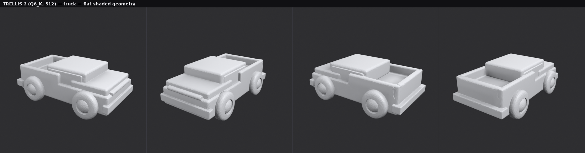

**TRELLIS 2 — geometry: better, by less than on the other two.** Both get the overall
structure. TRELLIS 2 is ahead on crispness — flatter body panels, sharper bed-wall edges,
better-defined wheel arches, and wheels that read as actual round wheels with a hub rather than
recesses. It does not fix the fused-wheel problem, and it loses the reference's separate
side-window panel the same way Hunyuan3D does.

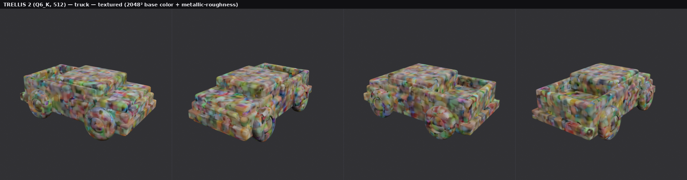

**TRELLIS 2 — texture: unusable.** The reference is the easiest possible texture target — large
flat red body, black tyres, white bumper, grey window. All of it comes back as confetti.

## The texture failure, examined

This is the finding that changes the recommendation, so it is worth being precise about what
was and was not established.

It is **not** a rendering artefact. Here is the baked 2048² base-colour atlas pulled straight
out of the sword's GLB:

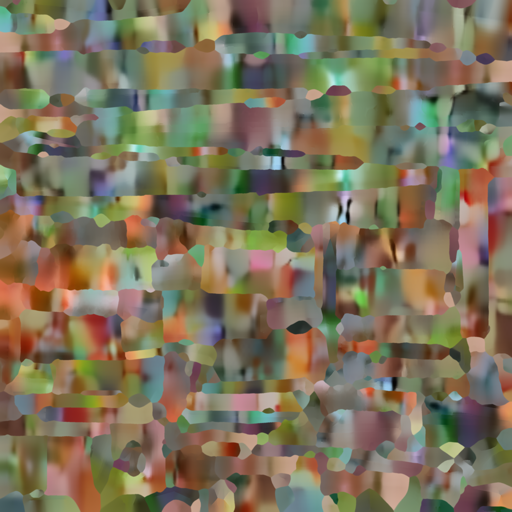

It is noise in the atlas itself. Three observations:

1. **The pipeline is not broken.** The TRELLIS dragon baked through the *same* 512 pipeline at
   the same texture size produces a completely coherent atlas — recognisable orange scales,
   cream horns, grey wing bones, clean UV islands. UVs are valid and span 0–1 in every case,
   and both texture slots are correctly populated and glTF-packed. The machinery works.
2. **It is not about thin geometry.** The obvious hypothesis after the sword — too few voxels
   for the colour SLAT to sample — is refuted by the crate and truck, which are chunky, solid,
   fill the frame, and fail identically. What the three references share is that they are
   **clean synthetic renders with large flat untextured colour regions**, which is plausibly
   out of distribution for the colour model. That is a hypothesis; it was not confirmed, and
   the root cause remains open.
3. **`TRELLIS2-EVAL.md`'s verification method cannot catch this.** That eval confirmed texture
   quality by checking the atlas had a plausible mean and standard deviation. So does this one:
   mean RGB (125, 116, 92), std (34, 32, 34); the truck's is (126, 115, 96) / (32, 30, 34).
   **Noise passes a mean-and-variance check.** Only looking at the image works.

## Verdicts

| Subject | Geometry | Texture | Overall |
| --- | --- | --- | --- |
| **Crate** | **TRELLIS 2** — sharp edges, defined brackets vs Hunyuan3D's rounded lumps | Neither (TRELLIS 2 noise) | TRELLIS 2 for geometry; texture separately either way |
| **Sword** | **TRELLIS 2**, clearly — rectangular guard, separated grip, blade ridge | Neither (TRELLIS 2 noise) | TRELLIS 2 for geometry |
| **Truck** | **TRELLIS 2**, narrowly — crisper panels, real wheels | Neither (TRELLIS 2 noise) | Close; either is usable untextured |

**TRELLIS 2 wins geometry 3–0.** On hard-surface props it holds flat planes flatter, keeps
rectangular things rectangular, and preserves small applied details (brackets, guard, wheel
hubs) that Hunyuan3D melts. It also does it in **3.58 GiB against 9.27 GiB device-wide**, which
matters on a card where Hunyuan3D is already sitting at 92 % of the usable budget.

**Hunyuan3D wins on everything else that ships a product.** It is ~2× faster in wall time here,
it is robust to unprepared input, its recommended settings actually complete, and it has no
texture stage to fail. Its meshes are also the friendlier topology for a fixed Roblox face
budget, because decimation puts polygons where the detail is rather than spreading them evenly.

## Recommendation: keep both. Do not switch the default yet.

`TRELLIS2-EVAL.md` recommended adopting TRELLIS 2 and considering making it the default. **The
first half stands; the second does not**, and three of that document's conclusions need
amending:

| `TRELLIS2-EVAL.md` said | This run measured |
| --- | --- |
| "~100 s at 5.08 GiB" at `1024_cascade`/4096 | Does not complete on a solid prop — killed at 21 min, 9.69 GiB, 96% of budget. Usable only at `512`/2048. |
| "2× faster on shape-only" | 79–151 s vs Hunyuan3D's ~41 s. Slower on all three. |
| "real PBR … not a flat placeholder" (verified by texture mean/variance) | Noise on all three subjects. Mean/variance cannot distinguish noise from content. |
| "strictly better on every axis measured" | Better on geometry and VRAM. Worse on speed, robustness, and texture. |

Concretely:

1. **Do not make TRELLIS 2 the default, and do not build the Roblox pipeline on its textures.**
   The reason to adopt it was arriving textured and UV-unwrapped without Blender. On Kitbash's
   own reference style that does not currently work. `docs/HARDWARE.md` should stop implying
   textures are a solved problem on this card until this is root-caused.
2. **Do add TRELLIS 2 as a geometry tier**, and prefer it for hard-surface props. It is better
   geometry at 40 % of the VRAM. Its UVs are valid even where the baked colour is not, which is
   still worth having — a correctly unwrapped mesh can be textured by other means.
3. **Root-cause the texture failure before spending more on integration.** The cheapest next
   experiments: a photographic (non-synthetic) reference of a hard-surface prop, to test the
   out-of-distribution hypothesis; and `1024_cascade` on the *sword* (the one subject small
   enough to fit), to test whether texture quality is tied to pipeline resolution.
4. **Whatever ships, guarantee an alpha channel before TRELLIS 2 sees an image.** Reuse the
   `rembg` call already in `server/imagegen.py`; it currently only runs on `POST /images`.
5. **Keep Hunyuan3D as the default** — it is faster, tolerant of unprepared input, and its
   settings complete. Its 92 %-of-budget VRAM headroom is worth watching: it leaves 0.73 GiB
   spare, so a driver update or a second display could push it into the same thrashing that
   killed the TRELLIS 2 `1024_cascade` run.

### Caveats

Three subjects, one seed, one reference style — all three references are synthetic Blender
renders, which is exactly the variable the texture hypothesis turns on. Geometry judgements are
from four fixed views per mesh, not a full turntable. TRELLIS 2 was measured at `512`/2048
because `1024_cascade`/4096 could not complete; a machine with more VRAM headroom may reach
different conclusions on both quality and speed.
