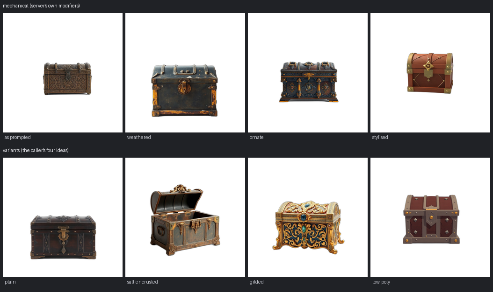
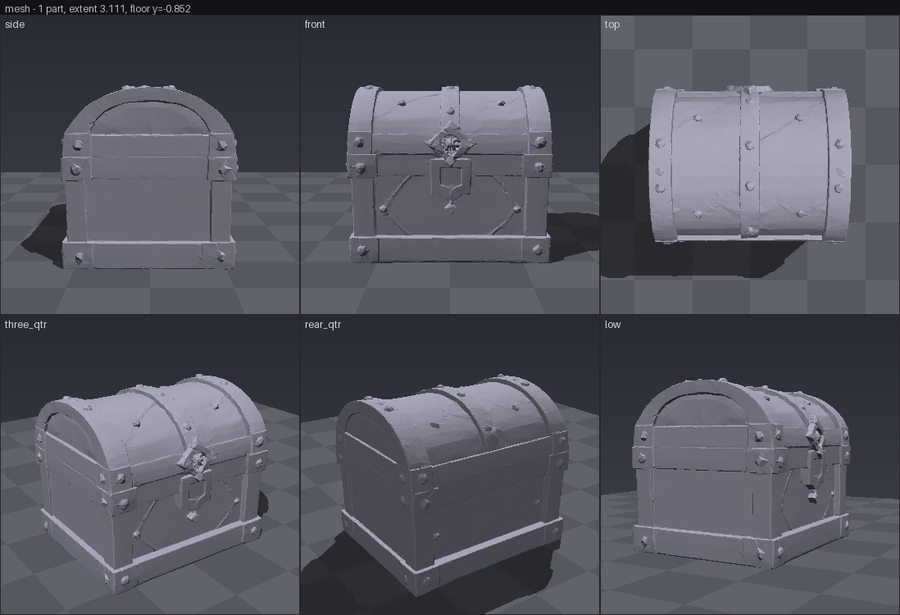

# Choosing the reference

`server/imagegen.py`, `POST /images/candidates`, and the
`generate_reference_options` MCP tool.

## Why this exists

Everything downstream of the front of the pipeline is image-conditioned. The
generator does not read the prompt; it reads the picture. Same model, same
seed, same settings, a different reference — a different object.

This project keeps rediscovering that, and always the hard way:

- **The cropping experiment.** Tail, propeller, wing and cowl cropped out of one
  photograph of a Beechcraft Bonanza. Every crop generated a complete aeroplane.
  Tighter crops, real alpha and generous padding all changed the result and none
  of them fixed it ([DECOMPOSITION.md](DECOMPOSITION.md)).
- **"Propeller"** returned a marine propeller — the right word, the wrong object,
  and no amount of downstream tuning recovers from it.
- **The chest lid.** Twenty candidate references, not one of which produced a
  usable lid.

In all three the *reference* was the defect. And until this feature, a caller
asking for one had exactly one lever: `POST /images` with a prompt, and whatever
came back was the reference. Choosing among several — the one judgement in this
pipeline a human is unambiguously better at than the machine — could not be
exercised at all.

So: one prompt, N candidates, and a human picks.

## The contract

```
POST /images/candidates
  { "prompt": str, "count": int = 4, "variants": [str] | null,
    "image_size": str | null, "seed": int | null,
    "remove_background": bool = true, "provider": str | null }

  -> { "batch_id": str,
       "prompt": str,
       "candidates": [ { "image_id": str, "prompt": str, "variant": str|null,
                         "seed": int, "bytes": int, "path": str } ],
       "count": int, "requested": int,       // cost: count == billed calls
       "elapsed_seconds": float,
       "provider": str, "mode": "variants" | "mechanical",
       "image_size": str, "failed": [...], "created_at": float }

GET  /images/batches/{batch_id}   -> the same object, for polling / re-display
GET  /images/{image_id}           -> the PNG
POST /jobs { "image_id": ... }    -> generate a mesh from the chosen one
```

The server never picks. It returns all of them and stops.

Batches are written to `OUT_DIR/images/batches/{batch_id}.json` rather than held
in memory, because the desktop app, the MCP server and whatever generated the
batch are three different processes — and a batch only one of them can see is a
batch the user cannot choose from. A restart does not lose an unchosen batch.

`count` is capped at 8. Each candidate is a separately billed image call, and a
typo in that field should not become a hundred of them.

## Parallel, because four sequential calls are four times the wait

A fal round trip is ~3.4 s of *waiting on a socket*. `imagegen` is stdlib
`urllib` and blocks, so threads release the GIL for the whole call and four
candidates cost roughly one call's wall time plus change.

Measured against the reference box, `fal-ai/flux/schnell`, `square_hd`,
background removal on:

| | wall |
| --- | --- |
| `POST /images`, one image | 3.39 s, 3.50 s |
| `POST /images/candidates`, four | **5.67 s, 5.79 s, 7.26 s** |
| the same four, if they were sequential | ~13.6 s |

Not the theoretical 4×, and the reason is worth knowing: **generation is
concurrent, storage is not.** `store()` runs rembg, which lazily builds a
process-wide inference session on first use, and several threads racing to
create it is a hazard in exchange for a few hundred milliseconds per image. So
the four HTTP calls overlap and the four background removals — roughly 0.5 s
each — run in a line afterwards. That is the whole of the gap between 3.5 s and
5.7 s.

One candidate failing does not fail the batch. Three usable references are worth
having and a paid-for image is not worth discarding, so failures come back in
`failed` with the slot, the seed and the reason. Only an entirely failed batch
raises.

## Two modes, and one of them is better

### `variants` — the caller writes four ideas. Use this.

The intended path. The caller is an LLM with the world knowledge to know that
"a treasure chest" could be a plain banded pine box, a barnacled thing dragged
off a wreck, a gilded and jewelled casket, or a chunky low-poly game prop. It
supplies one full prompt per candidate and the server generates them.

### `variants` omitted — the server's own modifiers

A fixed list in `imagegen.VARIATIONS`: distinct seeds plus one of
`weathered` / `ornate` / `stylised` / `sleek` / `rugged`, cycling. The first
entry carries no modifier at all, so **one candidate is always exactly what
`POST /images` would have returned** and choosing costs nothing.

Both, on the same subject, four candidates each:



Both give four different chests, and mechanical variation is much better than
four seeds of one prompt would be — that was measured in
[DECOMPOSITION.md](DECOMPOSITION.md) and the answer there was that the seed does
essentially nothing. But look at what each row can reach.

Mechanical stays inside one idea of a chest and re-finishes it: bronze, then
iron, then black-and-gilt, then stylised. Every one is a closed box of roughly
the same proportions, because **the server does not know what the subject is.**
It can vary surface, construction and camera. It cannot vary the *idea*, and it
must not try: naming any object in that suffix re-arms the completion prior that
returned a propeller attached to an aeroplane (DECOMPOSITION.md, *"The suffix
must not name the whole object"*). Every string in `VARIATIONS` is surface,
construction and camera only, and a test asserts that none of them contains an
object noun.

The variants row includes an **open** chest — a hinged lid, a visible interior,
a different topology. No adjective the server owns could have produced that,
because "open" is a fact about chests and the server has never heard of chests.

**So: supply `variants`.** The fallback exists so the endpoint works when the
caller has nothing to say, not because it is as good.

Variants are written by the same rules as any Kitbash prompt: describe the
object's shape and materials, never the larger thing it belongs to. For one part
of a multi-part build, name the geometry rather than the part — *"a hollow
tapered shell with six oval portholes"*, never *"a fuselage"*.

### Seeds

Every candidate gets its own seed, and every seed is reported back. A supplied
`seed` makes the batch reproducible (candidate *i* uses `seed + i`); without one
they are random. This buys almost nothing in variety — again, the seed does
essentially nothing — but it costs nothing either, and it is what lets a caller
re-roll exactly one candidate rather than the batch.

Nothing here is bit-reproducible. The same prompt and seed submitted twice came
back with a mean per-pixel difference of 4.6/255. Same composition, not the same
file.

## The MCP flow

Four tools, and the middle two are the point.

| tool | what it does |
| --- | --- |
| `generate_reference_options` | N candidates, returned **as images** in one result |
| `get_reference_options` | re-shows a batch, spending nothing |
| `choose_reference` | pops a picker, where the client supports one |
| `generate_part` | takes the chosen `image_id` |

`generate_reference_options` returns every candidate as MCP image content —
`{type: "image", data: <base64>, mimeType: "image/png"}`, the same shape
`preview_scene` uses — with a **text block before each image naming its
`image_id`**. The label goes first deliberately: without it the model has four
pictures and no way to name any of them, and "the second one" or "the one with
the horns" has nothing to resolve against.

The tool description teaches the loop, and the step agents skip is the third:

1. generate the options
2. **show them to the user**, with a sentence describing each
3. **ask, and wait for the answer**
4. pass the chosen `image_id` to `generate_part`

It says, explicitly, not to choose on the user's behalf when the user is there
to ask. An agent that picks silently and reports a finished mesh has thrown the
entire feature away — the reference decides the mesh, and choosing it is the
human's job. Unattended is allowed; unattended-without-saying-so is not.

`generate_part` accepts `image_id` alongside `image_path` and `image_b64`, so a
chosen candidate goes straight through without the picture making a base64 round
trip back through the agent's context.

### Elicitation, where it exists

`choose_reference` uses MCP elicitation to put the candidates in front of the
user as a list they select from, returning the `image_id` they chose. Claude
Code supports elicitation (2.1.76+), and the SDK here is `@modelcontextprotocol
/sdk` 1.30, which has `elicitInput` with `enum`/`enumNames`.

It is gated on the **negotiated capability**, not on a version:
`server.server.getClientCapabilities()?.elicitation`. That is the only answer
that is true for the client actually connected. Where it is absent, the tool
says so and hands back the numbered list to ask about in chat.

This is deliberately the *nicer* path and not the load-bearing one. The
image-content flow needs no protocol support beyond image content itself, and it
is what has to work. `choose_reference` is also a picker rather than a gallery —
elicitation shows labels, not pictures, so the images must already be on screen
from `generate_reference_options` for the labels to mean anything.

One caveat about showing images in Claude Code specifically: MCP image content
from tool results is [collapsed behind an
expander](https://github.com/anthropics/claude-code/issues/53256) rather than
rendered inline. The model sees the images; the user may have to expand the tool
result. That is why the tool tells the agent to *describe* each option in words
as well as showing it.

## Worked example

`an ornate treasure chest`, mechanical mode, four candidates, seed 20260807.
Batch in **7.26 s**, four fal calls.

The four came back genuinely different: a small bronze embossed casket; a dark
iron strongbox with rusted brackets; a black-and-gilt Renaissance jewellery
casket with columns and a cameo; and a clean stylised game chest in terracotta
and gold.

The fourth was the one to pick, and not because it is the prettiest — the
Renaissance casket is. It is the pick because it is the best *reference*:

- a genuine three-quarter view showing two faces and the lid, where the other
  three are nearly head-on;
- large in frame — the bronze one occupies about a third of the image, and
  everything DECOMPOSITION.md says about thin parts applies to small ones;
- a silhouette the generator can read, with the detail in **shape** rather than
  in surface relief. Fine relief does not survive to the mesh, so a heavily
  carved option and a plain one often produce a similar object anyway.

`POST /jobs {"image_id": "2d8f61bb09df", "target_faces": 20000}` on Hunyuan3D:
**40.0 s**, 20 000 faces decimated from 655 344, peak 7.63 GiB, silhouette IoU
0.947 against the reference.



A chest: domed lid with strap bands, corner brackets, studs, the diamond lock
plate and the escutcheon all present and all recognisably from that reference.

## Honest limits

- **The candidates are only as good as the prompt.** Four interpretations of a
  bad subject are four bad references. This does not replace knowing what to ask
  for; it makes the asking cheap enough to iterate on.
- **Prettiest is not best.** The most beautiful candidate is regularly the worst
  reference — fine relief photographs well and does not survive at 512 pipeline
  resolution. A user picking by eye will reach for it. The tool description says
  so; nothing enforces it.
- **The framing is still the framing.** `imagegen.FRAMING` asks for a
  three-quarter view and flux schnell frequently answers with something closer
  to head-on, at whatever scale in frame it likes. Candidate variation does not
  fix that, and picking the best of four is partly a way of routing around it.
- **N candidates is N bills.** Concurrency makes it fast, not cheap. `count`,
  `requested` and `elapsed_seconds` come back on every batch so the cost is
  never a surprise, and the cap is 8.
- **No scoring.** The server does not rank the candidates and deliberately
  offers no "best" field. It has no way to know which one the user meant, which
  is the entire premise of the feature.
