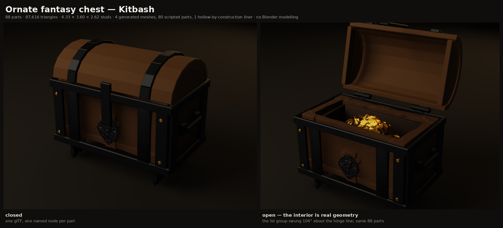
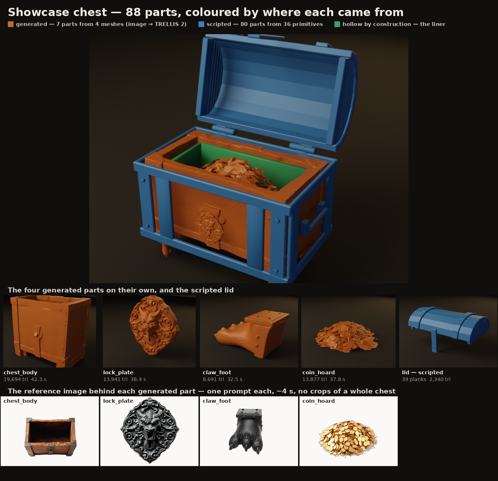

# Showcase: an ornate fantasy chest

The end-to-end build of one asset a Roblox developer could drop into a dungeon
today. Every stage in this repo is used: prompt → reference image → image-to-3D,
procedural primitives, hollow-by-construction interiors, anchors, mirroring,
per-part materials, assembly and Roblox export.



| | |
| --- | --- |
| Scene, closed | `0beb4d48055e` |
| Scene, open | `9a98a43f91ac` |
| Parts | **88**, one named glTF node each |
| Triangles | **87,616** total, **19,694** on the largest single mesh |
| Roblox export | 4.326 × 3.600 × 2.622 studs, base-centred pivot, 2.87 MiB `.glb` |
| GPU time | **151 s** for the four generations that shipped |
| Peak VRAM | **2.85 GiB** process, 4.84 GiB device-wide |
| Hand modelling | none — Blender was used only to render this page and to measure two meshes |

## Why a chest

The aircraft demo is the generator's worst case and it looks it: an airframe is
thin flat engineered panels, and [DECOMPOSITION.md](DECOMPOSITION.md) already
records the wing coming back as two crossed slabs and the gear as a spindle.

A chest is the opposite subject on every axis that matters — compact, chunky,
high-relief, irregular — and it needs **both halves** of the routing rule in
[PROCEDURAL.md](PROCEDURAL.md) in one object: a carved wooden carcass and an
ornate cast-iron escutcheon that no formula produces, bolted to strap iron and
a coopered lid that are nothing but dimensions. And because it opens, the
hollow interior is load-bearing rather than a claim.

## The parts



| | count | source |
| --- | --- | --- |
| Generated | 7 parts from **4 meshes** | `POST /images` → `POST /jobs`, TRELLIS 2 |
| Scripted | 80 parts from **36 primitives** | `POST /primitives` — 33 `plank` and 3 `cylinder` jobs, reused across placements |
| Hollow by construction | 1 | `POST /hollow/primitives`, `hollow_box` |
| Mirrored | 6 of the above | `mirror_of` — free, no second mesh |

### Generated

| part | faces | decimated from | generate | back-project | `silhouette_iou` | `texture_coverage` | peak VRAM |
| --- | --- | --- | --- | --- | --- | --- | --- |
| `chest_body` | 19,694 | 3,331,704 | 42.3 s | 5.8 s | 0.863 | 0.363 | 2.66 GiB |
| `lock_plate` | 13,941 | 2,705,892 | 38.4 s | 5.6 s | 0.858 | **0.015** | 2.66 GiB |
| `claw_foot` | 8,691 | 1,404,912 | 32.5 s | 5.2 s | 0.893 | 0.569 | 2.66 GiB |
| `coin_hoard` | 13,877 | 7,999,182 | 37.8 s | 5.6 s | 0.847 | 0.091 | 2.85 GiB |

All four at `generator=trellis2`, `textured=false`, GGUF Q8_0, 512 pipeline,
seed 20260806. Every reference image is ~4 s at `fal-ai/flux/schnell`.

**Why each one is generated.** The carcass is carved staves, chamfers and
mouldings — irregular surface relief, which is the thing a formula cannot
write. The escutcheon is a snarling beast face in deep relief; it is the single
most obviously *generated* thing on the model and it took one attempt. The claw
foot is an organic paw. The hoard is an amorphous pile, which has no
dimensions to state. That is four subjects on which image-to-3D is not merely
adequate but the only option here, and it is the honest answer to "does the
generator earn its place on this subject": **yes, on those four, and on nothing
else in the model.**

### Scripted

Everything with a measurement: corner straps, rim and base bands, vertical body
straps, hinge barrels and leaves, side handle bails and their mounts, brass
studs, the lock hasp, and the entire lid.

| shape | kind | parts | tri each |
| --- | --- | --- | --- |
| corner straps, bands, body straps, hinge leaves, hasp, lid staves, iron band segments, end caps | `plank` | 68 | 60 |
| hinge barrels, handle bails, brass studs | `cylinder` | 12 | 64–112 |

36 distinct primitive jobs, **2,268 triangles for the whole scripted library**,
about a millisecond each to build. That is less than a ninth of what one
generated carcass costs, for two-thirds of the parts on the model.

### The lid is scripted, and that was not the plan

The lid was supposed to be generated. It is the one decision in this build that
was made by measurement rather than preference, so it is worth writing down.

**Twenty candidate reference images across five prompt strategies**, and the
image model never once produced a long low barrel vault at a three-quarter
angle:

| prompt strategy | what came back |
| --- | --- |
| "barrel-vaulted cover, staves, iron bands" | an arch drawn **face-on**, a flat end elevation |
| "an oak barrel sawn in half along its length" | a **whole barrel** |
| "the detached curved cover of a steamer trunk" | a **whole chest**, lid and box |
| "a long half-cylinder tunnel of oak staves" | an open **tunnel bore** seen down its axis |
| "a small quonset hut of oak staves" | **the right shape** — and then the mesh was wrong |

The quonset framing worked, and the mesh built from it still failed: measured
in Blender, the reconstruction **arches over its long axis**. Extents 0.999 ×
0.526 × 0.634 with the curvature in the *xy* plane, so the vault is 0.63 long
per unit of arch span where a chest lid needs about 2.1. Correcting that needs a
per-axis scale of (2.05, 0.76, 0.61) — a 3.4:1 spread that would smear the
staves into mush.

So the lid is nine flat `plank` staves placed on an ellipse, plus 18 iron band
segments on the same arc and 12 stacked end boards: **39 parts, 2,340
triangles, exact to the body's footprint.** That is
[PROCEDURAL.md](PROCEDURAL.md)'s routing rule arriving at the answer from the
other direction — *when a generated part keeps coming out wrong, check whether
it should have been generated at all* — and it is the same lesson
[DECOMPOSITION.md](DECOMPOSITION.md) learned on the Bonanza's landing gear.

## The interior

The chest opens, so the inside is not optional.

**Carving was tried and correctly refused.** `POST /hollow` on the generated
carcass at a 0.045 wall returns

```
a 0.045 wall leaves no cavity — the part is thinner than two walls everywhere.
Thin parts like a wing stay solid, correctly.
```

which is true: TRELLIS 2 returned an *open thin shell*, not a solid, so there
was nothing to hollow. Dropping to a 0.02 wall at resolution 100 does produce a
closed manifold shell — `seal: 1`, so the input was sound — but it removes only
**6.0%** of the material and, per [HOLLOW.md](HOLLOW.md), resampling onto the
voxel grid destroys UVs and vertex colours. Paying 20,000 triangles and the
part's surface for six percent is a bad trade.

So the interior is **hollow by construction**: a `hollow_box` from
`POST /hollow/primitives`, 1.06 × 0.40 × 0.49 m, 0.04 wall, top face left off,
**300 triangles in 9 ms** including the HTTP round trip, nested inside the
generated carcass. HOLLOW.md
says this outright — *carving is the hard road, and most of the time it is the
wrong one* — and this is the case that proves it. The liner is the green part
in the breakdown image above, and the open render is the proof: that is real
geometry with a real floor and four real walls, not a dark texture.

## Assembly

Scene units are **1 unit = 1 metre**, chosen up front, and `server/primitives.py`
builds in the same unit, so every offset in the build script is metres and
`/export` converts the lot to studs once at the end.

- **`anchor`** places the carcass and the first foot on the ground, and the
  hoard inside the liner, so those three never carry an invented Y.
- **`mirror_of`** produces three of the four feet, the right-hand handle and its
  two mounts from parts already placed — six parts, no second generation.
- **`orient` is not used.** Every scripted part is already in a known frame (the
  trap the docs warn about), and the one generated part that arrived lying down
  — the claw foot, on its side along X — was corrected with an explicit
  `rotation: [0, 0, 90]` read off its preview, which is cheaper and more certain
  than a declaration for a part whose extents are nearly cubic.
- **The lid's arc was computed, not guessed.** A bounding box would have put the
  iron bands either floating above the vault or buried in it, so each band
  segment sits on the ellipse the staves were built from, offset along the local
  normal. The carcass's cavity floor and footprint were likewise ray-cast off
  the real mesh in Blender (0.282 of the body's height), not taken from its box.
- **Opening the lid** is a rigid rotation of the 42-part lid group about the
  hinge line, computed client-side: same 88 parts, same job ids, one extra
  `/assemble`.

**Every part states its own material.** `/assemble` re-derives materials from
node names unless told otherwise, and `band`, `stave`, `corner` and `strap` are
not in `materials.KEYWORDS` — the first build came back with light grey `paint`
ironwork for exactly that reason. This is the honest limit PROCEDURAL.md
records, and the fix is one `material` key per part.

## Roblox export

```
POST /export {"scene_id": "0beb4d48055e", "target": "roblox", "height_studs": 3.6}
```

| | |
| --- | --- |
| `part_count` | 88 |
| Triangles | 87,616 total; **largest mesh 19,694**, under the 20,000 per-`MeshPart` cap |
| Parts over budget | **0** |
| Size | 4.326 × 3.600 × 2.622 studs |
| Pivot | base-centred — it sits on the floor where you drop it |
| Files | `showcase_chest.glb` 2.87 MiB, `.obj` 10.8 MiB + `.mtl` |

Re-imported into Blender to check the file rather than the response:
`OBJECTS: 88`, `TRIS: 87616`, 7 materials, lowest vertex at exactly `z = 0`.

The 20,000-triangle cap being **per mesh** is what makes this legal at all: the
carcass alone is 19,694, so a welded version of this chest would be rejected
outright while the assembled one has 88 separate budgets.

**Warnings: 88, all the same** — `<part>: no texture or vertex colour, imports
untextured`. That is accurate. The model carries PBR *material factors* (base
colour, metallic, roughness) rather than texture maps, so Studio will import it
as flat-coloured `MeshPart`s in the right colours, which is what this build
intends — but there is no albedo map on any part, and the exporter says so.

## Cost of the whole build

| | |
| --- | --- |
| Reference images generated | **47** (~4 s each) |
| Meshes generated | **11** |
| Meshes shipped | **4** |
| GPU time, shipped parts | 151 s |
| GPU time, including the 7 rejects | ~7 min |
| Scripted parts | 36 primitives in **0.6 s** of wall clock including HTTP, **no GPU** |
| Assembly | 88 parts, well under a second |
| Hollow liner | **9 ms**, 300 triangles |

Seven of eleven generations were thrown away, and that is the number that
matters: rerolling one part is 40 seconds, not a rebuild. The chest survived
three complete changes of carcass and a lid that was abandoned entirely,
without touching the other 80 parts.

## What is still wrong

Judged harshly, because a showcase that only lists its wins is a brochure.

1. **The wood has no grain.** This is the biggest gap and it is a deliberate,
   measured retreat. Back-projection ([TEXTURING.md](TEXTURING.md)) was tried on
   every generated part and on five separate carcasses, including two
   references re-shot with explicitly flat, shadowless lighting to attack the
   "it bakes in the photograph's lighting" limitation head-on. Coverage came
   back **0.015–0.569**, and on a box — where one three-quarter view sees two of
   six faces and the interior is a dark cavity — the flood fill settles on a
   near-black dominant colour, so three faces of four arrived burnt-looking. The
   shipped asset uses semantic PBR materials instead, which are clean and
   coherent and flat. The chest reads as a good stylised prop, not a
   photoreal one.
2. **`apply_materials` is all-or-nothing.** There is no way to keep a
   back-projected texture on one part while giving another a material, so the
   choice above had to be made for the whole model. A per-part opt-out in
   `assemble.py` would let the carcass keep its photograph and the liner keep
   its wood.
3. **The hoard reads as gold shards, not coins.** At 13,877 triangles the
   individual discs are gone and what is left is faceted. It sells "treasure"
   at a glance and does not survive a close look.
4. **The carcass is scaled non-uniformly**, `[1.346, 0.801, 1.202]` — a 1.68:1
   spread — because the generated box came back near-cubic (1 : 0.93 : 0.67)
   where a chest wants about 1 : 0.5 : 0.5. The staves are squatter than the
   reference's. It is within what MULTI-PART.md sanctions ("a too-fat body is
   corrected for free with a per-axis scale") but it is not free of cost.
5. **The lid's ends are a staircase, not an arch.** Six stacked boards per end
   approximating a semi-ellipse. The first version was sized at each band's
   centre and left a wedge of daylight at every corner — you could see the
   hoard through the closed lid from the side, which is the kind of defect that
   only a side elevation catches. Sizing each board at the *lower* edge of its
   band on the staves' inner ellipse closes it, but the silhouette is still
   stepped where a real coopered end is curved. A proper elliptical cap needs a
   shape the primitive library does not have.
6. **The liner does not fit the cavity exactly.** The generated interior is not
   symmetric — the ray-cast footprint runs 0.085 to 0.939 of the width — so
   there is a visible slot down one side between the liner and the carcass wall.
7. **The lid has no joint.** It opens because the transform was recomputed and
   re-assembled; the glTF carries two static scenes, not one rigged asset. A
   Roblox developer gets the geometry in the right places and still has to build
   the `HingeConstraint` themselves.
8. **88 `MeshPart`s is a lot for one prop.** It is the right answer for the
   triangle budget and for editability, and it is probably the wrong answer for
   a dungeon with two hundred chests in it. There is no merge-by-material pass.
9. **No LOD and no collision mesh.** Roblox will auto-generate both, badly, on
   88 parts.
10. **The lock plate's texture pass was a total failure** — 0.015 coverage, a
    silhouette fit of 0.858 that nevertheless painted almost nothing directly.
    Worth chasing, because a flat plate facing the camera is the case
    back-projection should be best at.
11. **None of this is reproducible bit-for-bit.** Same prompt and seed gives a
    near-identical image, not an identical one, and the mesh stage adds its own
    variation on top.

## Reproducing

Build scripts are throwaway and live outside the repo, but the recipe is only
this:

```
POST /images    x4   -> reference per generated part, own prompt, no crops
POST /jobs      x4   -> trellis2, textured=false, target_faces 9k-20k
POST /primitives x36 -> plank and cylinder, exact dimensions
POST /hollow/primitives -> hollow_box liner
POST /assemble       -> 88 parts, materials stated per part
POST /export         -> target roblox, height_studs 3.6
```

The prompt rules from [DECOMPOSITION.md](DECOMPOSITION.md) were load-bearing
throughout and cost real attempts every time they were bent:

- **Name the geometry, not the object.** "an open-topped casket carcass" returned
  a complete chest with its lid open, twice. "a wide rectangular oak box … open
  at the top … no lid, no cover" returned a carcass.
- **The style suffix must not name the whole object.** It never mentions a
  chest; it lists oak, blackened iron, brass and the light.
- **Name the viewpoint.** Every failed lid reference was a viewpoint failure,
  not a content one.
- **A part whose material is the point wants its own suffix.** The claw foot came
  back *wooden* twice under the shared oak suffix; swapping to an iron-only
  suffix for that part fixed it in one attempt.
