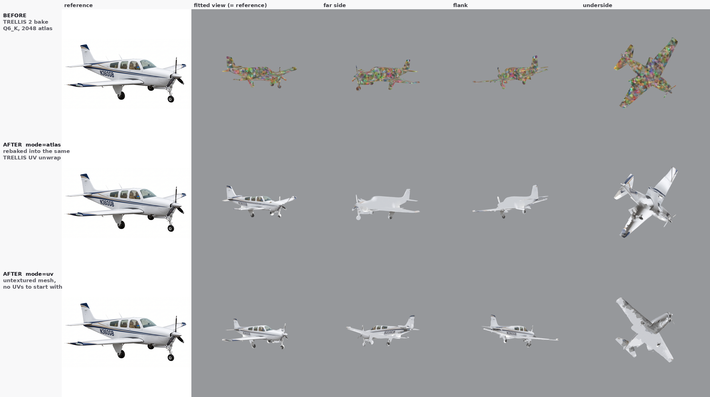
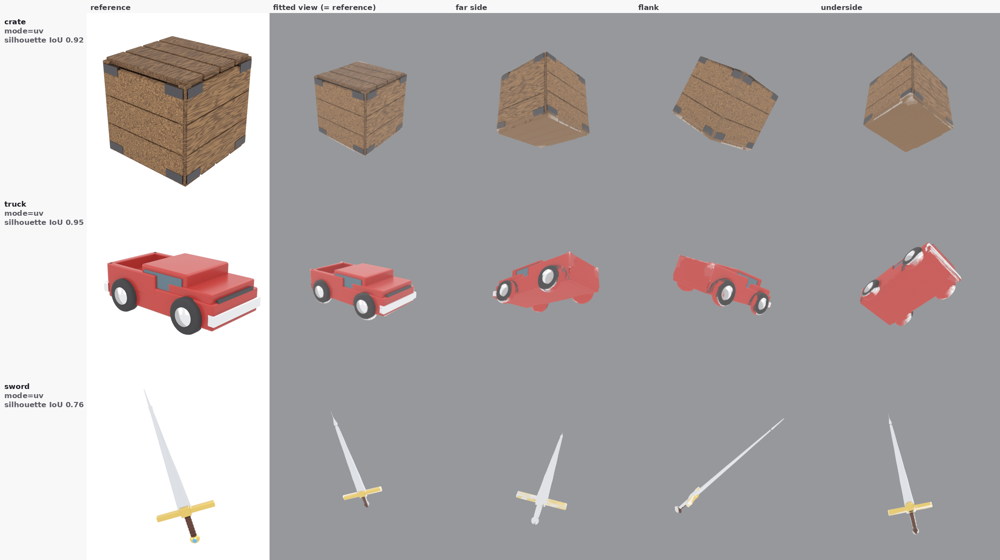

# Colour — back-projecting the reference photo onto the generated mesh

**Verdict up front: generated props can be correctly coloured, today, on this
card, for free. The reference image already contains the answer.** `POST /jobs`
hands the generator a photograph and gets back the shape in it. For every
triangle that photograph could see, the right colour is the pixel that triangle
projects to — no model, no VRAM, about a second of laptop CPU, and *exactly*
right rather than a generative guess. A white aircraft with navy stripes comes
back white with navy stripes, registration lettering and all.

`server/texturing.py` implements this. It needs only trimesh, numpy and PIL —
all already present, all permissively licensed, no pymeshlab and no bpy (see
[DECIMATION.md](DECIMATION.md) for why that constraint exists).

Two separate things are established below, and they are independent:

1. **The TRELLIS 2 rainbow-atlas failure is root-caused and fixable** — it is a
   broken K-quant GGUF, not a bug in the pipeline. One config line.
2. **Back-projection works** and is worth having regardless, because it is the
   only colour path that exists for the *untextured* generator tier and for
   Hunyuan3D, and because it reproduces the reference exactly where a generative
   texture model only approximates it.

---

## 1. The rainbow atlas: root cause

`docs/QUALITY-COMPARISON.md` recorded that TRELLIS 2's baked base-colour atlas
came back as multicoloured confetti on every Kitbash subject, and left the cause
open. It is now closed.

> **The K-quantised GGUFs of the 512-resolution *texture* DiT decode to
> input-independent noise.** `slat_flow_imgshape2tex_dit_1_3B_512_bf16_Q6_K.gguf`
> and its `Q4_K_M` sibling produce a colour SLAT whose statistics are the same
> whatever image you feed them. `Q8_0` of the same model is clean.

Same crate image, same seed, same everything else but the quantisation level:

| quant | base colour mean | std | metallic std | roughness std | atlas |
| --- | --- | --- | --- | --- | --- |
| Q6_K | 0.490 / 0.448 / 0.370 | 0.129 | 0.106 | 0.105 | confetti |
| Q4_K_M | 0.492 / 0.448 / 0.370 | 0.128 | 0.104 | 0.105 | confetti |
| **Q8_0** | **0.268 / 0.175 / 0.074** | **0.049** | **0.0003** | **0.0008** | **brown wood with grain, dark bracket patches** |

The clinchers, in order of how much each one narrows it:

- **The voxel colours are already noise before any bake.** Dumping the texture
  SLAT decoder's raw output and projecting it along the six axes gives a perfect
  crate silhouette — slat gaps and all — filled with rainbow confetti. So the
  UV unwrap, the atlas packing and the channel order are all exonerated:
  the bake is faithful, it is faithfully baking noise. `bake_on_vertices=True`
  reproduces the same distribution in vertex colours, with neighbouring vertices
  as different from each other as random pairs (ratio 0.83).
- **It is input-independent.** Crate at Q6_K, crate at Q4_K_M and *the TRELLIS
  dragon* at Q6_K all converge on mean ≈ (0.49, 0.45, 0.37).
- **The "the dragon works, props don't" split was never real.** The dragon GLB
  that baked coherently at 512 was produced under **Q8_0**; every Q6_K dragon run
  in `TRELLIS2-EVAL.md` was `1024_cascade`, which loads the separate *1024*
  texture DiT. The only component present in every broken run and absent from
  every working one is the 512 texture DiT under a K-quant. Hence
  `QUALITY-COMPARISON.md`'s out-of-distribution hypothesis — "clean synthetic
  renders with large flat colour regions" — is **wrong**, and its statement that
  "the pipeline is not broken, the dragon bakes coherently through the same 512
  pipeline" compared two different quantisations.
- Model files are all present and their SHA-256 match the HuggingFace LFS oids,
  so this is an upstream problem with the published quantisation (or with
  ComfyUI-GGUF's K-quant dequant for those tensor shapes), not a bad download.
  Worth filing at `Aero-Ex/Trellis2-GGUF`.

Geometry was never affected because the *shape* DiTs quantise fine. That is
exactly why the signature was "great geometry, noise texture".

### The fix (not applied — `server/config.py` is owned elsewhere)

```diff
-TRELLIS_QUANT = os.environ.get("KITBASH_TRELLIS_QUANT", "GGUF Q6_K")
+TRELLIS_QUANT = os.environ.get("KITBASH_TRELLIS_QUANT", "GGUF Q8_0")
```

`server/tests/test_trellis.py` asserts the Q6_K default and needs the same
change. Cost: crate generate goes 100.8 s → 156.4 s (+55 %); the bake stage is
unchanged, so a textured job goes ~151 s → ~211 s. Peak VRAM is set by the bake
stage, not the quant level, so it still fits. The Q8 files are already on disk.

Belt and braces, since `quant` is a per-job override: `trellis_worker.py` could
force Q8_0 whenever `textured and pipeline_type == "512"` and the requested
quant is a K-quant. Only that combination is affected — shape-only runs never
load the texture DiT, and `1024_cascade` uses the 1024 file.

### Verification rule

`TRELLIS2-EVAL.md` certified textures by checking the atlas's mean and standard
deviation. **Noise passes a mean-and-variance check** — the confetti's stats are
mean (126, 115, 95), std (33, 31, 34), which is unremarkable. Every claim above
was checked by extracting the atlas PNG from the GLB and *looking at it*. Do the
same or do not claim it.

---

## 2. Back-projection

### The idea

The reference image is a photograph of the object and the mesh was generated
from it. Project the photograph back onto the mesh from the generating
viewpoint and everything the camera saw gets its real colour. This is what
StableProjectorz does interactively; here it runs headless in ~6 s on the laptop
CPU with no GPU involved at all.

```python
import texturing
mesh, stats = texturing.texture_from_reference("mesh.glb", "reference.png")
mesh.export("textured.glb")
```

### Results



Top row is TRELLIS 2's own bake at Q6_K — the confetti. The two rows below are
the same reference photograph projected back on, in the two atlas modes. The
lettering `N360GB`, the navy flash, the gold pinstripe, the cabin windows and
the dark spinner are all in the right places because they are *the photograph*,
not a reconstruction of it. The "far side" view in the bottom row shows `N360GB`
mirrored, which is the symmetry pass working.



The three props from `QUALITY-COMPARISON.md`, whose atlases were all previously
unusable: wood grain with dark corner brackets, red bodywork with black tyres
and white hubs and a white bumper, steel blade with a gold guard and a brown
grip. Compare against `images/t2-crate-tex.png`, `t2-truck-tex.png` and
`t2-sword-tex.png`.

| subject | mesh | faces | silhouette IoU | direct | mirrored | flooded | coverage | wall |
| --- | --- | --- | --- | --- | --- | --- | --- | --- |
| Bonanza airframe | untextured tier, no UVs | 19 879 | 0.85 | 5 765 | 3 995 | 10 119 | 49 % | 6.3 s |
| Bonanza airframe | textured tier, `mode=atlas` | 18 958 | 0.85 | 29 % of texels | 11 % | 60 % | 40 % | 7.2 s |
| Crate | textured tier | 20 662 | 0.92 | 6 292 | 4 306 | 10 064 | 51 % | 6.0 s |
| Truck | textured tier | 19 661 | 0.95 | 6 748 | 4 052 | 8 861 | 55 % | 5.9 s |
| Sword | textured tier | 19 105 | 0.76 | 7 967 | 2 762 | 8 376 | 56 % | 6.0 s |

Wall time on the laptop, single-threaded numpy: matte 0.4 s, **camera fit 4.7 s**,
projection 1.1 s. The fit dominates and is the obvious thing to cache — every
part of a multi-part build shares one reference, so `texture_from_reference`
takes a `camera=` argument to fit once and reuse.

"Coverage" is the share of the surface that got a *real* colour, from the camera
or its mirror. The rest is flood-filled. Roughly half is the honest ceiling for
a single view of a closed shell: half the triangles face away, the mirror
recovers the far flank, and the underside was never photographed by anybody.

### How it works

**1. Matte the reference.** Alpha channel if there is a real one; otherwise
flood "near white" inward from the border, so only background-*connected* white
is removed and a white bumper survives — the same trick
`QUALITY-COMPARISON.md` used.

**2. Fit the camera.** This is the part that had to be measured rather than
assumed, and the measurement is the interesting finding:

> **There is no canonical orientation to assume.** Same reference photograph,
> same generator, same seed, two jobs:
>
> | job | path | extents | fitted roll | up axis |
> | --- | --- | --- | --- | --- |
> | `b3beac3f88cd` | `textured=false` | (0.979, 0.994, **0.368**) | 91.5° | **+Z** |
> | `b6c0d9bf5c89` | `textured=true` | (0.989, **0.372**, 1.001) | −0.02° | **+Y** |
>
> The aeroplane's short axis is its height, and it moves between the two paths.
> `trellis_worker._simplify_only` builds a trimesh straight out of the node's
> tensors and never applies the axis convention that
> `Trellis2PostProcessAndUnWrapAndRasterizer_GGUF` applies on the textured path.
> **The untextured tier ships Z-up meshes into a Y-up glTF world.** That is a
> real bug for anything downstream that assumes an up axis; it is in a file
> owned elsewhere, so it is reported here rather than fixed.
>
> And **azimuth is not canonical either**, on either path: the truck fits at
> yaw 318° and the airframe at yaw 174°, both from ordinary 3/4-view references.
> TRELLIS canonicalises the up axis (on one path) but places the object in its
> own object frame, so the input view's azimuth is whatever it is.

So `fit_camera` searches for it. Seven parameters — yaw, pitch, roll, an inverse
camera distance, and pixel scale/centre — scored by the IoU between the mask and
a splat of 60 k area-weighted surface samples. A coarse sweep covers **all of
SO(3)** (`Rz(roll)·Rx(pitch)·Ry(yaw)`, roll included at 30° steps), solving the
three framing parameters analytically at each node by moment matching; the best
24 nodes each get a shrinking random-perturbation refine. Sweeping yaw only —
the obvious thing, if you believe the mesh is Y-up — fits the wrong family of
poses and then spends roll and pitch apologising for it: on the airframe that
scored 0.61 against the full sweep's 0.85.

The returned IoU is the caller's confidence signal. 0.92–0.95 on the crate and
truck; 0.85 on the airframe, where the mesh has no propeller blades or antennas
to cover those parts of the silhouette; 0.76 on the sword, whose blade is a few
pixels wide so small angular errors cost a lot of the outline. A deliberately
mismatched mesh and image score below 0.3.

**3. Project, with a depth test.** A software z-buffer (per-face numpy loop —
~1 s for 20 k faces, no GPU rasteriser dependency) decides what the camera
actually saw. Two things are worth knowing here:

- **Face normals are useless on these meshes.** `mesh.is_winding_consistent` is
  `False` on the untextured tier — about half the shell's normals point inward —
  so the textbook `dot(normal, view) > 0` front-face test keeps a pile of back
  faces and throws away most of the front. Everything here is winding-agnostic
  instead: the z-buffer says which surface is nearest, and foreshortening comes
  from `projected_area / (world_area · px_per_unit²) = |cos θ|`, which has no
  sign in it.
- **"Won 60 % of its own pixels" is not enough on its own.** Triangles in a
  remeshed shell overlap slightly, so an entirely unoccluded face can lose most
  of its pixels to a neighbour a hair in front. Unioning that with "all three
  corners sit on the depth surface" more than doubled the directly-painted count
  on the airframe, 2.6 k faces → 5.8 k.

**4. Mirror what the camera could not see.** Most props are bilaterally
symmetric, so a hidden face borrows its mirror image's texture coordinates —
but only after a shadow-map test proves the mirrored point actually lands on
*visible* surface, otherwise it would paint the far flank with whatever is in
front of it. The plane is detected, not assumed: its orientation is searched
over a Fibonacci hemisphere and its offset along the normal is searched too,
scored by voxel-occupancy overlap. Three things that had to be got right:

- **Orientation must be searched.** A subject sitting diagonally in its own
  bounding box has a diagonal mirror plane: the airframe's is
  (−0.69, 0.73, 0.00). Testing only X/Y/Z scores it 0.24 against the searched
  plane's 0.96, i.e. it concludes an aeroplane is not symmetric.
- **Plain IoU is resolution-brittle on shells.** A cube scored 0.86 at grid
  resolution 24 and 0.32 at 56 — an artefact of half-voxel misalignment, not a
  fact about the cube. Two-sided coverage within one dilated voxel is stable
  across resolutions. Before this, the crate failed the symmetry test outright
  and got *zero* mirrored faces; now it gets 4 306 and the back of the crate is
  wood instead of flat brown.
- **The offset matters as much as the direction.** Pinning the plane to the
  centroid is exact for a truly symmetric object and wrong for a generated one;
  a plane a few percent of a radius off makes every mirrored point miss.

Because the shadow-map test gates every mirrored face anyway, the symmetry
threshold is set permissively. A false positive costs almost nothing — on a
lopsided object almost no mirrored point lands on surface — while a false
negative throws away the entire far side.

**5. Fill the rest.** Whatever is still unpainted takes a neighbour's colour
across the face-adjacency graph, **fading to the subject's dominant colour** as
the ring index grows. Both halves of that are load-bearing:

- *Copy, don't average.* Averaging the BFS frontier converges every unseen
  region on the mean of its surroundings, and the mean of a white aeroplane with
  navy stripes and black tyres is grey.
- *Fade anyway.* A copied colour is only trustworthy next to what it copied. An
  underside seeded from a shadowed wing edge otherwise inherits that shadow
  across the whole underside, which rendered as dark camouflage blotches on a
  white aeroplane. Fading keeps the seam continuous and lets the interior settle
  on the colour the object mostly is.
- *Dominant, not mean.* The dominant colour is the **mode** of a coarse RGB
  histogram. The mean of this aircraft is pale blue-grey, a colour that appears
  nowhere on it. The mode is white, which is what most of it is.

### The three modes

| mode | needs UVs | atlas | best for |
| --- | --- | --- | --- |
| `uv` (default) | no | the reference image itself, plus a swatch strip | sharpest result; the only option on the untextured tier |
| `atlas` | yes | a fresh square bake into the mesh's own unwrap | even texel density, no projective stretch, looks like a normal texture |
| `vertex` | no | none | exporters and viewers that drop textures |

`mode="uv"` is **projective UV mapping**: the atlas *is* the photograph and each
face's corners carry the pixel coordinates they project to. Nothing is
resampled, so the result is as sharp as the reference — `N360GB` stays legible
at 1024², and a three-pixel pinstripe stays three pixels. It needs no unwrap at
all, which is the whole reason it works on meshes that arrive with no UVs. The
price is that texel density inherits the photograph's perspective and the unseen
side gets flat swatches. Vertices are unmerged (one per face corner) so a face
can carry its own UVs across a seam without dragging its neighbours'.

`mode="atlas"` spends one resample to fix both, rebaking into the unwrap the
generator already produced. Worth noting that TRELLIS 2's Xatlas **UV layout was
always fine**, even in the runs whose baked colour was noise — this mode keeps
the unwrap and replaces only the colour.

### What it does not do

- **It bakes in the photograph's lighting.** Highlights, shadows and ambient
  occlusion end up in the base colour. For a Roblox prop that generally reads as
  free detail; for a PBR pipeline that wants clean albedo it is wrong, and a
  delighting pass would be a separate job.
- **It produces base colour only.** No metallic-roughness, no normal map. A
  flat 0.0 metallic / 0.65 roughness is written so the material is at least
  plausible. `server/materials.py` can still supply a per-part PBR family.
- **One view is one view.** ~50 % coverage is the ceiling; the underside is
  always inferred. The natural extension is multi-view: TRELLIS's own generator
  produces several conditioning views, and the same machinery would blend them
  by facing weight.
- **It cannot fix a bad silhouette fit.** If IoU comes back below ~0.7 the mesh
  and the image are not really the same object, and the sensible response is to
  fall back to `materials.py` rather than paint nonsense. That check is the
  caller's to make; the number is in the returned stats.

---

## Wiring it in

`texturing.py` is a library and touches no endpoint. To use it from the server,
`server/app.py` and `server/jobs.py` would need (both owned elsewhere):

1. **Keep the reference image alive.** `jobs.py` deliberately never writes the
   input image to disk. Back-projection needs it after generation, so either
   texturing runs inside the same job — the natural place, right after
   `generate_shape` returns — or the image is retained for the job's lifetime.
2. **A `texture` flag on `POST /jobs`**, defaulting to on for `trellis2` with
   `textured=false` and for `hunyuan3d`, since neither has any other colour path.
3. **Report the fit.** Put `silhouette_iou` and `coverage` in the job result so
   a caller can tell a confident paint from a guess, the way `/generators`
   already surfaces the texture caveat.
4. **Multi-part builds should fit once.** All parts of one build share a
   reference and therefore a camera; pass it down rather than refitting per part.

## Reproducing

Meshes: `b3beac3f88cd` (untextured) and `b6c0d9bf5c89` (textured) on the GPU box,
plus the crate/sword/truck GLBs from `QUALITY-COMPARISON.md`. Renders are Blender
4.0.2 EEVEE on the laptop, 480², `Standard` view transform, lit by a uniform
white world with no key light so that what you are judging is the texture and
not a lighting rig. The mesh is rotated by the fitted camera matrix before
export, so Blender's front view reproduces the reference view exactly — that
column is a direct A/B against the photograph.

Tests are `server/tests/test_texturing.py`, 34 of them, CPU-only. The rig is a
box with six differently-coloured sides, rendered to a reference by the module's
own projection maths, so every assertion is a specific colour in a specific
place. Nothing asserts on an atlas's mean or variance, for the reason above.
