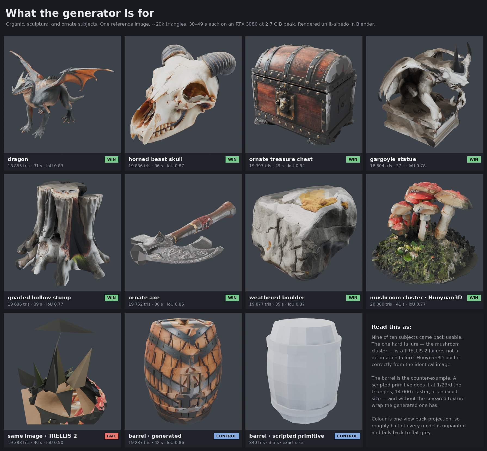

# What generation is for

The Bonanza build concluded that scripted primitives beat the generator. That
conclusion was drawn from a rigged test. An aircraft is hard-surface,
engineered, bilaterally symmetric, assembled from thin flat panels, and so
familiar that every millimetre of error is legible. It is the worst case for
image-to-3D and the best case for a parametric script. Reasonable question that
came out of it: *if we are just building wings with code, what is the AI
generator for?*

This is the answer, measured on ten subjects the Bonanza never tested — the
things a Roblox developer actually needs: creatures, terrain, foliage, ornate
props, weapons, statues.

**Nine of ten came back usable.** The hard-surface control lost to a 840-triangle
script, exactly as before. Both facts are the finding.

---

## The numbers

Reference hardware: RTX 3080, 10 GB nominal, ~8.88 GiB usable. TRELLIS 2 GGUF
Q8_0, 512 pipeline, 12 inference steps, `textured: false` with back-projected
colour applied afterwards. Every subject a single fal `flux/schnell` reference
image at 1024², seed 20260806.

| subject | job | gen s | colour s | raw faces | shipped | IoU | coverage | VRAM (torch / device) | verdict |
| --- | --- | --- | --- | --- | --- | --- | --- | --- | --- |
| dragon | `8df17b5f6f54` | 30.9 | 5.5 | 735 306 | 18 865 | 0.830 | 0.677 | 2.66 / 3.93 | **win** |
| horned beast skull | `ba6836d5404a` | 36.0 | 5.7 | 2 043 582 | 19 886 | 0.867 | 0.720 | 2.66 / 3.93 | **win** |
| ornate treasure chest | `3617f445ced8` | 49.4 | 6.0 | 4 911 890 | 19 397 | 0.843 | 0.409 | 2.66 / 3.93 | **win** |
| gargoyle statue | `f08cdd327fe9` | 36.9 | 5.7 | 2 511 190 | 18 604 | 0.777 | 0.337 | 2.66 / 3.93 | **win** |
| gnarled hollow stump | `17603a16b6f7` | 39.1 | 5.7 | 3 264 366 | 19 686 | 0.765 | 0.171 | 2.66 / 3.93 | **win** |
| ornate axe | `398da5b08a17` | 30.0 | 5.6 | 480 732 | 19 752 | 0.850 | 0.817 | 2.66 / 3.93 | **win** |
| weathered boulder | `3e0076ddbf52` | 35.3 | 5.6 | 1 932 892 | 19 877 | 0.870 | 0.644 | 2.66 / 3.93 | **win**, with a caveat |
| mushroom cluster (Hunyuan3D) | `7397e0ce1e08` | 41.2 | 5.8 | 700 470 | 20 000 | 0.771 | 0.271 | 7.63 / — | **win** |
| mushroom cluster (TRELLIS 2) | `c5755ea0782c` | 46.4 | 5.9 | **12 905 884** | 19 388 | 0.495 | 0.218 | 3.23 / 5.06 | **hard fail** |
| barrel — generated (CONTROL) | `1f0415e64567` | 42.2 | 8.2 | 4 448 532 | 19 237 | 0.856 | 0.341 | 2.66 / 3.93 | beaten by a script |
| barrel — scripted (CONTROL) | `a7a9b5e73c0f` | **0.003** | — | — | **840** | — | — | **0** | **win** |

Generation cost is flat: 30–49 s and 2.66 GiB regardless of how complicated the
subject is. A dragon and a barrel cost the same. Decimation from millions of
faces to 20 000 is 0.2–0.8 s. Colour is a further 5.5–8.2 s.

---

## Subject by subject

### Dragon — the case that settles it

31 seconds. Four limbs planted, long arching neck, wedge head with two
swept-back horns, a spine ridge running to the tip of a tapering tail, and two
membranous wings with visible finger bones. The claws have individual toes. The
scale texture on the flanks is real geometry at 18 865 triangles, not just paint.

Could a primitive have done it? No, and not remotely. There is no parametric
`dragon` and there never will be. Writing this by hand in `primitives.py` would
be a week of work producing something worse. This is a 31-second asset that a
Roblox developer would drop into a game unmodified.

### Horned beast skull — best of the set

The most convincing object here. Nasal opening, individually separated teeth
along the upper jaw, orbital ridges, hairline cracks across the cranium, and two
ribbed horns with correct spiral banding. `texture_coverage` 0.720 is the
highest of any subject, and the ivory-with-brown-staining reads as real bone.

Ship it. Also: it is a *skull*, so the model reproducing the sockets as actual
holes rather than painted dark patches matters, and it did.

### Ornate treasure chest — the ornate-prop case

The chest is where the argument against scripting gets strongest, because a
chest *is* a box and a box is trivially scriptable. But the generated one has a
barrel-vaulted lid, iron bands wrapping over the lid and down the sides,
individually raised rivet heads, a cast lion-faced lock plate, plank seams in
the wood, and scrollwork claw feet. All modelled, at 49 s.

A scripted chest would be a rounded box with a hinge. The ornament is the
entire value of the prop, and the ornament is exactly the part a script cannot
supply. **This is the strongest single argument in the document**: not that the
generator does organic shapes, but that it does *detail volume* — arbitrary
quantities of small surface incident that nobody wants to write down.

### Gargoyle statue — good geometry, and a lesson about how it was judged

A crouching winged figure on a plinth: folded ribbed wing membranes, wing claws
hooked over the shoulders, clawed hands gripping the plinth edge, thick horns,
a snarling face. Weathered-limestone albedo with soot in the recesses.

This one was nearly written off. See *The preview renderer was lying*, below.

### Gnarled hollow stump — foliage works

Deep fluted bark ridges, four splayed roots gripping outward, a swollen burl on
one flank, a splintered break ring at the top, and a dark rot-brown hollow. The
moss at the root collar came through as green. Coverage is only 0.171 and it
still reads, because the unpainted regions land on the inside of the hollow and
the underside.

Ship it. A scripted stump is a tapered cylinder.

### Ornate axe — weapons work, with the hilt as the point

Crescent blade with a scalloped edge, knotwork etched into the cheek, a beast
head cast where the blade meets the haft, a spiked counterweight, cord wrap over
the middle of the shaft, and a flared butt cap. The knotwork is *painted*, not
modelled — at 20 000 faces the engraving lives in the albedo. For a Roblox prop
seen at arm's length that is the correct trade.

The shaft is the weak part: it is lumpy and slightly banana-shaped where a real
haft is straight. The routing rule from PROCEDURAL.md applies cleanly — **script
the shaft, generate the head.** That is a two-part kitbash and it is exactly what
this project is built to do.

### Weathered boulder — a win, but the least defensible one

Granite with horizontal strata, sheared angular facets, deep fissures and yellow
lichen lodged in the cracks. IoU 0.870, the highest of the set.

The caveat: a boulder is the one organic subject a script can genuinely compete
on. An icosphere with a few octaves of noise displacement, 500 triangles, one
millisecond, is a serviceable rock, and it comes out at whatever size you asked
for. The generator's advantages here are the strata, the sheared flat faces and
the lichen — real, but not the "no primitive comes close" gap the dragon has.
**If you need forty rocks, script them. If you need one hero rock, generate it.**

### Mushroom cluster — the one hard failure, and it is instructive

TRELLIS 2 returned a shattered mess of large flat black planes and spikes. Not a
low-quality mushroom cluster — not mushrooms at all. IoU 0.495 against 0.77–0.87
for everything else.

**It is not decimation.** Three runs from the same reference image:

| run | generator | faces | IoU | coverage |
| --- | --- | --- | --- | --- |
| `c5755ea0782c` | TRELLIS 2 | 19 388 | 0.495 | 0.218 |
| `2ec81629b5c8` | TRELLIS 2 | 118 902 | 0.531 | 0.029 |
| `7397e0ce1e08` | Hunyuan3D 2.1 | 20 000 | 0.771 | 0.271 |

Six times the triangle budget buys 0.036 of IoU. The mesh is broken at every
resolution because it was born broken: TRELLIS 2's raw output before decimation
was **12 905 884 faces**, against 0.5–4.9 M for every other subject. The sparse
structure exploded. Decimation faithfully reduced garbage.

**Hunyuan3D 2.1 built it correctly from the identical image** — seven caps of
different heights, thick stalks, a mossy clod, correct crimson-and-cream colour.
So this is not "the generator cannot do dense clusters", it is "TRELLIS 2 cannot
do this one and the other model can".

That inverts the current default. QUALITY-COMPARISON.md established TRELLIS 2 as
the better model on hard-surface props; this establishes that **on high-genus
organic clusters — many thin separate stalks rising from a common base —
Hunyuan3D is the one that works.** The cost is VRAM: 7.63 GiB against 2.66.

### Barrel — the hard-surface control, still lost

The generated barrel is geometrically fine: a bellied cask with a raised rim, a
bung plug, and hoop relief. It is also 19 237 triangles, took 42 seconds, and
arrives at an arbitrary size that has to be declared by hand.

`primitives.barrel` produces the same silhouette in **840 triangles and 3
milliseconds**, at exactly the dimensions asked for, watertight, with clean
symmetric hoops.

And the generated one has a defect the script cannot have: the back-projected
texture *smears*. A barrel is a body of revolution, one photograph covers a
little under half of it, and the wrap around the curvature drags the stave grain
and hoops into visible streaks. On a symmetric machined object that reads as a
defect; on a boulder the same error reads as weathering.

**The control holds. Nothing here overturns the Bonanza's conclusion for
hard-surface parts — it bounds it.**

---

## The routing rule, restated with evidence

PROCEDURAL.md's rule was written from aircraft parts. These ten subjects say the
same thing from the other side:

| generate | script |
| --- | --- |
| creatures, monsters, anything anatomical | anything with a stated dimension |
| rock, terrain, bark, organic surface | bodies of revolution — barrels, columns, wheels |
| ornament, engraving, scrollwork, cast detail | flat panels, plates, slabs |
| statues, skulls, treasure — *irregular by nature* | anything that must be symmetric |
| one hero asset | forty of the same asset |

The one-line version: **the generator is for detail volume nobody wants to write
down; the script is for dimensions somebody has to get right.** A dragon has no
dimensions that matter. A wheel is nothing but dimensions.

The axe is the case that shows both at once — generate the head, script the
shaft.

---

## Failures and limits, in order of how much they cost

### 1. Colour covers about half of every model

Back-projection paints from the one reference camera. Measured coverage across
this set: 0.171 to 0.817, median ≈ 0.41. The rest is flood-filled from
neighbours or left flat. On the chest the far side is grey; on the boulder one
flank is unpainted; on the stump the interior of the hollow is bare.

For a prop against a wall this does not matter. For anything the player orbits,
it does. This is the single biggest quality gap in the pipeline and it is the
reason multi-view conditioning matters (below).

### 2. The preview renderer was lying, and it nearly cost four assets

`GET /jobs/{id}/preview` rendered the gargoyle, stump, boulder and chest as
near-black silhouettes. Every judgement in this project is made through that
endpoint. On the strength of those previews four of the best assets in this set
were initially written down as failures.

They are not black. Rendered from the same GLB in Blender, the gargoyle is pale
limestone with visible chisel marks.

It is not a UV bug. `preview.py` samples the base-colour atlas at each triangle's
UV centroid; sampling it both ways gives 2.3 % black faces for the existing
convention against 70.8 % V-flipped, so the current convention is correct.

It is **double-darkening**. The back-projected albedo already contains the
reference photograph's own shading and ambient occlusion — TEXTURING.md says so.
`_shade()` then multiplies it by a second lighting term with a floor of
`_AMBIENT * 0.62 = 0.186`. A mid-brown at 0.27 albedo lands at 0.05 and reads as
black on screen.

Two consequences:

- **Judge from an unlit-albedo render, not from `/preview`.** Every render in the
  contact sheet above is unlit or lightly lit in Blender for this reason.
- **The same double-darkening will happen in Roblox.** Baked-in shading in a
  base-colour map gets lit again by the engine. This is a shipping-quality issue,
  not only a preview issue.

### 3. Scale is still destroyed

Unchanged from DECOMPOSITION.md. Every mesh comes back normalised to roughly a
unit box. A dragon and an axe arrive the same size. `size_m` remains the only
source of truth and nothing can check it.

### 4. Nothing is watertight

Every generated mesh in this set reports `watertight: false`. Fine for a
rendered prop, a problem for anything wanting a solid boolean or the hollowing
path. The scripted barrel is watertight.

### 5. One subject in ten is a coin flip you cannot predict in advance

The mushroom cluster gave no warning. Its prompt follows the same rules as the
nine that worked. The only pre-generation signal was the raw face count — 12.9 M
against a normal 0.5–4.9 M — which is available in the job result but is not
currently checked.

**Cheap, unimplemented mitigation:** treat `decimated_from > ~8 M` or
`silhouette_iou < 0.6` as an automatic reroll or an automatic switch to
Hunyuan3D. Both numbers are already in every job result. Nothing reads them.

---

## MISSING CAPABILITY: multi-view conditioning

Every generation in this project has used **one** reference image. That is the
generator's weakest mode, and it is the direct cause of limit #1 above.

TRELLIS 2 supports more. The node call in `server/trellis_worker.py` already
passes `max_views=4` and takes `image=` as a batched ComfyUI tensor — the model
is built to condition on several views of one subject.

**The HTTP layer cannot express it.** `GenerateRequest` in `server/app.py` has a
single `image_b64: str | None` and a single `image_id: str | None`, and
`app.py:185` enforces exactly one of the two. The single image is threaded
through `jobs.submit()`, `_images[job_id]`, `trellis.generate_shape()` and into
`trellis_worker.generate()` as `req["image_b64"]`, decoded to one PIL image at
`trellis_worker.py:121`.

Probed directly. Three views of one dragon were generated at fal — three-quarter,
side and front, same subject, same style clause, seed 20260806 — and submitted
six ways:

| submitted | result |
| --- | --- |
| `image_b64` as a list of 3 | `422 Input should be a valid string` |
| `image_id` as a list of 3 | `422 Input should be a valid string` |
| `image_ids: [...]` | `400 give exactly one of image_b64 or image_id` |
| `images: [...]` | `400 give exactly one of image_b64 or image_id` |
| `image_b64` + `views: [b64, b64]` | **`200`** — job `9d3a38f2490f` |
| `image_b64` + `max_views: 3` | **`200`** — job `b049616c3f78` |

The last two are the dangerous ones. Pydantic drops unknown fields silently, so
both were **accepted, ran single-view, and returned a plausible mesh**. The
stored params confirm the extra fields never existed:
`{"seed": 20260806, "target_faces": 20000, "part_name": "mv_views", "generator": "trellis2", "textured": false}`.
A caller attempting multi-view gets a normal-looking result and no indication
that two thirds of the input was thrown away.

So: multi-view is unreachable, and the API will not tell you. Fixing it is a
list field in `GenerateRequest`, a list in `jobs.submit`, and stacking the
tensors before the existing `max_views=4` call. It is the highest-value
unimplemented change in the pipeline, because it attacks the coverage ceiling
and the geometry of unseen sides at the same time.

*(No server file was modified to establish this — the probes are HTTP only.)*

---

## Verdict

**The generator is worth having, and the Bonanza test was measuring the wrong
thing.**

For creatures, statues, terrain, foliage, ornate props and weapon heads it
produces, in about 35 seconds and 2.7 GiB, assets that a Roblox developer would
ship — and that no amount of parametric scripting could produce at any cost. The
dragon, the skull, the chest and the stump are not "good for AI". They are good.

For barrels, wheels, panels, columns and anything with a number attached to it,
`primitives.py` still wins outright and by two orders of magnitude on both
triangles and time. That has not changed and should not be argued with.

The project's real product is the router between the two, and the parts system
that lets one object use both. The axe makes the case in a single asset: the
generator carves the beast head, the script draws the straight shaft.

Three things stand between this and being genuinely good, in order:

1. **Multi-view conditioning.** Half of every model is currently unpainted.
2. **Stop judging assets through `/preview`.** It has been systematically
   under-reporting quality, and the same double-darkening will follow the assets
   into Roblox.
3. **Route on the numbers already in the job result.** `decimated_from` and
   `silhouette_iou` would have caught the one hard failure in this set
   automatically, and switching that subject to Hunyuan3D fixes it.

---

## Reproducing

Prompts follow DECOMPOSITION.md's rules: describe the geometry and its features
rather than naming the object, state the viewpoint explicitly, say "large in
frame", and keep the style clause to materials, palette and lighting only. The
full prompt set is the `SUBJECTS` list used for this run; the dragon's is
representative:

> a four-limbed winged reptilian beast standing on all fours, long serpentine
> neck arching upward, wedge-shaped head with a toothed jaw and two swept-back
> horns, overlapping keeled scales across the hide, a row of triangular spines
> running from the skull down the back to the tip of a long tapering tail, two
> membranous wings raised and partly furled with thick visible finger bones and
> ribbed membrane, muscular haunches, four splayed clawed feet, seen from a
> three-quarter angle slightly above so the wing depth and the length of the
> body are both visible, whole animal large in frame

Note what is *not* in it: the word "dragon". Naming the creature is unnecessary
once the geometry is described, and consistent with the fuselage result in
DECOMPOSITION.md, describing the shape works better than naming the thing.
